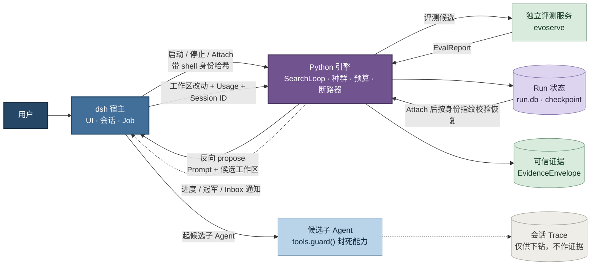
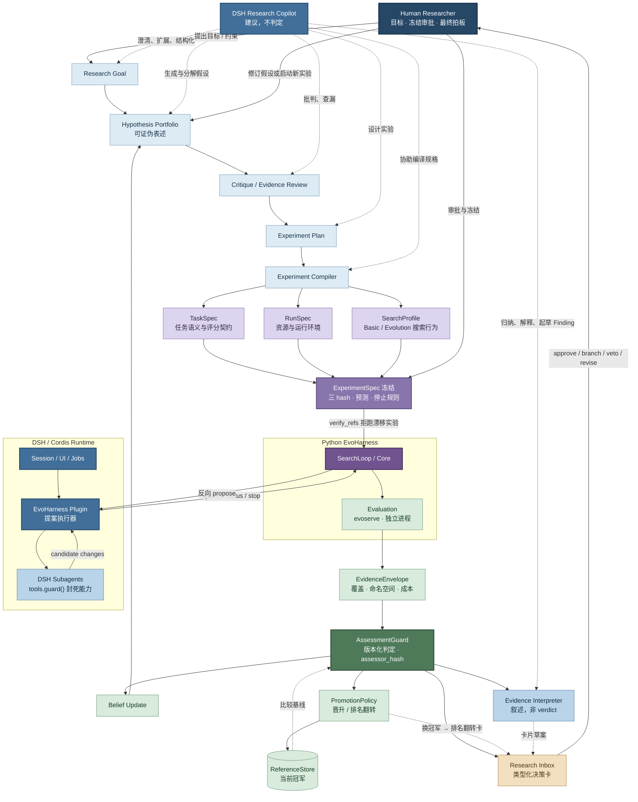

# DSH 集成

**dsh 驱动会话与提案，Python 驱动搜索与裁决。**

外壳可以换，裁决链不能动：控制流的归属可以谈，证据、覆盖与判定的权力不让。

---

## 1. 执行内核：谁驱动谁

**读图三条：**

- **箭头方向就是控制流归属。** dsh 只管起停与 Attach，代际循环留在
  `SearchLoop`；提案是 Python 发起的**反向请求**，dsh 是它的服务方。
  好处是 `SearchLoop.run()` 一行不动——种群、断路器、检查点、停机理由
  的权威天然只有一处，不需要跨语言协议转告。
- **候选子 Agent 单独成节点，因为守卫装在这一层。** `tools.guard()` 是
  单调守卫：在 `tools/pre-execute` 瀑布之后、工具体之前执行，返回理由
  即拒绝，监听器顺序无法把拒绝翻回允许。工具可见性过滤（`restrict`）
  只是纵深——它管不着作用域内注册的工具，不能当安全边界。
- **两个圆柱一实一虚。** `EvidenceEnvelope` 是唯一事实层；会话 Trace
  以冷副本身份归档，仅供从候选下钻回原始会话，**任何情况下不作证据**。
  dsh 的会话日志遵守"模型可见即已记录"，它是模型上下文的来源，
  不是评测判定的来源。

`evoserve` 与 Run 状态都画在 dsh 之外：前者是评估信任边界，后者是耐久性
归属。会话关掉，插件和 Job 全没了，检查点还在——Attach 就是对同一个
run 目录重新拉起并按身份指纹校验后续跑。

---

## 2. 研究闭环：判定权归谁

**读图四条：**

- **copilot 的虚线够不到 `AssessmentGuard`。** 它在目标澄清、假设分解、
  实验设计、规格编译、证据解读上都出力，产物是叙述、Finding 与卡片草案；
  但 supported / contradicted / unknown 三态只能由带 `assessor_hash` 的
  版本化规则产出。`Evidence Interpreter` 因此被涂成 copilot 的浅蓝色，
  而不是证据的绿色——**它是 agent 的产出，不是事实**。
  理由不是防 agent 说谎，是防判定标准悄悄漂移：LLM 每次解读的隐含阈值
  都不一样，而现行 assessor 的噪声下限有具体来历（IMO 终选在 12 题上取
  argmax，validation 到 test 掉 0.206，点估计比较会把幸运种子当成优势）。
- **信念更新与决策卡都挂在判定之后，不与判定并联。** 没有一条路径能让
  信念绕开 `AssessmentGuard` 更新。这也是 Research Layer 那条约束的
  字面意思：自动生成 Finding 和 DecisionRequest，但不绕过 AssessmentGuard
  和 Human Policy。
- **`ExperimentSpec 冻结` 单独占一格。** 三份 Spec 直接连到 SearchLoop 的话，
  "跑的和批的是同一个"没有着落。冻结把 task / run / search 三个 hash、
  预测声明与停止规则一起钉死，`verify_refs()` 靠它拒跑漂移实验——
  人审批的对象是这一格，不是三份 Spec。
- **晋升与信念是两条独立的反馈路径。** `Belief Update` 回到假设组合，
  决定人接下来相信什么、试什么；`PromotionPolicy` 回到 `ReferenceStore`，
  决定下一批候选跟谁比。后者还兼作 `AssessmentGuard` 的比较基线——
  换冠军会改变所有后续比较类判定的参照物，所以换冠军要出排名翻转卡。

---

## 3. 两图的接口

上下两层之间只有一个接口：**上层递进冻结好的 `ExperimentSpec`，下层递出
`EvidenceEnvelope`。**

中间发生了什么，治理层不需要知道；判定用什么规则，执行层无权干预。
这条接口是两张图能各自独立演进的原因——换外壳只动第一张，改判定规则
只动第二张。

> 配对文档：`todo/dsh_integration.md`（接入计划与停止线）、
> `todo/research_layer.md`（治理层契约）、`docs/eval_protocol.md`（评估信任边界）。
