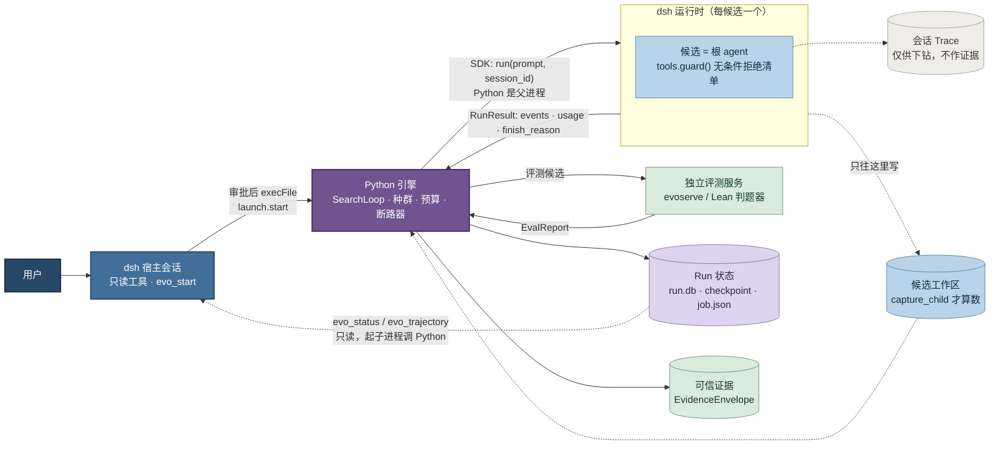
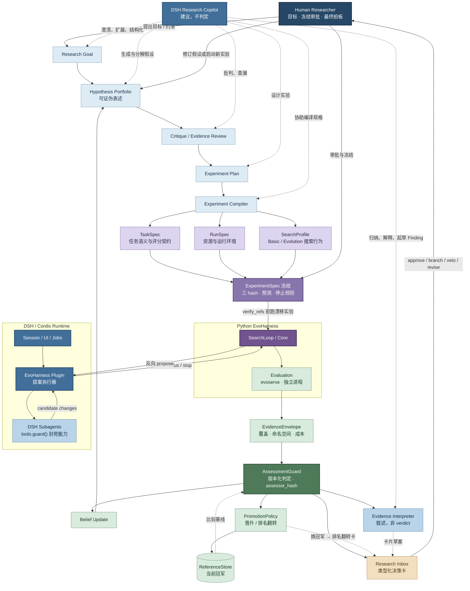

# DSH 集成

**dsh 驱动会话与提案，Python 驱动搜索与裁决。**

外壳可以换，裁决链不能动：控制流的归属可以谈，证据、覆盖与判定的权力不让。

---

## 1. 执行内核：谁驱动谁

> **这张图 2026-08-25 重画。** 旧版画的是 dsh 当宿主、Python 被它 spawn、提案走**反向 propose** 回到 dsh。那个形态是 `ReverseRpcAgentBackend`，`dsh_integration.md` 决定一在 v4 已把它**推迟**——主线走 `python/sdk` 的 `DeepSeekHarness`，**Python 是父进程**。一张画着推迟方案的图比没有图更糟：它读起来完全像是现状。

**读图四条：**

- **箭头方向就是控制流归属，而它和旧图是反的。** Python 是父进程，dsh 运行时是它按需拉起的子进程，每候选一个。宿主会话只做两件事：**只读地看**，以及**在人点头之后起跑**。跑起来之后它就出局了——`evo_start` 返回时进程已经脱离，会话关掉不影响它。
- **宿主会话与候选运行时是两套工具，不是一套。** 上面那条只读线用的 `evo_trajectory` 答的是整个种群；候选要是拿得到它，就看得见所有对手的分数，绕过了搜索正在调的灵感选择。两份 cordis 配置因此**不合并**，各自对应一条信任边界。
- **候选是它那个运行时的根 agent，深度 0。** 按"深度 ≥ 1 才拒绝"写的守卫会把它整个放过去——这个缺陷真的发生过，而且单元测试全程绿，因为其中一例在断言"放行主 agent"是对的。判据现在只看名字，**没有 agent 的调用也拒**：在一个每候选一个的运行时里，没有比候选更可信的调用方。
- **工作区那条虚线是权威边界。** dsh 只往 `workdir` 里写，Python 用 `capture_child(workdir)` 重新读回来才形成 Proposal。**backend 自报"我改了"不作数。**

`evoserve` / 判题器与 Run 状态都画在 dsh 之外：前者是评估信任边界，后者是耐久性归属。运行时死掉，检查点还在——恢复就是对同一个 run 目录重新拉起并按身份指纹校验（换过 cordis 配置的会被直接拒）。

---

## 2. 研究闭环：判定权归谁

**读图四条：**

- **copilot 的虚线够不到 `AssessmentGuard`。** 它在目标澄清、假设分解、实验设计、规格编译、证据解读上都出力，产物是叙述、Finding 与卡片草案；但 supported / contradicted / unknown 三态只能由带 `assessor_hash` 的版本化规则产出。`Evidence Interpreter` 因此被涂成 copilot 的浅蓝色，而不是证据的绿色——**它是 agent 的产出，不是事实**。理由不是防 agent 说谎，是防判定标准悄悄漂移：LLM 每次解读的隐含阈值都不一样，而现行 assessor 的噪声下限有具体来历（IMO 终选在 12 题上取 argmax，validation 到 test 掉 0.206，点估计比较会把幸运种子当成优势）。
- **信念更新与决策卡都挂在判定之后，不与判定并联。** 没有一条路径能让信念绕开 `AssessmentGuard` 更新。这也是 Research Layer 那条约束的字面意思：自动生成 Finding 和 DecisionRequest，但不绕过 AssessmentGuard 和 Human Policy。
- **`ExperimentSpec 冻结` 单独占一格。** 三份 Spec 直接连到 SearchLoop 的话，"跑的和批的是同一个"没有着落。冻结把 task / run / search 三个 hash、预测声明与停止规则一起钉死，`verify_refs()` 靠它拒跑漂移实验——人审批的对象是这一格，不是三份 Spec。
- **晋升与信念是两条独立的反馈路径。** `Belief Update` 回到假设组合，决定人接下来相信什么、试什么；`PromotionPolicy` 回到 `ReferenceStore`，决定下一批候选跟谁比。后者还兼作 `AssessmentGuard` 的比较基线——换冠军会改变所有后续比较类判定的参照物，所以换冠军要出排名翻转卡。

---

## 3. 两图的接口

上下两层之间只有一个接口：**上层递进冻结好的 `ExperimentSpec`，下层递出 `EvidenceEnvelope`。**

中间发生了什么，治理层不需要知道；判定用什么规则，执行层无权干预。这条接口是两张图能各自独立演进的原因——换外壳只动第一张，改判定规则只动第二张。

---

## 4. 代码在哪

集成横跨两个仓库，中间靠一个 Python SDK 连起来。两边**只靠环境变量找到彼此**，没有符号链接也没有依赖声明。

| | 位置 | |
|---|---|---|
| 后端 | `evoharness/core/agent/dsh_backend.py` | 起运行时、翻译事件流、算 token、映射终止原因 |
| 读出面 | `evoharness/readout/` | `peer.py` 给候选的窄视图；`status.py` / `detail.py` / `governance.py` 给宿主 |
| 起跑 | `evoharness/launch/` | `evo_start` 最终调的是 `start.py` |
| 启动脚本 | `scripts/dsh_demo.sh` | 配齐环境变量、自检、探判题器，然后拉起 `dsh web` |
| 桥 | `deepseek-harness/python/sdk/src/deepseek_harness/` | 挂在 `PYTHONPATH` 上，**不是 pip 装的** |
| 插件 | `deepseek-harness/packages/examples/evo-harness/src/` | `index.ts` 守卫、`peer.ts` 候选侧、`host.ts` 只读、`start.ts` 审批起跑 |
| 配置 | 同上 `fixtures/*.cordis.yml` | 四份，**每份是一条信任边界，合并即边界消失** |

**跨机器路径已经收拢。** 候选配置使用相对插件路径，因此进入运行身份的内容哈希不含 checkout 位置；宿主 patch 保存稳定包名，由 `dsh_demo.sh` 根据唯一的 `DSH_ROOT` 渲染为临时的机器本地路径。两个仓库同级时脚本自动发现 DSH，否则只需显式设置 `DSH_ROOT`，不再修改 Cordis 源文件。

---

> 配对文档：`todo/dsh_integration.md`（接入计划与停止线）、`todo/research_layer.md`（治理层契约）、`docs/eval_protocol.md`（评估信任边界）。
