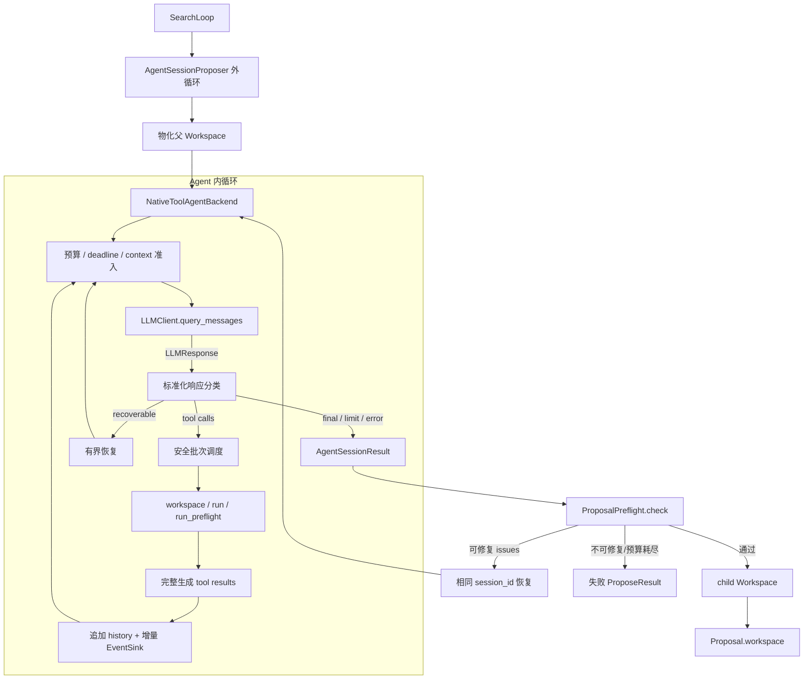
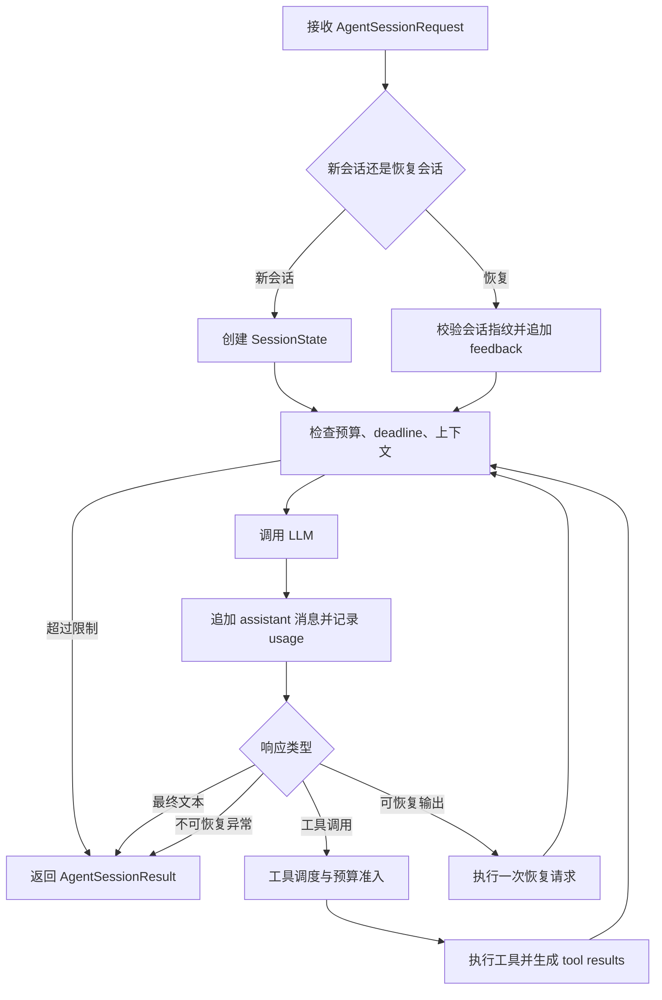
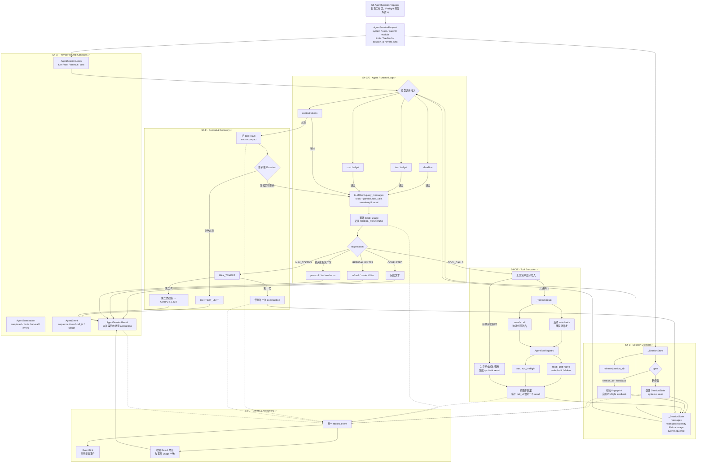

# AgentSessionProposer 详细实现计划

> 状态：Draft v3（2026-07-16，吸收 Claude Code Agent Loop 架构研究）  
> 对应：`docs/EvoHarness.md` P1.1、`todo/strategy_roadmap.md` WS-3 M3  
> 目标：用可审计、可预算、厂商无关的 Agent 工具循环取代单发盲重采，降低结构候选
> DOA；`SingleShotProposer` 保留为 parity/消融臂。

## 0. 已冻结的设计决策

1. **两层 Loop 分离**：`AgentBackend` 管模型—工具内循环；
   `AgentSessionProposer` 管预检—反馈—恢复外循环。
2. **厂商无关工具 IR + 原生工具调用**：参考 HyperAgents 的持久消息历史和工具循环，
   但 Transport 负责厂商协议映射；Runtime 只消费 `LLMToolCall/LLMToolResult`，不解析
   `<tool_call>` 文本标签。
3. **不依赖 `claude -p` / 特定 Agent SDK**：真实模型只是 Transport；工具、预算、
   transcript 和 session 语义由 EvoHarness 掌握。
4. **`PreflightIssue` 是纯 IR**：不携带 Agent 文本渲染职责；渲染只发生在 Runtime
   的消息边界。
5. **验证规则按任务注入**：核心不实现“适配所有项目”的通用 Validator；任务直接提供
   `PreflightValidator`。通用 `CommandValidator/ValidationPlan` 暂缓。
6. **一个权威验证入口**：Agent 主动检查和最终晋级门共用 `ProposalPreflight.check()`；
   最终检查始终由 Harness 强制再跑一次。
7. **Workspace 是代码记忆，session history 是对话记忆**：不在每轮 prompt 重发完整
   仓库；工具对同一物化目录持续读写。
8. **Transcript 是一级实验产物**：成功和失败 proposal 都必须可回放，且所有失败轮次
   的费用都计入 `ProposeResult.llm_cost`。
9. **Loop 是显式状态机**：跨轮状态集中保存在 `_SessionState`；每次继续、恢复与终止都有
   可断言的 transition reason，不用散落的布尔变量隐式驱动控制流。
10. **工具调用完整配对**：每个 `LLMToolCall.call_id` 必须恰好对应一个
    `LLMToolResult`。未知工具、坏参数、超时、取消和预算拒绝都生成结构化错误结果，
    history 中不允许悬空 tool call。
11. **并发由工具按输入声明**：Runtime 只并发执行连续的 concurrency-safe 调用；任何
    写操作、`run` 和 `run_preflight` 独占执行。并发结果按模型原始调用顺序回灌，保证
    可复现。
12. **Deadline 端到端传播**：`timeout_s` 不只在 Loop 外层检查；每次模型请求与工具调用
    都接收当前剩余时间。无法取消的阻塞调用不允许被包装成“硬超时”。
13. **Context 先机械治理**：先做工具输出限长和旧 tool result micro-compact，保持消息
    配对；本期不引入总结 Agent。无法收口时明确终止为 `CONTEXT_LIMIT`。
14. **Transcript 增量持久化**：事件产生时立即交给 `EventSink`，不能只等
    `AgentSessionResult` 正常返回后再一次性落盘。
15. **借鉴原则而非移植产品复杂度**：吸收 Claude Code 的状态机、工具配对、保守并发、
    deadline、context 和 append-only transcript 原则；不复制其流式 UI、权限弹窗、Hooks、
    MCP、Skills、多 Agent 或源码实现。

## 1. 范围与非目标

### 本计划交付

- 原生工具调用 IR、工具注册与内循环；
- 同一 session 上下文恢复；
- 文件查看/搜索/编辑与受控 `run` 工具；
- 按调用输入分类的安全并发调度；
- 工具调用/result 完整配对与 synthetic error result；
- 结构收口 + task preflight + 结构化反馈修复；
- turns/tool calls/time 的机械硬顶与成本准入上限；
- deadline 向模型 Transport、Runner 和工具执行层传播；
- 旧工具结果的机械 micro-compact 与明确 context-limit；
- transcript/preflight/final diff 落盘；
- `single-shot / conversational(tools=[]) / agentic` 三臂消融；
- 与 SearchLoop、Candidate metadata 和 run 报告接线。

### 本期不做

- 通用项目自动探测器；
- 通用 `ValidationPlan/CommandValidator`；
- 跨 proposal 长期记忆；
- LLM context summarizer、长期 memory 和语义检索；
- 流式响应期间抢跑工具执行；
- 交互式权限弹窗、PreTool/PostTool Hooks、MCP/Skills 动态工具加载；
- 多 Agent、后台任务、用户消息中断与跨进程 session resume；
- P3 级容器/网络/元进化安全全家桶；
- inspiration worktree、多文件 novelty（归 M4）。

## 2. 当前实现基线（2026-07-16）

| 模块 | 状态 | 后续动作 |
|---|---|---|
| `evocore/agent/contracts.py` | Session/Backend 基础契约与 model/accounting 已完成 | S4 前补 typed event、context-limit 和 deadline 语义 |
| `evocore/agent/tools.py` | S3 工具协议、稳定错误、deadline context 与注册表已完成 | S4 Scheduler 消费并发分类 |
| `evocore/agent/workspace_tools.py` | strict read/glob/grep/write/edit/delete 已完成 | 保持 workspace-only 边界 |
| `evocore/agent/run_tool.py` | argv-only Runner 工具与输出收口已完成 | S4 传播实时 remaining timeout |
| `evocore/agent/preflight_tool.py` | 权威 Preflight 的 Agent 边界适配已完成 | S5 最终门仍强制重跑 |
| `evocore/preflight.py` | Preflight 纯 IR、Pipeline、统一 `ProposalPreflight` 已完成 | 保持为 Harness 权威验证入口 |
| `evocore/workspace.py` | `capture_child()` 已支持改/增/删/no-op/Agent commit | 不再改语义 |
| `evocore/proposer.py` | `Proposal.workspace` 与 `SingleShotProposer` 已完成 | 新增 `AgentSessionProposer` |
| SearchLoop | 已支持注入自定义 Proposer | 后期补 metadata/失败 trace/混合调度 |
| `evocore/llm.py` | 原生 tools/tool_choice/parallel calls、响应解析和 ID 往返已完成 | 补每次请求的动态 timeout/deadline |
| 测试 | S3 定向 39 passed；全仓拆分回归 274 passed | S4 继续相关测试 + 全量回归双门 |

当前目录边界：

- `evocore/agent/contracts.py`：跨模块共享的 Session/Backend 契约；
- `evocore/agent/runtime.py`：session history、预算控制与原生工具内循环（S4 新增）；
- `evocore/agent/tools.py`：工具协议、上下文、错误与注册表；
- `evocore/agent/workspace_tools.py`：独立 strict workspace 工具；
- `evocore/agent/run_tool.py` / `preflight_tool.py`：诊断执行与权威预检工具；
- `evocore/agent/proposer.py`：`AgentSessionProposer` 外循环（S5 新增）；
- `evocore/agent/transcript.py`：仅在 S6 需要 JSONL/summary writer 时新增；
- Preflight、Workspace 和通用 Proposer 保留在 `evocore` 根层，Agent 单向依赖它们。

文件数量约束：S4 的 `_SessionState`、`_ToolBatch`、`_ToolScheduler` 和 context policy
先作为 `runtime.py` 私有实现，不预先拆 `scheduler.py/context.py/state.py`。只有单文件职责
已实际失控时再提取，避免把概念分层机械等同于文件分层。

## 3. 最终调用结构



### 内循环所有权

`AgentBackend.run(request)` 不是一次 completion，而是一次完整 autonomous turn：

```text
model -> tool_call -> execute -> tool_result -> model -> ... -> final/limit/error
```

它负责：

- session history；
- session start/resume 一致性校验；
- 工具分派、安全批次调度和完整 result 配对；
- 每轮 model/tool accounting；
- deadline、context 和 hard-limit 准入；
- structured `AgentEvent` 与增量 sink；
- 有界 output-limit 恢复；
- 将厂商响应映射成 `AgentTermination`。

### 外循环所有权

`AgentSessionProposer.propose()` 负责：

- 父候选物化和同一 workdir 生命周期；
- 跨 resume 的总预算；
- 结构收口和 task preflight；
- issue 回传；
- 最终 `Proposal.workspace`；
- transcript/summary/failure reason。

## 4. 目标数据契约

### 4.1 Agent 消息与 Transport

消息与 Transport 是通用模型基础设施，放在 `evocore/llm.py`，由 SingleShot 和
Agent Runtime 共同使用；Agent 不再定义第二套消息、Transport 或模型响应：

```python
@dataclass(frozen=True)
class LLMMessage:
    role: str
    content: str = ""
    tool_calls: tuple[LLMToolCall, ...] = ()
    tool_results: tuple[LLMToolResult, ...] = ()

class LLMTransport(Protocol):
    def __call__(
        self, *,
        messages: tuple[LLMMessage, ...],
        model: str,
        timeout_s: float | None,
        tools: tuple[LLMToolDefinition, ...],
        tool_choice: LLMToolChoice,
        parallel_tool_calls: bool,
        ...,
    ) -> LLMResponse: ...
```

`LLMClient.query(system, user, model)` 保持 SingleShot 调用语义，并委托给
`query_messages()`；Agent Runtime 直接调用 `query_messages()`，两者共享 Transport、重试、
`LLMResponse` 计费/Token IR 和 OpenAI-compatible / fake adapter。

`query_messages(timeout_s=...)` 将 timeout 视为**本次逻辑请求（含重试）的总 deadline**：

1. 用 `time.monotonic()` 计算本次请求截止时间；
2. 每次 retry 前重新计算 remaining；
3. 将 remaining 传给具体 Transport；
4. remaining ≤ 0 时不再重试，抛 `LLMTransientError`；
5. LiteLLM 与 OpenAI-compatible transport 都必须实际消费该参数，不能只在 Runtime
   返回后检查时钟。

### 4.2 工具 IR

模型工具调用和结果统一复用 `evocore.llm` 的公共 IR，不在 Agent 子包再定义第二套：

```python
@dataclass(frozen=True)
class LLMToolCall:
    call_id: str
    name: str
    arguments: dict[str, object]

@dataclass(frozen=True)
class LLMToolResult:
    call_id: str
    content: str
    is_error: bool = False
```

`agent/tools.py` 只定义工具执行边界：

```python
class AgentTool(Protocol):
    definition: LLMToolDefinition

    def is_concurrency_safe(
        self,
        call: LLMToolCall,
        ctx: AgentToolContext,
    ) -> bool: ...

    def invoke(
        self,
        call: LLMToolCall,
        ctx: AgentToolContext,
    ) -> LLMToolResult: ...
```

`AgentToolContext` 只暴露本 proposal 的 workdir、`ProposalPreflight`、父候选/operator、
本次调用剩余的 `remaining_timeout_s` 和工具策略，不暴露 Grader 隐藏数据。

`is_concurrency_safe()` 是最终协议的必选方法，不用 `getattr()` 或兼容默认值掩盖旧工具。
若并发分类自身抛异常，Scheduler 必须 fail closed，按不安全调用串行执行。

### 4.3 AgentEvent 与 EventSink

`AgentEvent` 是运行审计 IR，不是给模型看的消息，也不承担 UI 渲染：

```python
class AgentEventKind(str, Enum):
    SESSION_START = "session_start"
    SESSION_RESUME = "session_resume"
    MODEL_RESPONSE = "model_response"
    TOOL_CALL = "tool_call"
    TOOL_RESULT = "tool_result"
    CONTEXT_COMPACT = "context_compact"
    RECOVERY = "recovery"
    TERMINATION = "termination"

@dataclass(frozen=True)
class AgentEvent:
    sequence: int
    kind: AgentEventKind
    turn: int
    elapsed_s: float
    content: str = ""
    call_id: str | None = None
    tool_name: str | None = None
    data: Mapping[str, object] = field(default_factory=dict)

class EventSink(Protocol):
    def emit(self, event: AgentEvent) -> None: ...
```

约束：

- `sequence` 从 0 单调递增；
- `elapsed_s` 使用 monotonic 相对时间，不写伪精确的 wall-clock duration；
- tool call/result 事件必须带同一 `call_id`；
- `data` 只能包含可 JSON 序列化的 provider-neutral 数据；
- 敏感环境变量、隐藏 grader 数据和未截断大输出不得进入事件；
- Sink 失败不能被伪装成模型/工具失败：若配置要求 transcript 为强制产物，则终止为
  `BACKEND_ERROR`；测试用 `NullEventSink` 不落盘。

### 4.4 Session 请求/结果修订

- `AgentSessionResult` 新增 `model: str = ""`；
- `AgentBackend.run()` 文档明确“执行完整内循环”；
- `session_id is None` = 新会话，使用 system/user；
- `session_id is not None` = 恢复，只追加结构化 feedback；
- resume 时校验 workdir、parent ID、operator、model 和 tool-set 指纹与原 session 一致；
- `AgentTermination` 增加 `CONTEXT_LIMIT`；
- `events` 使用 `AgentEventKind`，不接受任意字符串；
- `AgentSessionLimits` 是本次 Backend 调用可用的**剩余预算**。

预算语义必须写实：

- `max_turns`、`max_tool_calls`：Runtime 在执行前准入，绝不越界；
- `timeout_s`：通过 deadline 传播到模型和可阻塞工具；
- `max_cost_usd`：没有 provider 服务端预算时，只保证累计到顶后不再发起下一次模型调用；
  单次调用可能产生可观测 overshoot，结果和报告必须保留真实费用；
- `max_repair_rounds` 属于 Proposer 外循环，不混进 Session Limits。

计数口径：

- `turns` 统计成功返回并被 Runtime 接受的标准化模型响应；Transport 内部 transient retry
  不另算 turn，`MAX_TOKENS/REFUSAL` 等已计费响应要算；
- `tool_calls` 统计通过预算准入的模型调用请求；未知工具和坏参数同样消耗额度，防止模型
  通过无效调用绕开预算；因额度不足而直接生成 synthetic `tool-limit` 的尾部调用不计入；
- `cost_usd/prompt_tokens/completion_tokens` 吸收所有获得 usage 的模型响应，包括随后进入
  recovery 或失败终止的响应；
- `elapsed_s` 是本次 `run()` 的 wall-clock monotonic 差值，包含模型、工具、排队与 Sink
  同步时间。

### 4.5 Proposal/ProposeResult 追踪字段

建议增加：

```python
Proposal.metadata: dict
ProposeResult.failure_reason: str | None
ProposeResult.trace_path: str | None
```

SearchLoop 将 `proposal.metadata` 传入 `Candidate.metadata`。失败 proposal 没有 Candidate，
故 trace 必须挂在 `ProposeResult`/run history 上。

## 5. 原生工具调用协议

Transport 将厂商响应严格映射为 `LLMResponse.tool_calls`。Runtime 不解析 assistant 文本中的
JSON 或 XML 标签，只根据标准化 IR 决策：

- `LLMResponse` 保持严格不变量：有 `tool_calls` 必须是 `TOOL_CALLS`，反之亦然；
- Runtime 只根据已正规化的 `response.stop_reason` 分支，并依赖 `LLMResponse` 对
  `TOOL_CALLS` 与非空 `tool_calls` 的双向不变量；Provider 自身 stop reason 的兼容差异只能
  在对应 Transport 内正规化，不能污染 Runtime；
- assistant 响应先完整追加进 history，再执行工具；
- 每个结果使用原始 `call_id`，同一批结果作为 `role="tool"` 消息回传；
- 同一 assistant 消息中的 call ID 唯一，每个 call ID 恰好对应一个 result；
- 未知工具、参数错误、工具异常、预算拒绝、超时和取消统一转成
  `LLMToolResult(is_error=True)`，允许模型在有剩余预算时自修；
- 非法厂商响应由 Transport 抛 `LLMProtocolError`，不重试；只有明确的
  `LLMTransientError` 可以在同一请求 deadline 内重试；
- 没有工具调用且 `COMPLETED` 时返回 final message；
- `MAX_TOKENS` 最多做一次有界 continuation：保存已返回文本，追加固定 meta nudge，消耗
  一个正常 turn 后继续；再次触发则明确终止为 `OUTPUT_LIMIT`；
- `CONTENT_FILTER/REFUSAL` 不伪装为完成，分别映射为同名的规范化终止原因。

### 5.1 工具批次调度

模型一次可返回多个调用。Runtime 先形成确定性批次：

```text
[safe read, safe search, unsafe write, safe read, unsafe run]
    → [read + search 并发]
    → [write 独占]
    → [read 并发批次]
    → [run 独占]
```

规则：

1. 仅连续的 concurrency-safe 调用组成并发批次；
2. unsafe 调用每个单独成批，执行期间没有其他工具运行；
3. Scheduler 使用固定 worker 上限，首版 `max_workers=4`，作为 Backend 构造策略；
4. 并发完成顺序不影响 history：结果始终按模型原始 call 顺序排列；
5. 并发工具不能修改 Runtime/Session context；需要修改共享状态的工具必须标为 unsafe；
6. `parallel_tool_calls=False` 时 Transport 应只返回一个调用；若 Provider 违反契约，
   Transport 抛 `LLMProtocolError`，Runtime 不猜测执行顺序。

### 5.2 预算不足与 synthetic result

若当前批次调用数超过剩余 `max_tool_calls`：

1. 按原顺序执行预算允许的前 N 个调用；
2. 其余调用生成 `tool-limit` synthetic error result；
3. 将整批 results 追加到 history，保持协议完整；
4. 不再请求模型，返回 `AgentTermination.TOOL_LIMIT`。

若在批次中途达到 deadline：

1. 可取消的 `run` 立即由 Runner 终止；
2. 尚未开始的调用生成 `cancelled`/`session-timeout` result；
3. 已启动但无法安全取消的调用必须等其明确结束，且该工具不得宣称支持 hard timeout；
4. 配对完成后返回 `TIMEOUT`。

工具错误本身不是 session 终止条件；只要预算仍允许，错误结果回传模型继续自修。

Conversational 消融臂使用同一 Runtime 但 `tools=()`；SingleShot 保持现实现。

## 6. 首批工具

所有具体工具统一使用：

```python
class AgentToolError(ValueError):
    def __init__(self, code: str, message: str): ...
```

`AgentToolRegistry` 将 `AgentToolError` 保留为稳定业务错误码；其他未预期异常收口为
`tool-error`。Provider-facing JSON Schema 用于模型约束，工具自身仍必须做运行时类型与
语义校验，不能假设模型一定生成合法参数。

### 6.1 workspace 工具

采用 Claude Code 风格的独立 provider tools，使每个工具保持 strict schema：

```text
workspace_read / workspace_glob / workspace_grep
workspace_write / workspace_edit / workspace_delete
```

硬约束：

- 路径 resolve 后必须在 workdir；
- 禁止 symlink 逃逸；
- read/glob/grep 显式分页；grep 通过注入 Runner 执行 `rg --json`；
- write 大小上限；
- replace 要求 old text 唯一命中；
- 禁止修改 `.git`；
- `read/glob/grep` 返回 `is_concurrency_safe=True`；
- `write/edit/delete` 返回 `False`，并且独占 workspace；
- Runtime 统一写 tool call/result event，具体工具不重复写第二套事件。

稳定错误码至少包括：`invalid-arguments`、`invalid-pattern`、`invalid-path`、`path-escape`、
`symlink`、`not-found`、`not-file`、`not-directory`、`output-too-large`、
`replace-not-found`、`replace-not-unique`、`search-timeout`、`search-failed`。

### 6.2 run 工具

Agent 自主选择项目诊断命令，解决“核心 Validator 不可能适配所有项目”的问题。

- 该结果仅是 Agent 调试证据，不拥有最终晋级权；
- 通过注入的 `Runner` 执行，生产组装可使用 `evoguard.Sandbox`；
- `RunTool.is_concurrency_safe()` 固定返回 `False`；
- 实际 timeout = `min(工具请求 timeout, ctx.remaining_timeout_s, runner 上限)`；
- Runner 必须报告 `return_code/stdout/stderr/elapsed_s/timed_out`，统一使用
  `return_code` 命名；
- stdout/stderr 分别限长，保留头部与错误尾部，并显式返回 `truncated=true`；
- 最小 env 采用 allowlist 构建，不从宿主 `os.environ` 全量继承；
- 不把 API key/隐藏数据传给候选进程；
- 第一版优先 argv 数组，不启用 `shell=True`；确需 shell 管道时再以独立安全决策扩展。

### 6.3 run_preflight 工具

调用与最终晋级相同的 `ProposalPreflight.check()`，将纯 IR 在工具边界渲染为文本/JSON。
即便 Agent 调用并通过，Proposer 仍必须最终强制再跑一次。

- `RunPreflightTool.is_concurrency_safe()` 固定返回 `False`；
- 原因不是 Preflight 必然写文件，而是它必须观察一个稳定 workspace 快照，不能与写工具
  交错；
- 工具结果只返回 provider-neutral JSON：`ok/issues/summary`；`PreflightIssue` 本身保持
  纯 IR，Agent 文本只在工具结果边界生成；
- 工具通过不缓存为最终晋级结论，外循环仍在所有工具结束后重新执行权威检查。

## 7. 上下文管理

### 7.1 `_SessionState` 与本次 `_RunBudget`

Backend 内部按 `session_id` 保存：

```python
@dataclass
class _SessionState:
    session_id: str
    messages: list[LLMMessage]
    workdir: Path
    parent_id: str
    operator: str
    model: str
    tool_names: tuple[str, ...]

    lifetime_turns: int = 0
    lifetime_tool_calls: int = 0
    lifetime_cost_usd: float = 0.0
    lifetime_prompt_tokens: int = 0
    lifetime_completion_tokens: int = 0
    output_recoveries: int = 0
    next_event_sequence: int = 0
    created_at: float = 0.0
    last_active_at: float = 0.0

@dataclass(frozen=True)
class _RunBudget:
    max_turns: int
    max_tool_calls: int
    max_cost_usd: float | None
    deadline: float
```

`_SessionState` 保存会话 lifetime 状态；`_RunBudget` 是当前一次 `backend.run()` 的剩余预算。
`AgentSessionResult` 的 turns/tools/cost/tokens/elapsed 只报告**本次 run 增量**，避免外循环在
多次 resume 时重复累计。Lifetime 仅用于一致性校验、trace 和内部状态恢复。

该状态只活在一次 proposal 外循环内；S4 使用内存 session store，跨进程恢复不在 MVP 范围。
Proposer 结束后必须显式释放 session，不能让 Backend 的 session dict 随进化轮次无限增长。

### 7.2 初始与恢复消息

- 初始：system + PromptBuilder 生成的 mutation user prompt；
- 文件不重复塞入后续轮次，Agent 用 workspace 工具读取；
- Preflight 失败：追加一条只包含结构化 issues 的 user message；
- tool result：紧跟对应 assistant tool call；
- 同一外循环始终复用 workdir 和 session ID。

新会话规则：

- `session_id is None`；
- system/user 非空；
- 创建 UUID，写入 `SESSION_START` event；
- 初始 history 仅为 system + user，不把整个仓库重复拼进消息。

恢复规则：

- `session_id` 必须存在；
- request 的 resolved workdir、parent ID、operator、model、tool names 必须与 fingerprint 一致；
- system/user 必须与初始值一致，Runtime 校验但不重复追加；
- `feedback` 必须非空，只追加一条由专用 renderer 从 `PreflightIssue` 生成的 user message；
- renderer 不回写 `PreflightIssue`，纯 IR 与 Agent 展示边界不反向耦合。

### 7.3 Context Budget 与 micro-compact

Backend 构造时接收明确的 `max_input_tokens` 与 provider/model 对应的 `TokenEstimator`；
Runtime 不在核心中硬编码某个模型的 context window。发送模型前固定执行：

```text
工具边界输出限长
→ estimate(history)
→ 未超限：直接发送
→ 超限：micro-compact 旧 tool results
→ 重新 estimate
→ 仍超限：CONTEXT_LIMIT
```

Micro-compact 是纯机械变换：

- 永远保留 system、初始 user、最新 repair feedback、所有 assistant tool call 外壳；
- 永远保留每个 call ID 对应的 tool result 外壳；
- 保留最近 N 个 tool result 的完整受限内容；
- 更旧结果替换为固定短 JSON，例如
  `{"ok":true,"compacted":true,"message":"older tool result removed"}`；
- 不调用 LLM、不生成自然语言总结、不猜测哪些代码事实重要；
- 每次替换写 `CONTEXT_COMPACT` event，记录释放估算量与被替换 call IDs；
- 完整原始输出只进入受控 artifact/transcript，不重新回灌模型。

不能通过删除任意 user/assistant 消息来“凑窗口”，因为这可能破坏 tool call/result 配对和
repair 语义。若机械压缩仍无法满足输入预算，返回 `AgentTermination.CONTEXT_LIMIT`。

### 7.4 Deadline 与取消边界

Runtime 使用 `time.monotonic()`：

```python
deadline = clock() + request.limits.timeout_s
remaining_s = max(0.0, deadline - clock())
```

- 模型调用前、每个工具批次前、每个 unsafe 工具前都重新计算 remaining；
- 模型 Transport 接收 remaining 作为本次逻辑请求总 timeout；
- Scheduler 为每个调用构造包含最新 `remaining_timeout_s` 的 `AgentToolContext`；
- RunTool/Runner 必须能真正终止子进程；
- 普通文件操作不使用线程超时伪装取消，依靠小输入上限和本地操作的有界性；
- 一旦 deadline 到达，停止新调用、补齐 synthetic results、增量写 termination event 后返回。


## 8. ProposalPreflight：唯一权威验证入口

新增：

```python
@dataclass(frozen=True)
class ProposalCheckResult:
    child_workspace: Workspace | None
    report: PreflightReport

class ProposalPreflight:
    def __init__(self, pipeline: PreflightPipeline): ...
    def check(self, ctx: PreflightContext) -> ProposalCheckResult: ...
```

固定顺序：

1. `parent.workspace.capture_child(workdir)`；
2. `WorkspaceError` → `workspace-invalid`；
3. serialize 等价 → `no-changes`；
4. 结构通过后执行 task `PreflightPipeline`；
5. 通过才返回 child workspace。

此服务同时供 `run_preflight` 工具和 `AgentSessionProposer` 最终强制门调用。

## 9. AgentSessionProposer 外循环

构造参数：

```python
AgentSessionProposer(
    backend,
    preflight,
    limits,
    event_sink_factory,
    max_repair_rounds=3,
    work_root=None,
)
```

状态机：

```text
materialize parent once
for repair_round in max_repair_rounds:
    calculate remaining total budget
    backend.run/start-or-resume
    absorb cost/turns/tools/time/events

    BACKEND_ERROR -> fail directly
    otherwise -> ProposalPreflight.check

    check ok -> accept child (even if backend stopped at hard limit)
    issue nonrepairable -> fail
    backend hard-limit termination -> fail without resume
    total budget exhausted -> fail
    else resume same session with report.issues
```

终止语义：

| termination | 检查当前工作区 | 失败后继续修复 |
|---|---:|---:|
| COMPLETED | 是 | 是 |
| TIMEOUT / TURN_LIMIT / TOOL_LIMIT / COST_LIMIT / CONTEXT_LIMIT | 是 | 否 |
| BACKEND_ERROR | 否 | 否 |

跨 repair round 累计 `rounds/turns/tool_calls/cost/elapsed`；独立 `max_repair_rounds`
防止错误 Backend 永远报告零消耗。

无论成功、失败还是异常，Proposer 都必须在 `finally` 中关闭 EventSink 并释放 Backend
session。硬限制终止后仍检查当前 workspace，是因为最后一次已完成工具调用可能已经产生
合法候选；但不再启动新的 repair round。

## 10. Transcript 与实验产物

```text
run_dir/agent_sessions/<proposal_id>/
  events.jsonl
  preflight.jsonl
  summary.json
  final.patch
```

- `events.jsonl`：round、session、model、AgentEvent；
- `preflight.jsonl`：每轮结果、issues、耗时；
- `summary.json`：parent/operator、成功/失败、usage、termination、failure reason；
- `final.patch`：最终规范 diff；
- 成功时将 proposal ID/trace path/rounds/tool calls 写入 Candidate metadata；
- 失败时也必须保留 trace，并将路径写入 run history。

### 10.1 增量写入协议

- Proposer 在第一次模型调用前创建目录并写 `SESSION_START`；
- JSONL 每行带 `schema_version/proposal_id/round/session_id/event`；
- 模型响应标准化成功后立即写 `MODEL_RESPONSE`；
- 每个工具先写 `TOOL_CALL`，完成或拒绝后写唯一对应的 `TOOL_RESULT`；
- micro-compact、output recovery 和 termination 分别写独立事件；
- progress/debug 日志不是权威 transcript，不写入 Agent history；
- Sink 内部串行化 append，不能让并行工具竞争写文件；
- `close()` 前 flush；测试可注入内存 Sink 并断言事件顺序；
- 进程级崩溃可能丢失正在执行中的最后一个工具结果，但此前已经写出的 call 仍能用于诊断；
  正常 timeout/cancel 路径必须用 synthetic result 补齐。

### 10.2 Transcript 与模型上下文分离

Transcript 保存完整、受安全策略过滤后的运行事实；模型 history 只保存 context policy
允许的内容。Micro-compact 只能改写发送模型的 history 视图，不能覆盖已落盘的历史事件。
因此“可回放”指重建模型消息与执行决策，不意味着无条件保存密钥、隐藏 grader 数据或
无限大 stdout/stderr。

## 11. 分阶段施工与测试门

### S0 清理基线

- [x] 删除暂缓的 Command* 半成品与无用 import；
- [x] 清理 Workspace Protocol 重复 `...` 和格式；
- [x] Agent 契约迁入 `evocore/agent/` 子包；
- [x] 相关测试 + 全量测试。

**门**：无死代码；全量绿。

### S1 ProposalPreflight

- [x] 新增 `ProposalCheckResult/ProposalPreflight`；
- [x] workspace-invalid/no-changes IR；
- [x] task validator 注入；
- [x] `tests/test_proposal_preflight.py`。

**测试**：合法修改、no-op、删主文件、binary/symlink、结构失败短路、task validator 失败。

### S2 Agent Runtime 契约

- [x] `LLMMessage/LLMTransport/query_messages()`，响应复用 `LLMResponse`；
- [x] 原生 `LLMToolDefinition/LLMToolCall/LLMToolResult`；
- [x] `tools/tool_choice/parallel_tool_calls` Transport 接线；
- [x] OpenAI Chat 严格序列化、解析和 call ID 往返；
- [x] `AgentSessionResult.model`；
- [x] 明确 AgentBackend 完整内循环语义；
- [x] fake transport/parser 单测。

**已验证门**：严格工具 IR 和多消息 Transport 基线完成。动态 per-request timeout 将在
S4-A 作为 Runtime 硬 deadline 的必要接线补齐，不另造第二套 Transport。

### S3 工具实现

- [x] **S3-A 工具基础**：`AgentToolContext/AgentTool/AgentToolRegistry`、definition
  去重、call ID 校验、未知工具与异常收口；
- [x] **S3-B0 最终工具契约**：增加 `AgentToolError`、必选
  `is_concurrency_safe(call, ctx)`、`remaining_timeout_s`；同步更新 fake tool 测试；
- [x] **S3-B1 安全路径解析**：拒绝 absolute/`..`/`.git`/中间 symlink 逃逸；删除 leaf
  symlink 时只删除链接本身；
- [x] **S3-B2 Workspace tools**：独立 strict read/glob/grep/write/edit/delete、分页、
  稳定错误码、读操作安全并发/写操作独占；
- [x] **S3-C RunTool**：注入 Runner、argv-only、最小 env、deadline/timeout、
  `return_code`、stdout/stderr 头尾截断、固定独占；
- [x] **S3-D RunPreflightTool**：复用 `ProposalPreflight.check()`、结构化 issue 渲染、
  固定独占；
- [x] **S3-E 工具集成门**：默认工具集合 definitions 稳定、所有异常都返回 IR、所有工具
  明确并发属性，不留兼容分支。

**测试矩阵**：

- 路径：正常相对路径、absolute、`..`、`.git`、目录/文件类型不符、中间 symlink、leaf
  symlink 删除；
- Workspace：glob 排序/分页、read/grep 分页、edit 0/1/N 命中、write 新建/覆盖、delete；
- Run：成功、非零 return code、timeout、长 stdout、长 stderr、env 密钥不可见；
- Preflight：通过、结构 issue、task issue、异常收口、调用后最终门仍会重跑；
- 并发分类：read/glob/grep=True，其余=False；分类异常 fail closed；
- Registry：未知工具、业务错误码、未预期异常、错误 call ID、重复 definition。

**门**：定向工具测试全绿，再跑全量；S4 不再补具体工具语义。

### S4 NativeToolAgentBackend 内循环

- [x] **S4-A Runtime 契约收口**：
  - `AgentTermination.CONTEXT_LIMIT`；
  - `AgentEventKind` + structured `AgentEvent` + `EventSink`；
  - `LLMTransport/query_messages(timeout_s=...)`，重试共享总 deadline；
  - Backend 构造参数 `max_input_tokens/token_estimator/max_parallel_tools`；
- [x] **S4-B Session 生命周期**：`_SessionState`、新建 UUID、fingerprint、start/resume、
  run-delta accounting、release；
- [x] **S4-C 单轮决策器**：预算/context 准入 → query_messages → 追加 assistant →
  completed/tool-calls/recoverable/terminal 分类；
- [x] **S4-D 工具 Scheduler**：连续 safe 批次并发、unsafe 独占、固定 worker cap、结果按
  原 call 顺序回灌；
- [x] **S4-E 配对与 hard limits**：tool budget 部分准入、synthetic result、deadline 停止、
  TURN/TOOL/TIME/COST 终止；
- [x] **S4-F Context 与恢复**：旧 tool result micro-compact、CONTEXT_LIMIT、MAX_TOKENS
  一次 continuation、拒绝/内容过滤/协议错误映射；
- [x] **S4-G Event/accounting 门**：sequence、turn、call ID、model/cost/tokens/elapsed、
  termination 事件与 `AgentSessionResult` 增量一致。

**测试矩阵**：

- happy path：read→edit→run→final，history 顺序与计费正确；
- self-repair：坏参数/未知工具/工具异常 → error result → 下一轮修正；
- pairing：正常、tool-limit 部分准入、timeout、scheduler 分类异常都无悬空 call ID；
- parallel：safe 工具真正重叠；write/run 独占；完成乱序但回灌顺序稳定；
- resume：不重复 system/user，只追加 feedback；fingerprint 不一致拒绝；result 只报本次增量；
- limits：turn=1、tool batch 越界、模型调用耗尽 deadline、Runner timeout、cost 到顶；
- context：未超限不改写、旧 result 定点替换、call/result 配对保留、仍超限明确终止；
- recovery：MAX_TOKENS 一次继续、第二次停止；协议错误不重试；transient retry 消耗同一
  deadline；
- events：单调 sequence、call/result 相同 ID、并发不乱写、Sink 失败策略明确；
- conversational：tools=() 走同一 Runtime，正常 final，不能出现工具 history。

**门**：Fake Transport 能确定性覆盖全部状态迁移；Runtime 无 provider 文本解析、无 UI/Hook
依赖、无后台未收尾线程。

**已验证门**：S4 定向状态机、工具调度、session、LLM 与全量回归测试通过；事件统一串行
写入 Sink，Sink 失败 fail closed，结果 accounting 与 termination event 保持本次 run 增量一致。






### S5 AgentSessionProposer 外循环

- [x] **S5-A 最终契约**：`Proposal.metadata`、`ProposeResult.failure_reason/trace_path`、
  `ManagedEventSink/EventSinkFactory`，失败结果必须携带稳定原因；
- [x] **S5-B 资源生命周期**：首轮前分配 proposal ID、创建 Sink、物化一次 workspace，所有
  出口 flush/close sink、release backend session、清理临时 workdir；
- [x] **S5-C 外循环与总预算**：同 workdir/session 多轮、structured feedback resume、总预算
  递减、run-delta 累计、cost overshoot 如实记录；
- [x] **S5-D 最终强制门与结果组装**：`ProposalPreflight`、终止矩阵、
  title/summary/model/workspace/metadata、稳定 failure reason；
- [x] **S5-E 集成测试门**：完整成功、修复、限制、异常和资源释放矩阵。

**测试**：首轮成功、no-op 后修复、task failure 后修复、不可修复立即停、多文件、费用累计、
硬限但当前代码通过、CONTEXT_LIMIT、BACKEND_ERROR、Sink 失败、parent 不变、session/workdir
释放、临时目录清理。

### S6 Transcript

- [x] `JsonlEventSink`，append/flush/close 与 schema version；
- [x] `preflight.jsonl` + summary/final patch；
- [x] Proposal/Candidate metadata；
- [x] 失败 proposal trace；
- [x] micro-compact 不覆盖原始事件；
- [x] 并行工具事件由 Sink 串行写入；
- [x] checkpoint/resume 不覆盖历史，失败路径完成 summary。

**门**：任意测试会话可从 run dir 重建模型消息、工具配对、预算决策与最终 workspace；
模拟 Backend 异常后此前事件仍存在。

### S7 SearchLoop/Recipe/消融

- [x] recipe 构造 Agent transport/tools/backend/proposer；
- [x] 默认仍为 SingleShot；
- [x] agentic 显式配置；
- [x] conversational = 同 Runtime + tools=()；
- [x] hybrid 低概率/停滞触发放在独立 `HybridProposalSelector`，不写入
  `AgentSessionProposer`；selector 在 prompt 构造前选择完整的
  `ProposalLane(PromptBuilder, Proposer)`，避免两种输出协议互相污染；
- [x] run manifest 记录模式、有效工具/限制、hybrid 路由策略和统一预算。

实现约束：`ProposalConfig.mode` 默认 `single_shot`；`conversational` 和 `agentic`
显式启用。Hybrid 不是第四套 Runtime，而是 SearchLoop 外层对 single-shot/agentic 两条
完整 lane 的调度：按 `hybrid_agent_probability` 做低概率探索，或在全局最优连续
`hybrid_stagnation_generations` 代没有严格提升时选择 agentic。实际路由写入 Candidate
metadata；随机性复用 SearchLoop RNG，因此 checkpoint/resume 可复现。checkpoint 指纹同时
覆盖 Search/Population/Plus/Proposal 配置和实际 recipe 插件栈，禁止跨模式或跨 recipe
恢复导致实验组串线。

**门（已通过）**：SingleShot/Conversational/Agentic 三臂可独立跑且成本口径一致；
Hybrid 的概率与停滞分支均有集成测试。S7 完成时全量回归为 403 passed。

### S8 真实模型与 DOA 重放

- [x] OpenAI-compatible `LLMTransport` 多消息/tool-call/call-ID 往返：严格 HTTP
  contract test 已覆盖，并提供 `experiments.s8_live_smoke` 外部服务验收入口；
- [x] GitWorkspace 多文件 smoke：标准 Task/Recipe 入口现可携带 `initial_workspace`，
  `s8_multifile` 在三臂均完成双文件修改、task validator 和谱系 patch；
- [x] 重放 syntax/interface/shape/no-op/timeout 五类样本；
- [x] 对比 SingleShot/Conversational/Agentic，并生成逐样本和聚合 `report.json`；
- [ ] 外部付费模型实跑：当前环境未设置 API Base/Key/Model，因此未虚构通过结论。

离线受控重放结果（框架回归，不代表生产模型质量）：SingleShot 5/5 最终结构 DOA；
Conversational 与 Agentic 均为 5/5 预检拦截、5/5 同 session 修复、最终结构 DOA 0/5；
Agentic tool call/result 配对 100%。固定 fake transport 记账成本分别为 0.05/0.10/0.20
USD，只验证成本聚合口径，不代表真实价格。S8 完成时全量回归为 **410 passed**。

```bash
# 可重复的离线 DOA 重放
python -m experiments.s8_replay --run-dir results/s8_replay

# 显式付费的外部服务验收；默认测试永远不会调用
EVOHARNESS_API_BASE=... EVOHARNESS_API_KEY=... EVOHARNESS_MODEL=... \
EVOHARNESS_INPUT_COST_PER_MILLION=... \
EVOHARNESS_OUTPUT_COST_PER_MILLION=... \
python -m experiments.s8_live_smoke --run-dir results/s8_live
```

**指标**：

- 正式 Grader 前拦截率；
- Agent 自修复率；
- 进入正式 Grader 后结构 DOA；
- 平均 repair rounds/tool calls/费用；
- tool call/result 配对完整率（必须 100%，否则是 Runtime bug）；
- safe 并发批次占比、工具等待时间与 wall-clock 节省；
- micro-compact 次数、释放估算 token、context-limit 次数；
- cost cap 单次调用 overshoot 分布；
- 每个有效候选成本；
- 结构变异通过率。

## 12. 完成定义

P1.1/M3 不是“新增了 Agent 类”就完成，而是同时满足：

1. Agent 能在同一工作区内查看、编辑、运行诊断并保持上下文；
2. 预检失败能在同一 session 上修复；
3. Agent 主动检查与最终强制门使用同一 `ProposalPreflight`；
4. turns/tools/time 是机械硬顶；cost 在 provider 无服务端预算时遵守下一调用准入上限，
   overshoot 与所有失败轮次如实计费；
5. 所有正常/错误/超限/取消路径保持 tool call/result 100% 配对；
6. 仅 concurrency-safe 调用并发，写/run/preflight 独占且结果顺序可复现；
7. context 超限有机械压缩和明确终止，不靠静默删历史；
8. 多文件修改收口为一条规范 lineage patch；
9. task validator 可插拔，第二个项目不改 `evocore`；
10. 成功和失败 transcript 都增量可审计；
11. DOA 重放显示结构失败率下降，而不是只增加 LLM 开销。

## 13. 推荐立即执行顺序

```text
S0 清理
→ S1 ProposalPreflight
→ S2 Runtime/Tool IR
→ S3-A 工具注册表（已完成）
→ S3 工具层（已完成）
→ S4-A..G Agent 内循环（已完成）
→ S5 Proposer 外循环
→ S6 Transcript
→ S7 接线/消融
→ S8 真实重放
```

每个阶段坚持“相关测试通过 → 全量测试通过 → 再进入下一阶段”，不同时开发真实 Transport
和外循环，避免把协议、工具、验证与 provider 故障混在一次调试里。

S8 的框架实现、离线协议验收、多文件 smoke 和受控 DOA 重放均已完成，全量回归
410 passed。当前只剩需要外部凭据和明确付费授权的 live smoke；在该结果落盘前，文档不宣称
真实 provider 或生产任务的结构 DOA 已得到验证。

## 14. Claude Code 参考映射与明确非目标

本节只记录独立实现时采用的工程原则，不复制第三方源码。该参考目录自述为静态研究材料，
使用时还需遵守其声明与项目自身许可边界。

| 参考位置 | 观察到的原则 | EvoHarness 决策 |
|---|---|---|
| [`query.ts`](../third_party/claude-code-analysis/src/query.ts) | 跨轮 State、明确 continue/terminal、工具结果回流 | 采用轻量 `_SessionState` 与可断言终止原因 |
| [`toolOrchestration.ts`](../third_party/claude-code-analysis/src/services/tools/toolOrchestration.ts) | 按输入判断并发安全，safe 批次并发、unsafe 独占 | 采用；固定 worker cap，结果按 call 顺序回灌 |
| [`toolExecution.ts`](../third_party/claude-code-analysis/src/services/tools/toolExecution.ts) | schema/语义/执行分层，错误变成 tool result | 采用轻量三层；不引入权限 UI 和 Hooks |
| [`StreamingToolExecutor.ts`](../third_party/claude-code-analysis/src/services/tools/StreamingToolExecutor.ts) | 流式工具抢跑、取消时 synthetic result | 只采用完整配对与 synthetic result；不做流式抢跑 |
| [`microCompact.ts`](../third_party/claude-code-analysis/src/services/compact/microCompact.ts) | 优先压缩旧工具结果并保留协议结构 | 采用 deterministic micro-compact；不做 LLM summary |
| [`QueryEngine.ts`](../third_party/claude-code-analysis/src/QueryEngine.ts) | 外部调用前后增量持久化 transcript | 采用 EventSink；跨进程 resume 暂不做 |
| [`Tool.ts`](../third_party/claude-code-analysis/src/Tool.ts) | Tool 承载大量 UI/权限/并发/输出协议 | 只保留 definition、并发分类和 invoke，拒绝胖 Tool 接口 |

明确不进入 P1.1/M3：交互式 permission、Pre/Post/Stop Hook 平台、MCP 动态工具刷新、Skills、
长期记忆、多 Agent、后台任务、TUI progress/tombstone、Provider 专属 prompt-cache 优化。
