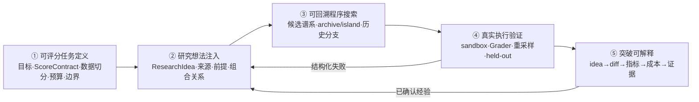
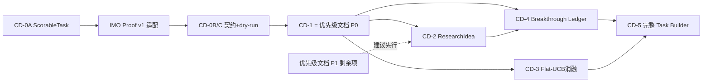

# Computational Discovery 产品设计（底层公式与 CD-0..CD-5）

> 状态：设计稿 v1.1（2026-07-20）。当前 `GitWorkspace` 与
> `AgentSessionProposer` 已落地，下一阶段的产品瓶颈从“候选如何修改”转为
> **“用户如何只提供 `grade_func + seed_agent` 就启动一次可信进化”**。
> 定位：**产品设计轨**，与 [EvoHarness.md](../docs/EvoHarness.md)（证据驱动优先级）配对——
> 本文由产品公式（愿景）驱动，**不按"测到的痛 × ROI ÷ 依赖深度"排序**；
> 各阶段进入执行的门槛见 §3 执行序。
> 前置阅读：[EvoHarness.md](../docs/EvoHarness.md)、[research_copilot_design.md](../docs/research_copilot_design.md)、
> [hypothesis_generation_product.md](../todo/hypothesis_generation_product.md)、
> [strategy_roadmap.md](../todo/strategy_roadmap.md)。
> 与优先级文档的耦合点只有两个：**CD-0**（最小任务入口与评分契约）与
> **CD-1**（= 优先级文档 P0 的可信评分验收）。其余 CD-2..CD-5 均为后置设计。

## 1. 底层产品公式

EvoHarness 的底层产品公式定义为：

> **可评分任务定义 + 研究想法注入 + 可回溯程序搜索 + 真实执行验证 + 突破可解释**

它描述的不是五个 UI 功能，而是一条不可拆断的发现链：只有问题可评分，搜索才有方向；
只有想法与代码分离，才能判断"想法错"还是"实现差"；只有保留完整谱系，搜索才能从
停滞路线回到历史 stepping stone；只有真实执行和 held-out 验证，提升才不是模型自评；
只有把突破还原成想法、diff、指标与成本，搜索结果才能成为可复用的科学知识。



### 1.1 五项底层能力的工程含义

| 能力 | 必须成为的一等对象 | 当前基础 | 主要缺口 |
|---|---|---|---|
| **可评分任务定义** | `ScorableTask + ScoreContract + EvalProtocol` | `TaskBundle`、`GradeFn`、`Grader`、`GitWorkspace`、远程评估协议 | 缺 `ScorableTask.from_directory()`、面向工作区的 grade 契约和框架内置 adapter；任务作者仍需理解内部 `Grader` |
| **研究想法注入** | `ResearchIdea`（来源、前提、父 idea、适用条件） | `task_sys_msg`、`research_msg`、inspiration、C3、人工 directives | idea 仍是 prompt 文本，无法独立统计"想法质量"和"实现质量"，概念重组不可审计 |
| **可回溯程序搜索** | 不可变 Candidate DAG + 可插拔搜索策略 | Population、island、archive、五种 ParentSelector、checkpoint、Git 多文件候选、Agentic 修改循环 | 缺显式 visit/acquisition 账本和 Flat-UCB 消融；还需用多个任务验证同一运行时 |
| **真实执行验证** | 带 provenance 的 `EvalReport` 分布 | sandbox、anti-hack、StagedGrader、RemoteGrader、structured feedback | P0.1 重采样/LCB 未落地；held-out 晋升门、跨版本精英重评仍待完成 |
| **突破可解释** | append-only `Breakthrough` 事件与证据链 | lineage、diff、metrics、Insights/Findings UI | 尚未机械定义"确认突破"；缺 idea→code→result→cost 的统一链和负结果回流 |

### 1.2 信任与可进化边界

五项能力不是同等可编辑：搜索可以改程序、组合 idea、选择历史节点，但不能修改定义胜负
的系统。边界固定如下：

```text
可进化：ResearchIdea、候选程序、搜索策略配置、prompt/经验检索策略
只读：TaskSpec、ScoreContract、数据版本、Grader、held-out、Sandbox、Budget、审计日志
外置裁决：结果签名、版本一致性、反作弊、晋升/回滚门
```

任何"突破"必须来自边界外的 Verifier；候选或研究 Agent 自报的成功只能记为 proposal，
不能直接进入 archive 冠军或 Findings 事实层。

## 2. 实施阶段 CD-0..CD-5

这条产品公式不另起一条与优先级文档 P0–P3 竞争的路线。正确顺序是：先用 CD-0 暴露
最小任务入口并完成跨域迁移，再用 P0/CD-1 把评分做可信；随后补 idea 与突破账本，
最后才比较搜索算法和建设完整 Task Builder。

### CD-0 最小可评分任务入口（立即做）

目标：建立类似 Verl 的清晰产品边界。用户只负责“什么算好”和“从哪里开始”；
EvoHarness 负责复制候选、让 Agent 修改、执行、评分、选择、归档与恢复。

```python
task = ScorableTask.from_directory(
    seed_dir=HERE / "seed_agent",
    grade_func=grade_func,
    main_file="solver.py",
    task_sys_msg=(HERE / "sys_msg.md").read_text(),
)
```

#### CD-0A `ScorableTask v0` 与工作区评分

- [x] 新增 `WorkspaceGradeFn`：输入候选工作区路径和 `GradeContext`，返回现有
  `GradeValue`（`Grade | dict | float | int`）；不再把单文件源码字符串作为通用任务边界。
- [x] 框架内置 `WorkspaceGradeFnGrader`，统一完成异常归类、结果归一化与
  `Grade/GradeValue → EvalReport` 转换。任务作者不再手写 `Grader` adapter。
- [x] 新增 `ScorableTask.from_directory(seed_dir, grade_func, ...)`：自动把种子目录物化为
  `GitWorkspace`，生成内部 `TaskBundle`、Grader 与初始 Candidate。
- [x] 保留现有单文件 `GradeFn` 作为便捷入口；它是 `WorkspaceGradeFn` 的 adapter，
  不是另一套执行管线。
- [x] 核心包不得反向 import `experiments/*`；任务专有 solver、prompt、judge 和依赖全部
  留在任务目录。

#### CD-0B `ScoreContract v0`

- [ ] 最小字段：优化方向、失败分、主指标、随机性/重采样来源、最低有效样本数、
  task/grader/dataset 版本或哈希。
- [ ] `ScorableTask` 为确定性任务提供安全默认值；只有非默认语义才要求用户显式填写。
- [ ] `ScoreContract` 只描述裁决规则，是只读 IR；不负责渲染 prompt，也不允许候选修改。

#### CD-0C dry-run 与可重建性

- [ ] 正式搜索前运行 seed smoke test：能否完成、分数是否有限、超时/依赖是否明确。
- [ ] 对声明为确定性的任务做最小 replay；对随机任务报告样本方差和建议重采样数。
- [ ] manifest 记录种子、任务、grader、数据、模型与运行配置指纹；held-out 不可见性作为
  conformance check，而不是 prompt 约定。

验收：

1. IMO Proof 已删除 adapter 内的任务专有 `IMOProofGrader`，改用通用 ScorableTask 和任务 `grade_func`。
2. IMO Proof 的候选面已收敛为 `grade.py + seed_agent/ + 薄组装`，
   不复制 transport、tool loop、workspace、executor 或 RPC 代码。
3. 同一 API 同时运行单文件与多文件候选；失败统一进入结构化 `EvalReport`。
4. 从 manifest 和 seed 可重建评分环境；任务升级不会与旧分数静默混排。

六实体关系图（Finding / Proposal / ResearchIdea / Breakthrough / Experience / Directive）
不再是最小任务入口的硬前置。它在 CD-2/CD-4 启动前统一，以免“先设计完整研究本体”
阻塞第一个可用产品接口。

### CD-1 先完成可信评分底座（= 优先级文档 P0 的产品化验收，最高优先）

目标：让 Search、Archive 和 Breakthrough 消费"确认后的表现"，而不是单次幸运分数。
本阶段**不新增工作项**——它就是 [EvoHarness.md](../docs/EvoHarness.md) P0.1/P0.2/P0.3 的落地，
以下仅补充产品侧验收口径：

- [ ] 落地 P0.1 的重采样能力与 `mean/std/n/lcb`；原始单次 report 全保留，聚合不覆盖证据。
- [ ] 明确三种数据角色：search/validation 用于迭代，held-out 只用于晋升确认；任务不支持
  held-out 时必须在 manifest 中显式声明，而不是伪装成泛化结论。
- [ ] `ScoreContract` 声明方向（max/min）、多指标聚合、失败值、随机性来源、成本、最低
  有效样本数和 breakthrough 最小效应量。
- [ ] archive 冠军、模型/算子 reward 和 Breakthrough 一律消费 LCB 或复评确认值；保留
  raw best 仅用于诊断。
- [ ] 完成 P0.3 的版本指纹和跨版本精英重评；不同 ScoreContract 的分数禁止同池排序。

验收：同一候选重复评估能产出稳定置信区间；"新冠军"必须跨过噪声地板并通过 held-out
或任务声明的替代确认门；改变 fitness 后旧冠军不会静默保留。

触及：`evocore/population.py`、`interfaces.py`、`loop.py`、`evoserve/grading.py`、
`evoguard/report.py`。

### CD-2 ResearchIdea 一等化与概念重组（建议 P1 之后启动——先修已测浪费，非结构依赖）

目标：把"研究什么"和"代码怎样实现"拆开，能分别评价 idea 与 implementation。

- [ ] **启动前先统一六实体关系图**：Finding / Proposal / ResearchIdea / Breakthrough /
  Experience / Directive 的引用、确认和存储边界，并与
  [research_copilot_design.md](research_copilot_design.md) §3 reconcile；这是 knowledge
  store 的前置，不是 CD-0 任务 API 的前置。
- [ ] 新增 `ResearchIdeaStore`（先 SQLite/JSONL 均可），保存来源、前提、负证据、父 idea、
  关联 runs/candidates 和当前结论。
- [ ] 一个 idea 允许多次独立实现/多父代展开；idea 的收益不能由单个最好孩子定义，使用
  确认成功率、最佳 confirmed LCB、平均成本和跨父代复现共同描述。
- [ ] 新增 `idea_recombine` 外环算子：先比较两个 idea 的机制、互补点和冲突，再产出新的
  结构化 ResearchIdea；之后由现有代码算子实现，不直接拼接两份源码冒充概念组合。
- [ ] `research_msg`、C3 experience 和 human directives 逐步从无身份文本迁移为带
  provenance 的 idea/reference；prompt 只是 ResearchIdea 的一种渲染视图。
- [ ] 负结果回写 idea：区分 `idea_falsified / implementation_failed /
  evaluator_inconclusive / infra_error`，禁止把编译失败解释为科学假设失败。

验收：可以回答"哪个 idea 在多个父代/实现上稳定有效""哪个 idea 很好但实现成功率低"
"哪次概念重组产生了真正增益"，而不只是查询最高 fitness 候选。

建议先服务 Research Copilot 与 modmul 方法族分析；与独立 Hypothesis Generation 产品的
关系见 [hypothesis_generation_product.md](../todo/hypothesis_generation_product.md)，
此阶段不建设独立 Discovery 前端。

### CD-3 可回溯搜索策略消融（依赖 CD-1）

目标：吸收 ERA 的 Flat-UCB 思路，但把它作为可插拔、可证伪的 ParentSelector，而不是
凭论文结论替换现有 population/island 机制。

- [ ] 新增 `FlatUCBSelector`：节点记录 `visit_count / rank_score / acquisition_score`，
  从可选历史节点全局/岛内选最大 acquisition 后扩展，并向祖先回传 visit。
- [ ] RankScore 必须基于 confirmed LCB；不得用单次 raw fitness 复制 ERA 参考实现。
- [ ] 保留 `WeightedSelector`、Beam 和 islands，做相同模型、token、评估次数与 wall-clock
  预算下的消融：`best-of-N / weighted / beam / flat-UCB`。
- [ ] 同时报告 best confirmed score、time-to-first-breakthrough、探索覆盖、无效评估率、
  每美元提升与跨 seed 方差；不能只比较单次最高分。
- [ ] 只有跨至少两个任务或多个独立 run 显著优于当前默认，才考虑升级默认策略。

实现注意：现有 `children_count` 折扣已经提供弱探索压力，Flat-UCB 的新增价值必须通过
"停滞后回到历史 stepping stone 的效率"证明；若只是换一种排名公式，不值得增加状态。

触及：`evocore/selection.py`、`population.py`、checkpoint schema、evoweb lineage/
breakthrough plot。

### CD-4 Breakthrough Ledger 与解释产品面（可与 CD-2 并行）

目标：从"展示最高分曲线"升级为"解释为什么发生了可信跃迁"。

- [ ] Breakthrough 机械判定：超过上一 confirmed frontier 的最小效应量，置信区间满足门槛，
  且无关键 held-out 回归；其余只记 candidate improvement。
- [ ] 自动生成净 diff、行为差异、分指标 delta、引入/废弃的 idea、祖先路径、评估成本、
  复评结果和已知风险。
- [ ] 区分三类跃迁：`method`（机制变化）、`implementation`（同 idea 更好实现）、
  `evaluation`（评分/数据变化；不得计为算法突破）。
- [ ] 在 Insights 中增加 breakthrough 卡和 search breakthrough plot；所有结论复用现有
  evidence chips 深链，不生成脱离数据的自然语言庆功稿。
- [ ] 保存"看似突破但复评失败"的 negative breakthrough，作为 lucky-winner 和评估噪声
  的一等研究资产。

验收：研究者能在五分钟内回答"哪一处变化造成提升、提升在哪些条件成立、花了多少钱、
是否通过复评、可能牺牲了什么"，并能从结论直接跳到原始证据。

触及：`evoviz`、`evoweb` Insights/lineage、Research Copilot playbooks。

### CD-5 Scorable Task Builder 产品化（多域接入走通、CD-0 协议稳定后）

目标：把 CD-0 的代码级最小入口升级为完整向导/UI；它负责降低非框架开发者的接入成本，
不再承担“第一个可用任务 API”的职责。

- [ ] 引导用户定义目标、可变异面、score 方向/聚合、数据切分、随机性、资源、超时、
  依赖、反作弊规则与交付产物。
- [ ] 自动生成 `TaskSpec`、grader adapter、最小 seed、smoke tests、protocol conformance
  tests 和 manifest；生成后必须由任务作者审阅。
- [ ] 提供 dry-run：seed 能否完成、评分是否有限、相同代码是否可重放、随机性有多大、
  held-out 是否隔离、候选能否读到目标函数或答案。
- [ ] 在正式搜索前给出"可评分性报告"：指标是否可被投机、是否只奖励短期表现、评估成本
  是否支持数百次搜索、哪些科学价值没有进入 score。
- [ ] 第二个外部任务成功接入后再决定是否抽出 `evowire` 包和独立 Task Marketplace。

验收：一个外部任务方无需理解 EvoHarness 内核，只依照向导与协议即可接入；TaskSpec
足以重建评分环境；任务升级会正确失效旧缓存并阻止跨版本错误比较。

## 3. 推荐执行序与依赖

```text
CD-0A ScorableTask + WorkspaceGradeFn ✅
→ IMO Proof v1 适配 ✅
→ CD-0B ScoreContract + CD-0C dry-run/版本指纹
→ CD-1 重采样、LCB、held-out、版本冻结（= 优先级文档 P0）
→ 优先级文档 P1 剩余的 repair 节流等已测浪费
→ 六实体关系图 → CD-2 ResearchIdea + CD-4 Breakthrough Ledger
→ CD-3 Flat-UCB 等搜索策略消融
→ CD-5 完整 Task Builder 向导/UI
→ P3 元进化 / 独立 Hypothesis Generation 产品（仍以后置门槛为准）
```



## 4. 明确不做

- 不把 `fitness: float` 重新降级为唯一评价契约；Flat-UCB 只能消费完整 EvalReport 的
  确认聚合值。
- 不把 ResearchIdea 做成一段无 ID、无来源、不可回溯的 prompt blob。
- 不把 raw best、公开榜单提升或模型自评直接命名为 scientific breakthrough。
- 不允许候选、Research Copilot 或元进化 recipe 修改 ScoreContract、Grader、held-out、
  Sandbox、Budget 和审计记录。
- 不因 Google 产品有"数千并行变体"就提前扩吞吐；先证明单位评估信息价值，再扩计算。
- 不复制复杂多 Agent 角色图；Proposer/Critic/Selector/Verifier 接口稳定前，角色数量没有价值。
- 不让 Task Builder 隐藏目标函数缺陷；它必须暴露"没被评分的价值"，而不是制造虚假完整性。
- 不要求任务作者实现 EvoHarness 专有 `Grader` adapter，也不在每个任务里复制
  transport、Agent loop、workspace、executor 或 RPC。
- 不用完整研究本体阻塞 `grade_func + seed_agent` 的最小任务入口；六实体 schema 只在
  ResearchIdea/Breakthrough store 开工前冻结。
