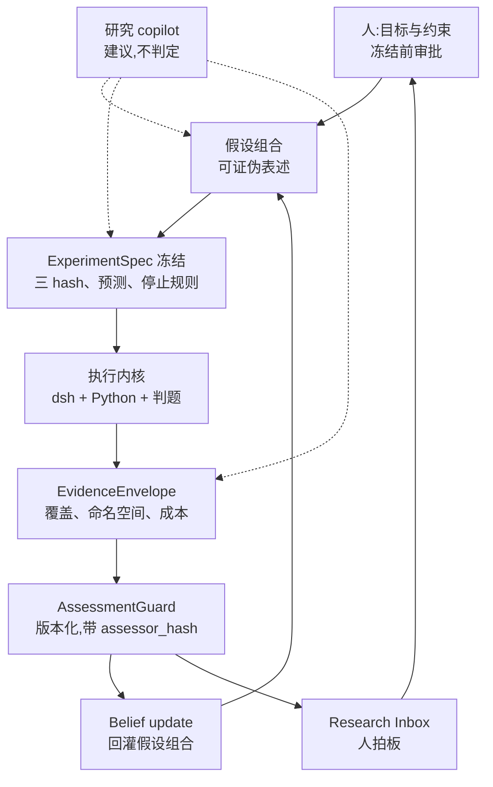
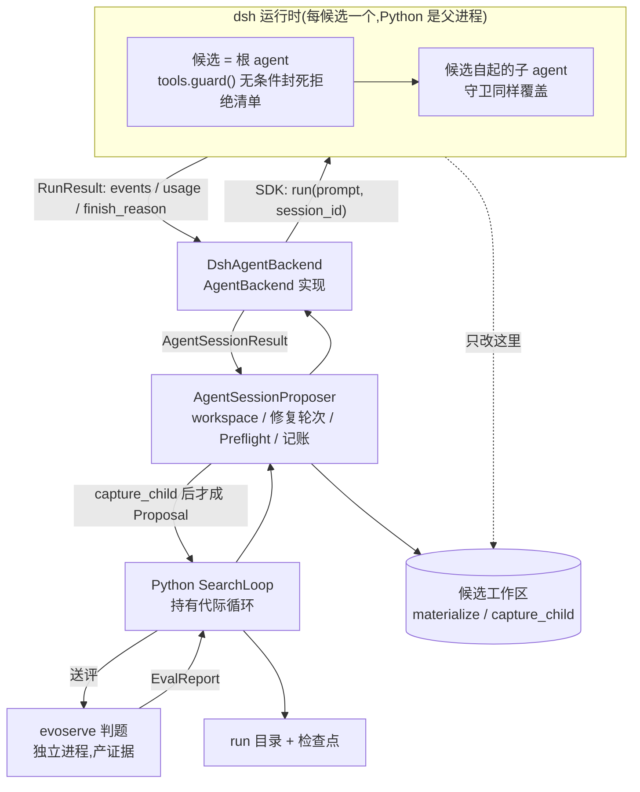

# EvoHarness 接 dsh:Agent Backend 实现与外壳可选倒置(DH-0..DH-6)

> 状态:**v10(2026-09-01)—— dsh 包归属收进 EvoHarness(DH-3.8);研究模式取代 demo 外壳、demo 已删(DH-3.7);证明模式已做成 dsh agent preset(DH-3.6);v8(2026-08-27)—— 带 Lean 的单题闭环已跑通,上游 854 个提交已合入**。架构与接缝自 v1 未变:仍是现有 `AgentBackend`,`SearchLoop` / `_execute_plan` / `AgentSessionProposer` / `SingleShotProposer` 零修改(已验证,且在跨 854 个提交的合并后复验)。逐版进度见下面几段。对象:[deepseek-harness](/Users/zhangkang/Documents/Projects/deepseek-harness/)(`@deepseek-ai/dsh`,MIT,developer preview)。以下 dsh 侧路径均相对该仓库根。配对文档:[research_layer.md](research_layer.md)(治理层)、[eval_protocol.md](../docs/eval_protocol.md)(评估信任边界)、[DSH 集成.md](DSH%20集成.md)(两张架构图)。
>
> **v5(2026-08-18 晚)** 的三处改判仍然有效,不再重复陈述:①`cost_usd` 的价目表方案**作废**(成本统计是次要信号,不得写死在代码里、不得变成阻断项);②`finish_reason` 的词表是 dsh 的 `TurnEndReasonMap` 六个成员,不是 provider 的 finish reason;③三个不可强制的 limit 风险**下调**——`_ProposalUsage.absorb` 在调用方一侧 fail-closed。整篇取代 v4 及更早。
>
> **当前进度一句话(v8,2026-08-27)**:**跟上了上游 854 个提交,零冲突**——「dsh preview 破坏性变更」这条风险第一次被真实检验,结论是接缝选对了(见 §5 的 DH-4 合并记录)。同一批改动里补上了 DH-4 欠了最久的那张证据:沙箱边界这次是**真的从沙箱里写了一次**,而不是读 `writableRoots` 的代码推出来的;顺带发现**候选的编辑器从来就没在沙箱里**。仍未清的两项:候选的读那一侧完全没堵;`evo_start` 只能起进化跑。
>
> **v7(2026-08-25)**:**带 Lean 的单题闭环真的跑通了**——run `etp_one_dsv4` 第 1 代 fitness 1.0,`judge_cached: false`、6.9 秒,Lean 真的编译了那份证书。DH-0..DH-3 承重项全部闭合,DH-4 的对抗测试与审批循环已补,DH-5 第一、二层可用、第三层仍未做。v7 记的是这次演示暴露的四条缺陷(其中一条经核查**不成立**,记为更正)与随之挖出的第五条:**`turn/end` 的失败原文一直被丢掉,五代失败只留下一个词**。
>
> **v6(2026-08-20)**:DH-0、DH-1 完成;**身份已进 `spec_hashes`,决定四成立**——换 cordis 配置或换 runtime 入口再 resume 旧 run 目录会被现有指纹不符路径拒掉,换机器路径不会被误拒。治理层人类入口的空缺已部分补上:`evoharness/readout/` 提供只读读出,`evoharness/launch/` 提供不阻塞的起跑,DH-5 第一、二层因此有了可调用的 Python 面。
>
> 一句话定位:**dsh 执行一次 Agent 循环,Python 驱动搜索与裁决**。dsh 出运行时——模型、工具、沙箱、会话日志;EvoHarness 出算法与裁决——种群搜索、修复策略、证据契约、研究治理。二者之间是 `AgentBackend` 这一个方法,不是嵌套控制流。

## 1. dsh 侧能力盘点

- **`python/sdk` 的 `DeepSeekHarness` 是最短路径(v4 新增,已实测)。** 它按配置拉起一个 dsh 运行时子进程并持有其生命周期,`run(prompt, session_id=...)` 跑完一次会话后返回 `RunResult{session_id, final_response, finish_reason, events, notifications}`。`cwd` 决定候选工作区,`cordis` 写进 `DSH_CORDIS_CONFIG` 决定这个运行时挂哪些插件,`close()` 回收进程。**Python 是父进程,dsh 是子进程**——反向 RPC 不再是必需品。
- **树外插件是一等公民,不用 fork。** 普通 npm 包在 `package.json` 里声明 `dsh.bundle` 指向一个 `cordis.patch.yml`,入口可以是纯 JS;`dsh plugin` 子命令把剩余参数转发给 profile 目录里的 pnpm (`apps/cli/src/args.ts:171`)。走 SDK 路径时更简单:一份完整 cordis 配置文件即可,不经 profile。
- **没有特权内核**:agent loop 本身也是插件,一切可从配置替换。
- **`ctx.subagents`** 是可编程 seam,不只给模型用:`start()` 接受 output schema、tool filter、persona、depth limit;能力不支持时抛 `SubagentError('UNSUPPORTED_CAPABILITY')` 而不是接受后静默忽略。
- **`ctx.subprocess`** 是受管子进程 seam:detached 进程树、有界收集/spill、先终止再等待退出的 dispose。**仅在可选的反向 RPC backend 里才需要**(§4.2)。
- **`--dump-config`** 打印的合成配置树与 `boot()` 实际挂载的内容一致,因此可哈希;走 SDK 路径时身份锚点改为 cordis 配置文件的内容哈希(决定四)。
- **usage 从会话日志可得(已实测)。** `assistant/message` 事件带 `usage`(`packages/core/session/src/types.ts:273`),Python 从 `RunResult.events` 自行汇总,不需要 TS 侧聚合再回灌。

**回源码后改掉的三处判断:**

**其一,隔离候选能力的正确原语不是工具过滤,是 `tools.guard()`。** `ToolRestriction` 只是 `{allow?, deny?}` 的**全局工具**可见性掩码 (`packages/core/tools/src/index.ts:680`),文档原话是"restrictions intersect and do not affect scoped registrations" ——**作用域内注册的工具它管不着**。真正管用的是 `tools.guard()` (同文件 :1110):一个在 `tools/pre-execute` 瀑布**之后**、工具体**之前** 执行的单调守卫,返回字符串即拒绝;注释写死了"no guard can force-allow a call another guard denied"。**已在 DH-0 实测证实**(§5)。

**其二,长跑的耐久性不能指望 job 注册表。** `JobStart.owner?: Agent` 的注释明说"agent disposal cancels and awaits the job"(`packages/jobs/jobs/src/types.ts:62`),而 `jobs-local` 是**进程本地** 注册表。**耐久性归 EvoHarness 的检查点。** 走 SDK 路径时这条自动成立:进程树的根就是 Python。

**其三(v4 新增),候选的委派深度是 0,不是 1。** 走 SDK 路径时每个候选拥有**自己的 dsh 运行时**,它是那个运行时的**根 agent**。按"深度 ≥ 1 才拒绝"写的守卫会把候选整个放过去。**已实测**:smoke 打出 `callerDepth: 0`。守卫判据必须改为无条件拒绝(决定三)。

## 2. 两层架构

接线分两层看:上层是研究闭环(谁提出、谁冻结、谁判定、谁拍板),下层是执行内核(进程、Agent 执行、判题、检查点)。两层之间只有一个接口——上层递进冻结好的 `ExperimentSpec`,下层递出 `EvidenceEnvelope`。中间发生了什么,治理层不需要知道;判定用什么规则,执行层无权干预。

### 2.1 研究闭环(v3.1 原图,不变)



三处是刻意画成这样的:

- **copilot 的虚线够不到 `AssessmentGuard`**。它在假设分解、实验设计与证据解读上出力,但判定那一格不归它(决定六)。
- **信念更新与 Inbox 都挂在判定之后**,不与判定并联;没有一条路径能让信念绕开 `AssessmentGuard` 更新。
- **`ExperimentSpec 冻结` 单独占一格**。它才是把 task/run/search 三个 hash、prediction_claims 与 stopping_rule 一起钉死的对象,`run_experiment` 的 `verify_refs()` 靠它拒跑漂移实验。

### 2.2 执行内核(v4 改画)



`evoserve` 与 `run 目录 + 检查点` 画在 dsh 运行时**外面**不是排版方便:前者是决定二的信任边界,后者是决定一的耐久性归属。dsh 运行时死掉,检查点还在。

**工作区那条虚线是权威边界**:dsh 只往 `workdir` 里写,Python 用 `workspace.capture_child(workdir)` 重新读回来才形成 Proposal。**backend 自报"我改了"不作数。**

**已知未画**:晋升与参照物(`PromotionPolicy` / `ReferenceStore`)是独立于信念更新的另一条反馈路径,它今天在 EvoHarness 里还没有生产调用方(见 research_layer.md 的 I-5 收尾记录),应在本计划之外单独补。

## 3. 六条设计决定

**决定一:控制流与耐久性都归 Python;dsh 只执行一次 Agent 循环。** `SearchLoop.run()` 原样跑在 Python 进程里——种群、档案、rng、断路器、检查点、停机理由,权威全在 Python。dsh 提供的是**一次模型/工具循环**,通过 `AgentBackend.run()` 这一个方法进出。**run 的真实身份是 run 目录 + 检查点**;dsh 运行时是每候选一次性的,崩了就是一次 backend 失败,由现有 `proposer_dead` 路径接住。

**v4 修订**:v3.2 里"dsh 是宿主、Python 是被 spawn 的引擎"这个进程关系**不再是主线**。走 SDK 路径时 Python 是父进程。dsh 会话当运行入口的形态保留为可选的第二 backend(§4.2),它是体验问题,不在关键路径上。

**决定二:证据主权不转移。** dsh 的会话日志遵守"模型可见即已记录",它是**模型上下文的来源**,不是评测判定的来源;格式随版本演进且无兼容承诺。EvidenceEnvelope 仍是唯一事实层,构造与落盘全程发生在 Python 进程内。dsh 的 `session.event` 流以**冷 trace 副本**身份归档进候选工件——建议**同时**保留 dsh 原始日志与翻译后的 `AgentEvent`,因为翻译是有损的。session log 什么都记,顺手拿它当证据是最省事也最错的一步。

**决定三:候选能力靠单调守卫封死,不靠可见性(v4 改判判据)。** 每个走 agentic lane 的候选由一个**独立的 dsh 运行时**执行改写;single-shot lane 仍走 Python 基线。隔离分两层,**顺序不能颠倒**:

1. **`tools.guard()` 是承重的那层**——插件注册一个全局守卫,拒绝 `cordis_define` / `cordis_run` / `cordis_stop` / `cordis_undefine`、`tool-ask-user`、`tool-web`。单调、不可被顺序绕过、在工具体之前执行。
2. **`tools.restrict()` 是纵深**——把这些工具从可见集合里也去掉;但它只管全局工具,**不能当作安全边界**。

**v4 修订(承重)**:判据**不是**委派深度。整个运行时的存在意义就是跑这一个候选,所以拒绝**无条件生效**,包括根 agent。v3.2 写的"对候选子 agent 拒绝"在 SDK 架构下等于不设防——候选就是根 agent。

拒绝清单是封闭集合,进 cordis 配置因而进身份哈希——**改清单 = 改身份 = 新实验**。理由:插件树**就是**运行环境,能挂插件的候选可以改写搜索本身。

**决定四:身份是候选运行时的完整定义,且必须进 resume 校验(v5 去掉价目表)。** `RunSpec.proposer_backend` 的 `ComponentSpec.config` 记:

- dsh 版本
- **候选 cordis 配置文件的内容哈希**(取代 v3.2 的 `--dump-config` 输出哈希——SDK 路径不经 profile)
- provider / model
- 守卫拒绝清单
- backend 声明的**不可强制 limit 清单**(读 trace 的人要知道当时哪些上限只是摆设)

~~价目表~~ —— **v5 删除**。价格不影响候选能干什么,不该改变实验身份;`DshRuntimeSpec.identity()` 已按此实现。

该哈希进 checkpoint 指纹。换配置后对同一 run 目录 resume,Python 按现有指纹不符语义直接拒绝。dsh 升级即换身份,没有热升级。

**v6 已闭合。** `DshRuntimeSpec.fingerprint()` 现在进 `RunSpec.proposer_backend` 的 `ComponentSpec.config`,顺着 `frozen_spec_hashes` → `checkpoint_configs` → `SearchLoop._config_fingerprint()` 走到已有的"指纹不符即拒"路径,不需要改 `RunSpec` 的字段语义。装配顺序也跟着改了:dsh backend 必须在 `RunSpec` **之前**构造,否则被哈希的仍是 transport。

`identity()` 与 `fingerprint()` 分成两个方法是刻意的,**因为它们回答的不是同一个问题**:

- `identity()` 回答"这次跑用的是哪份文件",带绝对路径,进 manifest 给人看;
- `fingerprint()` 回答"两次跑算不算同一个实验",**不含任何绝对路径**——cordis 与 runtime 入口都换成内容哈希。

按路径判同一性两个方向都会错:同一份 checkout 换台机器会被误拒(和 `source_dir` 那次是同一个 bug),而路径没变、文件内容改了则漏判。内容哈希两边都对。已有变异对照:把绝对路径塞回 `fingerprint()`,三个用例立刻红;把 dsh 分支短路掉,四个用例立刻红。

**决定五:治理留在 EvoHarness,不迁进 dsh 的审批 seam。** dsh 的审批是会话内操作级、同步、以秒计;Research Inbox 的决策是跨天治理级、异步、要证据引用与署名。两者粒度不匹配,合并会让其中一个变形。决定仍只认 `InboxStore` 的 actor 鉴权路径。

**v5 澄清:这一条拒的是"拿 dsh 的审批机制当决定的载体",不等于拒绝 dsh 参与治理。** 两件事必须分开:

- **迁移机制**(把 Inbox 换成 dsh 的 approval)—— 拒绝,理由如上。
- **当输入设备**(人在 dsh 会话里点一下,权威仍归 `InboxStore`)—— 有条件可行,见 DH-5 的三层切分。

`InboxStore.answer()` 的实际保护只有三条:`actor` 在 store 的白名单里、`action` 在这张卡的 `allowed_actions` 里、写一次即锁死;`require_decision()` 再绑 kind / experiment_id / **subject_hash**。**保护不在 store 里,在"谁被允许调它"**——能调 `answer()` 的进程就能以白名单里任何一个人的名义签字。旧 evoweb 服务端因此把 actor 绑在服务端,请求体里带 `actor` 直接 400。任何新的答复入口都必须沿用这个形状。

**决定六:copilot 建议,不判定。** 研究 copilot 可以在目标澄清、假设分解、实验设计与证据解读上出力,产物是叙述、Finding 与 DecisionRequest 草案。但 **verdict 不归它**:supported / contradicted / unknown 三态只能由带 `assessor_hash` 的 `AssessmentGuard` 产出,信念更新与 Inbox 卡片一律挂在判定之后(§2.1)。理由不是防 agent 说谎,是防**判定标准悄悄漂移**:LLM 每次解读的隐含阈值都不一样,而现行 assessor 的噪声下限有具体来历——IMO 终选在 12 题上取 argmax,validation 到 test 掉 0.206,点估计比较会把幸运种子当成优势。方向与 research_layer.md 的 I-7 约束一致。

**决定七:"什么时候算解开了"归任务,不归启动命令(v7 新增)。** 演示第 1 代就拿到 1.0,循环照常跑完五代,最后是人手动 kill 的。加早停容易,难的是那个数字该住在哪。

第一版写在 `evo_start` 的 argv 里(`search.stop_at_fitness=1.0`)——**这等于让启动器替任务断言它的分数上限**。ETP 这道题恰好是"判题器收或不收",满分就是 1.0;而一个 fitness 是加速比的任务,12x 才刚开始,1.0 会在第一代就把它停掉。**启动器不知道一个任务有没有天花板,任务知道。**

现在分两层:

- `SearchConfig.stop_at_fitness: float | None`,通用旋钮,缺省关。开放式搜索没有这样一个数,写错了就是在第一个走运的代结束运行。
- `CriterionSpec.solved_at: float | None`,判据自己声明的解开点。它进 `criterion.hash` → 任务 hash → 运行身份,所以**"这道题 1.0 就是解开了"成了实验身份的一部分**,而不是启动时随手带的参数。
- 交接和 `task_sys_msg` 那一行同形:任务给默认值,显式 `--set` 说了算。

两处刻意的收窄:

**`to_payload` 只在声明时才写这个键**,所以加这个字段没有让任何既有任务换身份。这不是为了让旧 run 能续跑而做的手脚——**一个没有"解开点"的判据,和有办法声明它之前是同一个判据**。对照钉住两个方向:不声明时 payload 里没有这个键,声明了必须换 hash(否则前一条就是靠"这字段谁也不影响"混过去的)。

**`solved_at` 配 `direction="minimize"` 直接拒。** 那种情况下人写下的是判据值,而循环拿去比的是 fitness(grader 已经调成越大越好)。照单全收会让运行停在与任务声明**相反**的条件上,而且下游没有任何东西能看出来。

早停要在**串行和批量两条路径上各写一次**。只写一条是那种"测过了"的缺陷:套件默认走串行,而真正的长跑几乎都开着 `eval_batch_size`。两条各有独立用例,变异对照确认互不覆盖。

⚠️ **`SearchConfig` 进 `config_fingerprint`,所以加这个字段改变了指纹**:v7 之前建的 run 目录只能读,不能续跑。这正是那条拒绝链该有的行为(配置形状真的变了),但要说在前面。

## 4. 接缝与两个 backend

### 4.1 接缝位置(不变)

切口是已经存在的 `AgentBackend`,不是 `Proposer`。`SearchLoop._propose` ([loop.py:801](../evoharness/core/loop.py:801))仍是 `_plan_proposal` → `_execute_plan` → `_absorb_proposal`,不感知 dsh。

`AgentSessionProposer` ([session_proposer.py:436](../evoharness/core/agent/session_proposer.py:436))**已经全包**了以下事项,backend 一概不碰:

- workdir 的建立(`workspace.materialize(temp)`)与读回(`workspace.capture_child(workdir)`)
- 修复轮次与 feedback 组装、`ProposalPreflight`
- event sink 的开关与 `release()` 的调用时机
- 跨轮次 usage 聚合、transcript、`ProposeResult` 构造

因此 **`DshAgentBackend` 只有一件事**:拿到一个已经铺好的 workdir,跑完一次初始或恢复的 Agent 循环,返回归一化的 `AgentSessionResult`。

```text
Python SearchLoop
  -> AgentSessionProposer            # workspace / 修复 / Preflight / 记账
      -> DshAgentBackend.run(AgentSessionRequest)
          -> DeepSeekHarness.run(user, session_id=...)   # 一次 dsh 会话
      <- AgentSessionResult
      -> ProposalPreflight;repairable 时携 feedback + 同一 session_id 再 run
      -> workspace.capture_child(workdir)  # 权威读回
  -> SearchLoop admission / novelty / grade / population / checkpoint
```

### 4.2 两个 backend 实现

| 实现 | 传输 | 状态 | 换来什么 |
|---|---|---|---|
| `DshAgentBackend`(SDK) | `python/sdk` 的 `DeepSeekHarness`,Python 是父进程 | **主线**,smoke 已跑通 | 零 TypeScript,最短路径 |
| `ReverseRpcAgentBackend` | `ctx.subprocess` 双向 JSON-RPC,TS 是父进程 | **推迟,不删** | dsh 会话当运行入口 |

两者实现同一个 `AgentBackend` 协议,可以并存。第二个只有在"从 dsh 聊天界面里起一次进化跑"这件事被证明值得那份 TS 维护成本时才做。

**契约映射(SDK backend):**

| `AgentSessionRequest` | 对到 SDK | v5 状态 |
|---|---|---|
| `system` | `DSH_SYSTEM_PROMPT` → cordis 里的 persona | 真实跑已验 |
| `user` | `harness.run(user)` | 真实跑已验 |
| `workdir` | `DeepSeekHarnessConfig.cwd`,每候选一个 | 真实跑已验(两次提案两个运行时目录) |
| `session_id` | `harness.run(session_id=...)` 续跑同一会话 | **仅单元测试**——真实跑 `repair_rounds: 0`,恢复路径没被走到 |
| `event_sink` | 逐事件翻译后 emit | 真实跑已验 |
| `preflight` | **不出 Python 进程**,backend 看不到 | 设计如此 |
| `feedback` | 恢复轮只送 feedback,不重复原任务 | **仅单元测试** |

| `AgentSessionResult` | 从哪来 | v5 状态 |
|---|---|---|
| `session_id` / `final_message` | `RunResult` 同名字段 | 真实跑已验 |
| `prompt_tokens` / `completion_tokens` | 汇总 `assistant/message.usage` | 真实跑已验(3395/747、27314/2838) |
| `turns` / `tool_calls` / `elapsed_s` | 数 events / 计时 | 真实跑已验(6/6、10/15) |
| `events` | `session.event` → `AgentEvent` 翻译 | 真实跑已验,**有损**,未译类型按类计数上报 |
| `termination` | **`turn/end` 的 `reason.kind`** → `AgentTermination` | 真实跑已验为 `completed` |
| `cost_usd` | 可选价格,缺省 `0.0` + `cost_priced: false` | 真实跑为 0(未配价) |

**`termination` 的词表 v4 写错了,v5 更正。** 它不是 provider 的 finish reason,而是 dsh 的 `TurnEndReasonMap`([session/src/types.ts:155](/Users/zhangkang/Documents/Projects/deepseek-harness/packages/core/session/src/types.ts))六个成员:`completed` / `aborted` / `blocked` / `error` / `max-tokens`(连字符)/ `interrupted`。照 v4 那张 OpenAI 风格的表(`stop` / `length` / `content_filter`),**每一次真实会话都会落进 `PROTOCOL_ERROR`**,而用假事件写的单元测试一路绿。现有实现另有一个用例专门断言 provider 风格取值必须被拒,防这张表被改回去。

`finish_reason` 为 `None` 判 `PROTOCOL_ERROR` 而非 `COMPLETED`:SDK 返回 `None` 表示区间内**没有 `turn/end` 事件**,那是"结束方式未知",按成功处理会去给一个候选可能还在改的工作区打分。

## 5. 分阶段实施

### DH-0:可行性 spike —— 已完成(2026-08-18)

产物在 deepseek-harness 仓库 `packages/examples/evo-harness/`:守卫插件 `src/index.ts`、单元测试 `tests/guard.spec.ts`(6 例)、真实模型 e2e `tests/guard.e2e.ts`(3 例)、SDK 冒烟 `fixtures/smoke.py` 与候选配置 `fixtures/candidate.cordis.yml`。

- [x] **守卫验证(承重项)** —— 单元 6 例 + 真实模型 e2e 3 例,两套都做了变异对照(把判据改成永不生效,承重用例应声而倒)。实测证据:子 agent 调 `cordis_define` 被拒,**拒绝理由原文出现在子模型的报告里**——说明理由确实回到了模型上下文,而不只是记进了日志。
- [x] **`tools/pre-execute` 无法翻案** —— 挂一个抢在最前、不调 `next()` 的强制放行监听器,结果与不挂时逐字一致。单调性在真实链路上成立。
- [x] **嵌套穿透** —— 孙代(depth 2)同样被拒,且台账里的 agent id 与直接子代的 session id **不同**,证明被拒的确实是第二层。守卫从未为孙代注册过任何东西。
- [x] **枚举拒绝清单** —— 挂上 `tool-cordis` 后:四个挂载类工具全部落进拒绝集,三个 `cordis_inspect_*` 按设计留在允许集。**顺带发现:`tool-cordis` 与 `tool-ask-user` 在 `dsh-base` 和 `dsh-web-app` 里都没挂**,不显式挂载的话第二、第四轮测的是一个不存在的工具。
- [x] **程序化调 `ctx.subagents.start()`** —— `evo_spike_probe` 工具走通,拿到子 agent 的结构化返回与工作区改动。
- [x] **SDK 路径可行(v4 新增)** —— `fixtures/smoke.py` 实测:`DSH_CORDIS_CONFIG` 确实是插件注入口;候选 `callerDepth: 0`;`assistant/message` 里捞得到 usage;起一个运行时约 1 秒;工作区改动**由脚本读磁盘确认**,不采信模型自述。
- [ ] ~~`ctx.subprocess` 双向 JSON-RPC~~ —— **推迟**。SDK 路径不需要;只有做 `ReverseRpcAgentBackend` 时才回来做。
- [ ] ~~parent 存活性~~ —— **失效**。SDK 路径下 Python 是父进程,不存在"parent agent 挂在会话寿命上"这个问题。
- [ ] 树外 bundle 打包(`dsh plugin add`)—— 部分。插件经 `--patch` 与 `DSH_CORDIS_CONFIG` 加载均已验证,bundle 打包未做,不阻塞。
- [ ] `--dump-config` 连跑两次比对 —— 未做。SDK 路径的身份锚点改为 cordis 配置内容哈希,此项降级为可选。
- [ ] **沙箱 fail-closed —— 未验(记录在案)**。`candidate.cordis.yml` 已从 `danger-full-access` 改为 `workspace-write`,但**只验证了工作区内能写,未验证工作区外写不了**。

**停止线判读:守卫这一条过了。** 承重项、嵌套穿透、抗翻案三项都有真实链路证据,拒绝清单是封闭集合。

### DH-0.5:立即清账 —— 已完成(2026-08-21)

- [x] **守卫判据改为无条件拒绝**。旧判据 `depth < 1 就放行` 读起来是"候选是某个可信者的子 agent",而 SDK 架构下**每候选一个运行时、候选就是那个运行时的根 agent(深度 0)**——于是它每一次调用都走放行分支。守卫拦住的是它永远见不到的孙 agent,放过的恰好是它为之存在的那一个。**一次真实进化就是这么跑完的,而单元测试全程绿**,因为其中一个用例在断言"放行主 agent"是对的。

  现在判据只剩"名字在不在拒绝清单上"。**没有 agent 的调用也拒**——在一个每候选一个的运行时里,没有比候选更可信的调用方,无法归属的调用不是更安全的调用,只是记不下名字的调用。深度**仍然记进 ledger**(谁伸的手值得留档),但不再参与判定。

  那个编码了错误假设的用例**反转而不是删除**,判据要是回来,测试立刻红。变异对照:把 `depth < 1 就放行` 塞回去,2 例立刻红。

- [x] 修 `candidate.cordis.yml` 里那句过期注释。顺带写清 `workspace-write` 到底管什么:**只confine 改,不 confine 读**,所以候选照样读得到工作区上面那层 run 目录。堵这个是 DH-4 的事。
- [x] 提交现有产物。

### DH-1:`DshAgentBackend`(SDK 实现)—— 已完成(2026-08-18)

位置:`evoharness/core/agent/dsh_backend.py`,导出经 `evoharness/core/agent/__init__.py`。SDK 依赖是**懒导入**,框架包不硬依赖 dsh。测试:`tests/test_agent_dsh_backend.py`(24 例,假 harness,不需要 key),含变异对照。

- [x] **同 session 修复恢复** —— 会话表按 `session_id` 缓存运行时,恢复轮复用同一个;恢复轮的 prompt **只送 feedback,不重复原任务**(重复会读成第二个竞争请求)。⚠️ **仅单元测试覆盖**:真实进化跑里 `repair_rounds: 0`,恢复路径没被真实链路走到。停止线因此**保留**。
- [x] 会话表与 `release()` —— `release` 幂等、吞掉 `close()` 异常(teardown 失败不得掩盖真实提案结果);换了 workdir 还想 resume 直接拒(运行时 cwd 在构造时钉死,继续跑会去改上一个候选的目录)。
- [x] 事件翻译 —— `assistant/message` / `tool/call` / `tool/result` / `compaction/*` 映射,`SESSION_START` / `SESSION_RESUME` / `TERMINATION` 由 backend 自补。**未映射类型不硬塞进相邻 kind**(那是往耐久 trace 里写编造的事实),而是按类型计数挂在 TERMINATION 的 `data.untranslated_event_types` 上——有损翻译必须看得见。
- [x] `AgentTermination` 映射 —— 见 §4.2 的更正。映射不出来一律 `PROTOCOL_ERROR`,`None` 也判 `PROTOCOL_ERROR`。传输/启动异常返回 `BACKEND_ERROR` 而**不是 raise**:`_ProposalUsage.absorb` 在检查 termination **之前**跑,返回才能把失败会话的花费记上账。
- [x] ~~`cost_usd` 价目表~~ —— **v5 作废(用户 2026-08-18 决定)**。理由:可信花费账本只有 BudgetMeter 的 `budget.json`,这个字段至多是参考数;而 v4 的方案把它做成**构造时硬报错**,等于拿次要指标卡住新模型跑不起来,价目表还会随端点和时间静默过期。现方案:token 照记(会话日志里的观测事实),美元换算做成调用方可选传入 `price_usd_per_mtok`,缺省 `cost_usd = 0.0` 并在 trace 里标 `cost_priced: false`——**"没定价"与"免费"必须可区分**。
- [x] `AgentSessionLimits` 三项只能观测不能强制 —— 已确认 dsh 的 agent loop **没有任何 turn/step 上限配置项**;`UNSUPPORTED_LIMITS` 常量显式列出三项,并写进 `identity()` 与 SESSION_START 事件。**v5 新发现**:调用方一侧是 fail-closed 的——`_ProposalUsage.absorb` 在 `turns > max_turns` 或 `tool_calls > max_tool_calls` 时抛 `backend-error`。所以超限的代价是**浪费一次会话**,不是无上限烧钱。因此故意老实上报:少报以躲开这个检查,正是本文件禁止的静默忽略。
- [x] `SearchLoop`、`_execute_plan`、`AgentSessionProposer`、`SingleShotProposer` 零修改 —— 真实跑验证。

### DH-2:接线与身份 —— 一半(2026-08-18)

- [x] 接线 —— 没有新建 lane,而是给 `RecipeContext` 加了 `agent_backend` 覆盖位,由 `_build_proposer` 在 agent 模式下**替换**进程内运行时;`experiments/run_evolution.py` 加 `--dsh-config` / `--dsh-runtime`(必须成对)。替换而非包装是刻意的:外部运行时自带工具集、上下文策略与沙箱,`max_input_tokens` / `max_parallel_tools` / 压缩阈值对它一个都不适用,同时把 `tools` 清空——**manifest 不得列出候选从未见过的工具**。
- [x] 冷 trace —— `JsonlEventSinkFactory` 原样可用;SDK 的 `session_root` 指到 `<run>/dsh_sessions/`,dsh 原始会话日志与翻译后的 `AgentEvent` 并存(决定二要求的"两份都留")。
- [x] **身份进 `spec_hashes`** —— 2026-08-20 落地。`fingerprint()` 进 `ComponentSpec.config`,`build()` 把 dsh backend 挪到 `RunSpec` 之前构造。没有改 `RunSpec` 的字段语义:`ComponentSpec.config` 本来就是自由 dict 且整体进哈希。测试在 `tests/test_launch_build.py`(装配这一跳)与 `tests/test_agent_dsh_backend.py`(指纹本身),两个方向都有变异对照。
- [x] **提示词不再点名候选没有的工具(2026-08-21)** —— 查 DH-3 的真实工具集时发现的一个真缺陷:`workspace_agent` 一个开关同时在管"这是不是 agentic 会话"和"读的人能不能取别的候选",而这两件事在 dsh 后端下不再一致。后果是 agentic + dsh 时,提示词让候选调 `inspect_candidate` 和 `workspace_read`——**两个都是进程内工具的名字,而 `_build_proposer` 已经把工具表清空了**。其中参考程序那一处还**因为相信工具在**,把源码换成了文件清单,于是候选既没工具也没源码。`recombine` 的算子意图里也写死了这个名字。

  改法:`PromptBuilder` 接受 `peer_fetch_tool` / `workspace_read_tool` 两个工具名,`_history()` 改看前者而不是看模式;`recipes/common.py` **从 registry 推**(外加外部运行时的声明),不从模式推——重复那个条件就是下次再走散的方式。缺省值是"不点名、直接渲染源码":长一点,但点名一个不存在的工具是这次要修的失败本身。进程内两条路径的提示词字节不变。测试 `tests/test_prompt_tool_honesty.py`,变异对照:把判据退回 `workspace_agent`,4 例立刻红。

- [x] **dsh 侧的 `evo_inspect_candidate`(2026-08-21)** —— 候选在 dsh 下终于能按需取参考程序。三个决定:①**TS 不自己读 `run.db`**,起子进程调 Python,表结构只有一处知道;②**不做"过滤",做窄视图**——新增 `evoharness/readout/peer.py`,只构造固定那几个键,`hidden_metrics` / `stdout_log` / `stderr_log` 漏不出去不是因为被删掉,是因为那段代码从来没放进去过(拿 `report.to_json()` 删字段的做法,下次 `EvalReport` 加字段就默认漏);③**可达范围与进程内一致**(按 id 取任意已评测候选),收窄要改 `propose()` 签名,破"四个核心类零修改"。

  `DshRuntimeSpec` 加 `run_dir`(不进 fingerprint,同 `output_dir` 之理)与 `peer_fetch_tool`(**进** fingerprint:候选够得着什么就是实验是什么)。运行时拿到 `EVO_RUN_DIR` / `EVO_PYTHON` / `EVO_HARNESS_ROOT` 三个环境变量,都由 Python 侧给定而非在 TS 那边猜。TS 侧 `packages/examples/evo-harness/src/peer.ts`,argv 传参不过 shell(候选 id 是模型写的),退出码 2 当作可回给模型的拒绝、其他退出码明说是部署坏了——**候选读到"未知候选"却其实是解释器崩了,会把剩下的轮次全花在猜 id 上**。

  ⚠️ **`peer_fetch_tool` 是声明不是探测。** Python 看不到运行时的工具表,指一份没挂这个工具的 cordis 配置又声明了它,提示词还是会撒谎。进 fingerprint 只保证两次声明不同的跑不会被当成同一实验。探测要 SDK 配合,未做。

  ⚠️ **这个工具不减少暴露面。** 候选手里有 bash,而 `workspace-write` 管改不管读,`sqlite3 ../../run.db` 照样能读到全部。它的价值是"提示词承诺的东西真的存在"和"受支持的路径干净",不是安全措施。绕过去的问题属于 DH-4。

- [x] **单发模式配 dsh 直接拒(2026-08-21)** —— 写接线测试时发现:`proposal.mode` 缺省是 `single_shot`,而这条 lane 在 `_build_proposer` 里**提前 return,根本不看 backend**。于是 `--dsh-config` 会被记进 `run_hash` 和 manifest,而每一次提案其实都走进程内 transport——**manifest 指名一个候选从没进去过的运行时**。和"给了 `--dsh-config` 不给 `--dsh-runtime`"是同一个失败,`build()` 现在照样拒。

- [ ] backend 对拍(fake 与 dsh 返回结构等价)—— 未做。
- [ ] 断路器语义测试(`proposer_dead` 路径)—— 未做;真实跑 `proposals_failed: 0`,失败路径一次没走到。

### DH-3:跑一次真实进化 —— 一半(2026-08-18)

**已跑通**:`--recipe e0 --task demo_counter --live`,2 代,3 次评测,`proposals_failed: 0`,`best_fitness: 1.0`,`stopped_reason: completed`。

- [x] agentic lane 的候选进种群并被评分 —— patch 是 `SOLVED = ["q0"]` → `["q0","q1","q2","q3","q4"]`。
- [x] 执行内核确实换掉了 —— 冷 trace 里候选用的是 **dsh 自己的工具**(`bash` 17 次、`str_replace_editor` 2 次、`evo_spike_tools` 2 次),不是 EvoHarness 的进程内工具集。两次提案两个 `dsh_sessions/` 目录,**每候选一个运行时**成立。会话规模:6 turns/6 tool_calls/25.9s 与 10 turns/15 tool_calls/103.4s。
- [ ] ~~成本对账~~ —— **随价目表一起作废**。`total_llm_cost: 0.0` 是设计结果不是 bug。**但留下一个真问题**:`--budget-usd` 现在对提案侧完全不起作用(BudgetMeter 收到的提案花费恒为 0),评测侧照常。要用预算停机,得先决定是给 backend 传价格,还是明确预算门只管评测侧。
- [x] **可回溯四跳(2026-08-21 实测 4/4)** —— 键搞清楚了:**跳 3 用 `proposal_id`,跳 4 才用 `session_id`**。链路是 候选 id → `metadata.proposal_id` → `agent_sessions/<proposal_id>/events.jsonl` → `metadata.session_id` → `dsh_sessions/<workdir>/<session_id>/session.jsonl`。真实 run 上四个 agentic 候选全通。

  审计的 traceability 检查跟着加严:原来只验"session id 在不在",现在还验**那个 id 指向的冷 trace 目录真的存在**——**指向空处的 id 比没有 id 更糟**,它一路读起来都像可回溯的,直到有人真去追。

- [x] **杀掉进程再 resume(2026-08-21 实测)** —— 起一个 20 代的 dsh 跑,第 4 代 `kill -9` 父进程,然后同一条命令恢复:日志里 `resuming from generation 5`,接着跑而不是从头。**孤儿进程不漏**:候选的 dsh 运行时短暂变成 PPID 1,但 dsh 的 `runner.ts` 在 stdin 关闭时自行 dispose,父进程一死管道就断,它自己退了。

  **决定四也在真实 resume 上验了**:往 `candidate.cordis.yml` 追加一个字节再恢复 → `ValueError: checkpoint was written with a different configuration`。换部署确实 resume 不了。

  过程中挖出两个:

  ① **崩溃恢复需要 `--force`,而 `--force` 也是能毁掉活跑的那个开关。** 被杀的跑留下一个永远写着 `running` 的检查点,`_already_running` 没有别的证据可用。**安全用法和危险用法长得一样的开关,迟早变成习惯性动作。** 现在 `job.json` 记 pid:pid 没了 → 明确是崩溃 → 直接放行;pid 还在 → 仍然要求显式 `force`(pid 复用只往"拒绝"方向错);老目录没记 pid → 保持旧行为。顺带处理了僵尸进程——`os.kill(pid, 0)` 对僵尸返回成功,而僵尸是确定死了的。

  ② **resume 的握手是假的。** 握手等的是"子进程写出 manifest",而 resume 时 manifest 早就在了,所以**无论子进程死活都立刻通过**。那次被决定四拒掉的 resume,`start_run` 报的是 `identified: true`,而进程两秒后就死了——**握手本来要防的那种混淆,在证据过期的这条路径上原样重现**。现在 resume 走"活过一小段"的判据,并写清它只覆盖"进门就死",不保证第三分钟。
- [x] **`scripts/audit.py` 活性检查(2026-08-21)** —— 三个新检查:**traceability**(agentic 候选必须带 session 引用,全零即 DEAD)、**runtime substitution**(外部后端下若会话调了进程内工具名,说明替换没发生)、**peer fetch**(提示词点名的工具到底调没调得动)。每个都配"活着"的对照,不然一个永远返回 DEAD 的实现也能全绿。

  检查本身又挖出四个:①**审计脚本自己是死的**——它读 `experiment_manifest.json`,而主线写的是 `manifest.json`,所以每次主线跑 manifest 都是 `{}`,`code version` 永远 "unknown";②`prompt sections` 对 dsh 跑永远是空,因为 dsh backend 的 `session_start` 没记系统提示词(进程内那个记了)——**"没找到"和"没法看"印出来一模一样**,已给 backend 补上并让检查说清是哪种;③`experience buffer` 的 DEAD 旁边写着"还没有后代",而实际有,读的人会直接跳过;④`turn budget` 只数 `termination == turn_limit`,而**不能强制上限的后端永远不会那样终止**,改成读候选的 `limit_overruns`。
- [x] **turn 预算的洞已逼出并处理(2026-08-21)** —— `proposal.max_turns=3` + `deepseek-v4-pro` 复现:五个会话**全部 `completed`**、跑了 5–10 轮、真的改了文件(`final_patch_present: true`),然后被 `absorb` 全部丢弃 → 断路器 → `proposer_dead`、`evaluations: 1`。

  查的时候顺带发现一个更要紧的:**`absorb` 的检查在累加之前**,所以被拒会话的花费一分没记上。实测那次真花了 16,836 输入 / 6,776 输出 token,而五份 summary 全是 `turns: 0, prompt_tokens: 0, cost_usd: 0.0`。「返回 BACKEND_ERROR 而不是 raise,是为了把失败会话的花费记上账」这条理由**对这个分支恰好是反的**。

  两处一起改:①**先记账,后判定**;②超限的判定改成**看后端有没有承诺过这个上限**——`AgentSessionProposer` 从 `backend.unsupported_limits` 读,承诺过还超就是后端撒谎,**仍然 fail-closed**;没承诺过(dsh 的三项)就**记录并放行**,写进候选的 `limit_overruns`。丢掉一个已完成、真改了代码的会话换不来任何东西:后端本来就停不住,真正能强制的是 `timeout_s`。

  同配置复跑:`completed`、6/6 代、`best_fitness: 1.0`、`evaluations: 5`,四个候选带 `limit_overruns`,其中三个 fitness 1.0——**全是原来会被丢掉的工作**。审计的 `turn budget` 也跟着改了:只数 `termination == turn_limit` 在这种后端下永远是 0,现在读候选身上的 `limit_overruns`。

### DH-3.5:带 Lean 的单题闭环 —— 已跑通(2026-08-25,v7 新增)

目标是把 dsh 后端放进一个**分数不由自己说了算**的任务里:一道 ETP 竞赛题,候选写 `submission.lean`,判题器编译,收或不收。任务在 `tasks/authored/etp_one/`;当时的启动脚本 `scripts/dsh_demo.sh` 已于 DH-3.7 删除,同一条链现在从「研究模式」preset 的 `evo_start` 起跑。

**结果(run `etp_one_dsv4`)**:

```
32444631708c  seed      fitness 0.0   BANNED_PLACEHOLDER: sorry
791f00d32407  gen 1     fitness 1.0   accepted   judge_cached: false   6.9s
```

`judge_cached: false` 加 6.9 秒是这条记录里最要紧的两个数:**Lean 真的编译了**,不是从缓存里翻出来的旧结论。种子交 `sorry` 得 0,子代被收,分差来自判题器而不是来自任何能被说服的东西。交上去的是 `finOpTable` 五阶乘法表加 `decideFin!`。

`grade.py` **刻意不做离线兜底**,和 `experiments/etp_stage2/grade.py` 相反。长跑里退到纯 Python 代理是对的(判题器每份几秒);这里是错的——**退化之后的输出和正常输出长得一模一样**,同样的形状、同样的数字、同样的绿。判题器不在就报错停跑。测试 `tests/test_task_etp_one.py`,含"缺文件是候选答错、不该惊动判题器"这条反向对照(只测"缺判题器要炸"的话,一个凡事都炸的实现全绿)。

#### 演示暴露的四条,其中一条不成立

**其一,模型名有两个来源(真缺陷,已修)。** `candidate.cordis.yml` 的 catalog 从 `process.env.DSH_MODEL` 建,而 EvoHarness 取 `proposal.model or search.llm_models[0]`,缺省 `gpt-5.1`。**没有任何东西保证这两个名字相等。** 物证在前一次跑 `etp_one_run1`:overrides 恰好是 `evo_start` 发出的那一组(`proposal.mode=agentic` + `search.num_generations=5`,没有模型),`agent_sessions/*/summary.json` 写着 `"model": "gpt-5.1"`,五代在 5 秒内全败,断路器报 `proposer_dead`——**一个关于提议器的判决,而提议器是好的**。

修法:`launch/start.py` 加 `--model`(展开成 `proposal.model=` 与 `search.llm_models=`,插在 overrides 最前面,显式 `--set` 仍然赢);`evo_start` 把 `DSH_MODEL` 列进 `REQUIRED_ENV` 并原样转发。**读同一个变量,两边就不可能再不一致**——这比再加一个 `EVO_DSH_MODEL` 好,后者只是把同一个不一致换个地方发生。

**其二,"沙箱拒绝创建 run 目录"—— 核查后不成立(更正)。** 沙箱只作用于 shell 工具:只有 `packages/shell/{bash,pwsh}-sandbox` 这一族 import `dsh-sandbox-local`,而 `evo_start` 走的是插件里的 `execFile`,不经过它。反证很直接:**`etp_one_run1` 确实建在了 `~/evoharness-runs` 下,而它就是 `evo_start` 启的**。

当时撞到的应该是模型用 bash 去看那个目录被拒——而那**拒得对**,宿主会话的 shell 本就不该写工作区外。真正的问题在别处:**模型被拒之后会以为 run 不存在**,然后把剩下的轮次花在猜路径上。这一条不改代码,归到工具描述里说清"run 目录在 shell 沙箱之外,只能用 `evo_status` 这些工具读"。

**其三,`--set` 多次出现互相覆盖(真缺陷,已修)。** `nargs="*"` 的语义是每次出现整体替换。为了可读把设置分几行写的调用者,实际只有最后一组生效,**而且没有任何声音**——丢掉的那些悄悄取默认值,运行记录再把那些默认值写成"这就是当初要的"。改 `action="extend"`。

变异对照里有一条专门防那个看起来对的错修:`action="append"` 同样能让"两次 `--set` 都留下"变绿,但会把一次 `--set a b` 套进一层列表,再让 `load_experiment_config` 在一个 list 上做 partition —— 4 条用例同时红。

**其四,拿到满分仍跑满代数(真缺陷,已修)。** 见下面 §3 决定七。

#### 顺带挖出的第五条:失败原因一直在被丢掉

`etp_one_run1` 五代全败,而 `run.log` 里只有五行 `plan gen=N`,候选记录里只有一个词 `backend-error`。**五代预算换回零条可读线索。**

原因:`turn/end` 不翻译成 `AgentEvent`(它变成 termination),所以它整个载荷落进 `untranslated_event_types` 计数然后被丢弃——**provider 自己的报错文字就在那个载荷里**(`data.reason.failure.message`)。

修法:`_normalize` 捞出 `reason.failure`,①写进 termination 事件的 `data.failure`,②`BACKEND_ERROR` 时 `logger.error` 带上模型名与原文。两处都要:**日志给正在看着它失败的人,trace 给第二天才来读的人,而只有后者第二天还在**。`turn/end` **仍然计入**有损翻译的计数——从一个事件里读走一个字段不等于翻译无损,一个悄悄不再计数的统计会把仍在丢弃的 trace 报成完整的。

对照包括"没失败的轮次里 `failure` 键按构造不存在"(一个永远写这个键的实现会让每次正常会话看起来都有话要说)和"报了错但没给话时,日志说的是**这件事本身**而不是空字符串"(空串读起来像日志坏了,会把人送去查日志)。

**v5 观测到的翻译损耗**(未译事件按类计数):`assistant/chunk` 586、`step/start`/`step/end` 各 16、`turn/start`/`turn/end` 各 2、`user/message` 2、`session/title` 2、`request/header` 2、`request/context` 2、`agent/inbox/spliced` 4。chunk 是流式碎片,不进冷 trace 是对的;但 **turn/step 边界丢了**,后果是从冷 trace 里重建不出"哪几次模型调用属于同一轮",下钻只能看到平铺事件。要不要补映射取决于下钻时想不想要轮次结构。

### DH-3.6:证明模式做成 agent preset —— 已落地(2026-09-01,v9 新增)

**dsh 里「模式」不是要发明的概念,它就是 agent preset。** `apps/cli/config/agent-presets/code/agent.cordis.yml` 第一行自称 "presented as **Code Mode**"。preset 是一个装着 `agent.cordis.yml` 的目录,roster 按 preset 挂载一次、每个点名它的会话按 scope 父子关系加入,工具与 prompt 段只落进这一个会话的层;`$DSH_HOME/.agent-presets` 是可写的用户根,运行时新建即刻可见。所以证明模式**不需要新控制流**,只是一份组合。

落地物:模板在 `integrations/dsh/presets/proof/`,`scripts/install_dsh_presets.sh` 渲染进 `$DSH_HOME/.agent-presets/proof/`。roster 里显示为「证明模式」。

**三处刻意的形状:**

**其一,preset 不带模型路由。** 主机组合(`base` + `web`)保留 preset 不得拥有的东西,模型路由是其中一项。`host.proof.cordis.yml` 那个 `llm-pi-ai` 覆盖是**给 `--patch` 路径**用的——那条路上没有别的路由。preset 路径上路由归部署,会话用主机已经配好的那个。

**其二,插件路径靠符号链接,不靠绝对路径写进组合。** preset 里的相对 specifier 解析基准是组合文件所在目录,而**包名**解析基准是主机的 base——`$DSH_HOME` 底下向上找 `node_modules` 永远走不到 dsh 自己的依赖,所以 `proof.ts` 必须真身留在 dsh 包里(它 import `@deepseek-ai/dsh-tools`)。安装器在 preset 目录里放一个指过去的链接,Node 先解析真实路径再解析模块自身的 import,于是组合文件里一个绝对路径都没有。`render-config.mjs` 那套预渲染在 preset 路径上因此不需要。

**其三,路径从插件行的 config 进来,环境变量降为兜底。** 原来 `requireEnv` 是唯一来源,而 preset 挂进的是一个 EvoHarness 启动器从没碰过的 dsh 进程——那里一个变量都没有。现在 `Config` 收 `python` / `harnessRoot` / `leanProject` / `attackTimeoutMs`,config 优先、环境兜底,`dsh_proof.sh` 的 patch 路径原样可用。**报错同时点名两处**(``设成行上的 `python`,或者 export EVO_PYTHON``):只说变量名会把一个 preset 用户送去找不存在的启动器。

**其四(2026-09-01 补),`proof_attack` 的模型凭证走 dsh 的凭证服务,环境变量降兜底。** 这一条是配置 API key 时挖出来的:`base` bundle 挂 `credentials-local` 那一行的注释自己写着「Models 页只写托管文档,**该文档从不materialize 进进程环境**」。而 proof 工具是 shell out 到 Python 的,子进程只继承 `process.env`——**于是按 dsh 的方式配好的 key,Python 那侧一个字都看不到**。preset 路径上尤其致命:没有启动器 export 过任何东西。

现在 `proof_attack` 用 `ctx.get('credentials')`(不是 `inject`,理由和整份文件的晚解析一致:没有凭证服务的运行时照样挂载)按调用解析 `EVOHARNESS_API_BASE` / `EVOHARNESS_API_KEY`,交给子进程的 env **叠加**在继承环境之上——`execFile` 的 `env` 是**整个**环境,直接替换会把 `PATH` 一起换掉。三条边界:①只有 attack 解析,`proof_status` 这类不碰模型的调用不把密钥塞进用不上它的子进程;②store 里没有就交空的,**拒绝留给 Python 那侧**(它已经会说清楚要哪两个变量,这边再发明一句措辞就是同一件事两种说法);③没有凭证服务时退回继承环境,也就是 `dsh_proof.sh` 一直以来的形状。

顺带,这条路比 export 到启动 shell **更收敛**:密钥不进 dsh 自己的 `process.env`,同一会话里的 `tool-bash` 跑 `env` 打不出来。

**顺带修掉一个从没被执行过的缺陷:`proof_attack` 一直挂在 30 秒的天花板上。** `callHarness` 的 `TIMEOUT_MS = 30_000` 是给「读 run 目录、读板子」这类数据库查询定的,而 proof.ts 复用了同一个函数。attack 跑的是一个反复编辑 Lean 再编译的求解器,Python 那侧光 `--lean-timeout` 缺省就是 300 秒。**这条从来没被测出来,因为 `session_smoke.py` 明写着不叫 `proof_attack`。** 现在 attack 走自己的 `attackTimeoutMs`(缺省 900 秒,刻意留在 repl 那条 1800 秒请求超时之下——工具调用活得比这一轮长会把会话一起带走),超时消息也改成说明「被切断的是这次调用,它启动的东西可能还在跑」。

**验到哪一步:**

- roster 列出且不 broken;`mountPreset` 下 `evo-proof` 行激活(未激活的八行全是最小 harness 没提供的主机面服务:`shell` / `fs` / `web` / `tokenMeter` 一类);
- **删掉全部 `EVO_*` 环境变量**后,只靠组合里的 config,`proof_open` 真的开出了目标、`proof_status` 读了回来、`proof_sketch` 真的调起 Lean 并拿回编译器的拒绝理由;图落在会话工作区的 `.evo/graph.db`;
- 新增 `packages/examples/evo-harness/tests/proof.spec.ts`(14 例):config/env 两条来源与优先级、两处都没有时报错点名两处、`leanProject` 空串按未设处理、**attack 与 status 不共用天花板**(同一个慢解释器,只有带自己天花板的那个被切断)、凭证从 store 到子进程且 `PATH` 仍在、store 空时交空、无 store 时退回环境、`proof_status` 不解析凭证、无工作区拒绝。该包 89 例全绿,类型检查干净。

**2026-09-01 晚补:真实浏览器会话跑过了,并且当场又抓出一个同类缺陷。**

题目取自 `superhuman/leap/solutions/LEAN-IMO-Bench/Basic/PBBasic002`(LEAP 解过,所以失败一定是我们的管线而不是题目——**首跑必须让题目不成为混淆项**)。只给签名不给解答文件。

**当场抓到的缺陷:`proof_sketch` 也一直挂在 30 秒天花板上。** DH-3.6 只给 `proof_attack` 换了上限,因为它的工具描述写着「花钱」;`proof_sketch` 写的是「costs one Lean compile and no model budget」,被读成了「便宜」。**便宜不等于快**:实测一个只有 `import Mathlib` 加一句 `positivity` 的文件编译要 **28 秒**,而上限是 30 秒——所有带 Mathlib 的分解校验都在 Lean 开口之前被切断,板子上留下一份永远不会被判定的 `proposed` 分解。

修法:编译类调用(`proof_sketch` / `proof_assemble`)拿自己的 `LEAN_TIMEOUT_MS`(360 秒),**且必须高于 Python 那侧的 `--lean-timeout`(缺省 300 秒)**——两个上限谁先响谁决定调用方看到什么,而只有 Lean 自己的超时会产出关于证明的**判定**;我们这侧先响就是把一个正要回答的调用切断。用例钉的是这个**次序**而不是数字。

**超时消息起了作用。** 模型的原话:「这次不是 Lean 拒绝分解,而是检查在 30 秒窗口内没有返回;任务可能仍在后台完成」——它没有把超时当成数学上的反例,也没有重复提交同一份分解。

**修完重跑,闭环成立:** 提议 → Lean 拒(两次,真编译错误:实数幂消去的 elaboration 问题)→ 读理由改用 `nlinarith` → **Lean 接受**(`2 lemmas, parent closed`)。全程由浏览器会话里的模型驱动,判定权一次都没离开 Lean。会话的收尾自己写明「目前只是分解路线被认证,PBBasic002 尚未证明」——persona 里那条「只有 assemble 通过才能说证明了」守住了。

**仍未验:**

- **`proof_attack` 经这条 TS 通道一次都没跑成过。** 这一轮是刻意不调的(它花钱),不是跑不了。「修好了」和「跑过了」必须分开。
- **两个叶子引理仍是 open,根目标未证。** 分解被接受只说明路线合法。
- **`tool-bash` 在这个 preset 下报 `sandbox escalation to "workspace-write" is not strictly wider than this call's current "workspace-write" mode`**,连报三次触发了 repeat-tool-reminder。模型自己绕开了,但这是 dsh 侧一个待查的缺陷。

### DH-3.7:研究模式取代 demo 外壳,demo 删除(2026-09-01,v10 新增)

**用户判断:`.env.moved-by-demo.bak` 这样的实现不专业,demo 相关的东西删掉。** 核对之后同意,但要点得说准:`demo.cordis.yml` 挂的是 `evo-host`(五个只读工具)与 `evo-start`(带审批的起跑),**那是 DH-5 第一、二层已交付的治理面,不是演示**。不专业的是把一个能力包装成 demo 脚本、并且为了让 dsh 能启动而把它自己的 `.env` 改名藏起来。所以先改造,再删壳。

**改造**:`integrations/dsh/presets/research/` —— 「研究模式」,和证明模式同一形状。`host.ts` / `start.ts` 加 `Config`,九个变量改从插件行进来,环境变量降为兜底;`dsh_demo.sh` 那些缺省值(runs / tasks / research 根、候选 cordis、runtime 入口、provider)搬进 `scripts/install_dsh_presets.sh`,一个安装器装两个 preset。

三处新东西:

- **`config` 与环境两条来源的解析规则收进 `cli.ts` 一处**(`Setting` + `resolveSettings`),三个插件各自只声明字段表。报错同时点名配置键与变量名。
- **`evo_start` 把凭证与 `DSH_MODEL` 一起交给子进程**。前者的理由同 `proof_attack`;后者是因为 `DSH_MODEL` 原来靠 `dsh_demo.sh` export,候选 cordis 的 catalog 和 `--model` 才对得上——preset 路径上没有任何 export,catalog 会静默退回自己的默认值,那正是 v7 修过的那个五代 `proposer_dead`。**删一个脚本差点把它带回来。**
- **`DSH_MODEL` 安装时没有缺省值**。它必须是候选 catalog 真的提供的名字,而安装器无从知道;写错就是每个请求 404。留空则 `evo_start` 在调用时报出来,只读工具照常。

**删除**:`scripts/dsh_demo.sh`、`packages/examples/evo-harness/fixtures/demo.cordis.yml`、`scripts/install_proof_preset.sh`(被合并的安装器取代)。两个脚本对 `.env.moved-by-demo.bak` 的 source 也一并删掉——凭证统一之后那两个 `DEEPSEEK_*` 在这边本来就没有读者(全仓 grep 零引用)。

**验到哪一步**:两个 preset 都进 roster 且不 broken;**删掉全部 `EVO_*` 环境变量**后,只靠组合里的 config,`evo_status` 列出了真实的 run、`evo_task_check` 加载了 `etp_one`、`evo_decisions` 读出空队列。新增用例覆盖:路径全从行上来、缺失时点名两处、无 ledger 也能读 run、凭证与模型名进入被启动的运行且 `PATH` 仍在。该包 96 例全绿,EvoHarness 侧全绿。

**仍未验**:和 DH-3.6 一样,没有从真实浏览器会话里驱动过,`evo_start` 经 preset 这条路一次都没真起过跑。

### DH-3.8:归属线统一 —— 整个 dsh 包收进 EvoHarness(2026-09-01,v10 新增)

DH-3.6/3.7 之后有条线画得不一致:`proof.ts` 归 EvoHarness 并按次拷进 dsh 包,而 `host.ts` / `start.ts` / `peer.ts` / `cli.ts` / `index.ts` 与八个 spec 只存在于 dsh 那边。查证之后这不是审美问题:

- **`packages/examples/` 在 dsh 的 `origin/master` 里根本不存在**——整个 `evo-harness` 包是本地新增;
- **它待的分支 `evo-harness-spike` 没有上游、从没推送过**。

也就是说七个插件模块和八个 spec 只存在于一台机器的一个本地分支上,离没有只差一次 `rm -rf`。EvoHarness 有 remote。方向由这条定,不由「谁写的」定。

**做法**:`integrations/dsh/package/` 是 dsh 那个包的**逐字节镜像**(源码、spec、fixtures、`package.json`、`tsconfig.json`;不含 `node_modules` 与 `lib`)。安装器把它整体拷进 dsh checkout。EvoHarness 侧原来那两份零散副本(`proof.ts`、`host.proof.cordis.yml`)删除,它们现在是镜像里的普通文件。

**为什么必须是拷贝而不是链接**:每个插件都 import `@deepseek-ai/dsh-tools`,Node 解析裸 specifier 是从文件**真实路径**向上找 `node_modules`,从 EvoHarness 里怎么走都到不了 dsh 的依赖;符号链接先被解成目标,救不了这一条。所以文件必须物理待在 dsh 包里才能编译、类型检查、跑 vitest。

**防漂移**:`package/tests/mirror.spec.ts` 跑在 dsh 那边——**诱惑在哪就放哪**:测试在那边跑,人已经在那边开着终端,而文件本身不写任何「我是生成的」。它比对文件清单与逐字节内容,失败时点名是哪个文件、该把改动挪回哪里。找不到 EvoHarness checkout 时**判失败而不是跳过**:一个看不见原件就悄悄通过的镜像检查,恰好在它存在的理由发生时报绿。变异对照做过:往 `src/peer.ts` 追加一行,该用例立刻红并点名 `src/peer.ts`;还原后转绿。

**不镜像的**:`presets/` 与两个 Python 入口——dsh 包里没有任何东西消费它们(preset 渲染进 `$DSH_HOME`,`proof_repl.py` 以 EvoHarness 身份跑),各自只有一份。

### DH-4:安全加固(**已按决定跳过,条件保留**)

用户 2026-08-18 决定跳过安全测试,先做业务实现。以下条目保留但不阻塞 DH-1..DH-3:

- [x] **沙箱边界已测定,并发现一个承重缺陷(2026-08-21)** —— 结论不是"沙箱漏了",是**我们把 run 目录放错了地方**。

  dsh 的 `workspace-write` 明文定义(`@deepseek-ai/dsh-sandbox` 的 `writableRoots`)是"工作区根 **加上平台临时区**":

  ```ts
  return [...new Set([policy.workspaceRoot, '/tmp', tmpdir()].map(canonicalPath))]
  ```

  而这个项目历史上**每一次跑的 run 目录都是 `/tmp/evo_*`**。

  ⚠️ **v7 之前证据的强度**:当时验的是 `writableRoots` 对我们的真实路径返回什么(下表),**不是**真的从沙箱里写成功过一次。模型驱动的写探针跑了两次都没跑成——第一次环境变量没传进去,第二次端点余额空了。**对照组也一起失败**(工作区内那次写也没成),所以那次输出"四项全部未被改写"什么都不能证明。当时的结论来自 dsh 自己的文档与代码,不是一次执行:

  ✅ **v8 已补上执行证据**,见本节末尾的编辑器条目——那条用例真的做了写操作,而且直接推翻了下表隐含的一个假设。下表本身仍然成立:

  ```
  ⚠️ /private/tmp/evo_dsp2/run.db            种群库(自己和所有对手的分数)
  ⚠️ /private/tmp/evo_dsp2/evidence.jsonl    证据账本
  ⚠️ /private/tmp/evo_dsp2/checkpoint.json   运行状态
  ⚠️ /private/tmp/evo_dsp2/manifest.json     冻结身份
     /Users/.../tasks/demo_counter.py        评分函数(不在临时区,安全)
  ```

  **候选读 harness 是研究诚信问题;候选能写 harness 不是结果有问题,是没有结果。**

  修法:`DshRuntimeSpec` 构造时拒绝落在临时区里的 run 目录,和缺 SDK 那条同一个纪律——**不可信的跑不该起来,而不是跑完才发现候选不可信**。逃生口 `allow_writable_run_dir` 给测试用(pytest 的 `tmp_path` 天生在临时区),但它**进 `fingerprint()`**:用了它的跑不是同一个实验,没法悄悄拿来跟正经跑比。测试在 `tests/test_dsh_sandbox_boundary.py`,含变异对照与"活着"的对照。

  ⚠️ **平台差异**:这条主要打 macOS。Seatbelt 方言把宿主 `/tmp` 直接列进可写根;而 Linux 的 bwrap 方言是 `--tmpfs /tmp`,`/tmp` 是一次性内存盘,写不到宿主上。检查本身与平台无关且偏保守,两边都拒。

  ⚠️ **遗留:临时区可写这一条本身没堵。** 候选仍可写 `/tmp` 下的任何东西,只是 run 目录不再在那儿。要真堵得把候选的 mode 收到 `read-only` 再单开工作区写权,或者用 dsh 的 bwrap/Landlock 方言——未做。
  ⚠️ **读那一侧完全没堵**,这是 `workspace-write` 的设计:候选照样读得到仓库、读得到别的 run 目录。已实测候选会**自发**去找(`find / -iname '*harness*'`,还显式排除自己的工作区)。
- [x] **对抗测试(2026-08-23)** —— `packages/examples/evo-harness/tests/adversarial.spec.ts`:七个禁用能力 × 四种调用方,外加一个抢在最前、不调 `next()` 的强制放行监听器。**不需要模型**,所以它进常规套件而不是 e2e——一套只有拿到 key 才跑的对抗测试,等于没有对抗测试。
- [x] **审批答复循环(2026-08-23)** —— `evo_start` 走 `ctx.approval.request`,只在 `allowed-once` 时起跑,其余四种结局**各自照实报**。把它们合并成一句"被拒"会告诉模型"没有答复者"和"人说了不"是同一回事,于是它去重试错的那一个。`inject = ['tools', 'approval']`:没有审批服务这个插件根本挂不上,**没配答复者的部署是起不了跑,而不是无人值守地起跑**。测试 `tests/start.spec.ts`。

- [x] **候选的编辑器根本不在沙箱里(2026-08-27,承重)** —— 比"临时区可写"严重得多的一条,而它躲过了前面每一轮检查。

  `candidate.cordis.yml` 挂的是 `fs-local`,**裸文件系统**。旁边的注释写着 workspace-write 把改动限制在 `DSH_CWD` 里——那句话对 persistent Bash 是真的,**对编辑器一个字都不适用**,因为编辑器从不咨询那份策略。候选一句 `str_replace` 就能改写自己的评分函数,中间没有任何沙箱。

  **注释声称的边界和实际生效的边界是两回事,而前面几轮我读的一直是注释。** 这和守卫判据那次同构:代码在那儿,写着一件它不做的事。

  改法:换成 `fs-sandbox`,编辑器进同一份策略。

  测试**放在 `packages/fs/tool-str-replace-editor/tests/tools.spec.ts` 而不是这个包里**——那是编辑器的边界,不是我们的。四步:工作区外的评分函数可读、直接写被拒(`FS_SANDBOX_DENIED`)、**经工作区内的软链写也被拒**、工作区内写成功。

  两个细节是这条用例能证伪的原因:①评分函数建在 **home 底下而不是 `tmpdir()` 底下**——建在临时区里的话它按策略本来就可写,那个反例根本不可能失败;②最后那步工作区内写是前三步的活性对照。**这是这个项目第一次真的从沙箱里执行写操作,而不是读策略代码推结论。**

- [x] **跟上上游 854 个提交(2026-08-27)** —— 「dsh preview 破坏性变更」这条风险的第一次真实检验。

  ```
  合并前:领先 7、落后 854        合并后:零冲突
  dsh 插件 + llm + 编辑器:431 passed(合并前 243,上游加了 188)
  tsc --noEmit:exit 0
  EvoHarness 全量:945 passed
  ```

  **接缝选对了。** `python/sdk` 的 `run()` 签名一字未改,`RunResult` 只增不减(多了 `session_root`)。决定一那句"二者之间是 `AgentBackend` 这一个方法,不是嵌套控制流"在 854 个提交的跨度上兑现了——我们贴着的是 SDK 的返回结构,不是它的内部。

  ⚠️ **`llm-deepseek` 的流式解析缺陷在上游仍然存在**:`origin/master` 的 `translate.ts` 与合并前逐字节相同。我们的修复现在是这个分支独有的,**没有回上游就意味着下次合并要重新面对它**。

  ⚠️ **合并即换身份**:候选运行时的世界变了,`run_hash` 跟着变。`etp_one_dsv4` 那个跑通的演示现在只能读、不能 resume。这是决定四该有的行为,但要说在前面。

- [x] **配置不再钉死在一台机器上(2026-08-27)** —— 四份 cordis 里的插件行原本写的是某个人 home 底下的绝对路径,**换台机器全部作废**。现在源文件写相对路径,`scripts/render-config.mjs` 在启动时渲染成本 checkout 的绝对路径。

  这层间接不是装饰:**Cordis 的 patch 文件贡献配置,但不改变 profile 的模块基准**,所以一个相对名字直接交给 `--patch`,解析的是 profile 的目录而不是它自己所在的目录。渲染器在**一次替换都没发生时报错退出**,而不是写出一份原样保留相对名的配置——后者会在加载器那里失败,报的是一个谁也没写过的模块名。

**常设条件:在对抗测试通过前不无人值守运行。** 有人盯着跑没问题,别让它悄悄变成常态。

### DH-5:治理与观测 —— dsh 参与到哪一层

**⚠️ 先记一个阻塞事实(v5 发现):`evoharness/evoweb/` 已从工作树删除**(git 标 `D`,目录不存在)。原验收写的"隔天在 evoweb 拍板"当前**没有界面可走**。治理层眼下没有任何人类入口——这不是 dsh 接入的可选项问题,是治理闭环现在就是断的。

因此 DH-5 的问题从"要不要让 dsh 参与"变成"**dsh 参与到哪一层**"。按权限递减切三层,界线落在 `InboxStore.answer()` 这**一个方法**上:**dsh 可以读、可以起草、可以通知;不可以签字。**

#### 第一层:通知与深链(安全,决定五本就允许)

- [x] **读出面已落地(2026-08-21)** —— `evo_decisions` 给待决队列与单张卡,`evo_decided` 给已签署的审计记录。**主动通知未做**(要 dsh 那边的会话推送接缝),但"会话里问得到待决卡片"这一层成立了。

  队列条目刻意带上 `default_action` 与 `consequence_of_waiting`:**只给问题的队列只能按到达时间排,带上"不管会怎样"才能按后果排。**

#### 第二层:只读渲染(安全,建议优先做)

- [x] **决策卡与证据引用可渲染(2026-08-21)** —— `evoharness/readout/governance.py`,`readout` 加 `cards` / `card` / `decided` 三个子命令。**记分卡与迁移面板报告未接**,那两个的读出面还没写。

  **边界是靠"没有"守的,不是靠"检查"守的。** 这个模块整个没有写路径——没有 `answer`,也没有可以被绕过的开关。另外账本用 `mode=ro` 打开,写在驱动层就失败;`ResearchStore.__init__` 会跑建表 DDL,路径打错会**造出一个空账本然后报"没有待决卡片"**,所以不能拿它来读。

  和 `peer.py` 的窄视图**刚好相反**:那边读的人是被评测的候选,所以字段要收窄;这边读的人是证据服务的对象,所以字段全给。**窄的是操作集合,不是字段集合。**

- [x] 这是 evoweb 删除后最便宜的补救 —— 成立。不重建前端,会话里就能问到治理状态。

#### 第三层:答复(有条件,且不得做成模型工具)

**真正的危险不是粒度不匹配,是这一条:工具调用由模型发起,不由人发起。** 会话里若有 `evo_answer_card` 工具,就是 **agent 决定何时答复**;人在聊天里说的"行,批了"只是模型对自然语言的解读,签了名的治理决定退化成"模型认为你同意了"。这是决定六那个失败模式往上一层——不是 agent 产出 verdict,是 **agent 产出批准**。

若要做,只有一种形态成立:

> **⚠️ 第三层仍未做,而且第一、二层的落地让它更容易被误以为做了。** 会话现在能显示卡片、能起草回复;它**不能签字**。TS 侧有一条断言钉死了工具集(v7 起五个:`evo_decided` / `evo_decisions` / `evo_status` / `evo_task_check` / `evo_trajectory`),加任何工具都得先改那个断言。
>
> 那条断言已经挡过一次:`evo_task_check` 是**先改断言再进 host.ts** 的——它加载一个任务目录、报告读到了什么,什么都不启动。**能动手的一律归 `start.ts`,在审批接缝后面。**
>
> 那条断言第一版是按名字匹配 `/answer|approve|veto|decide|sign/`,**当场就把 `evo_decided` 误伤了**——而它只是读审计记录。改成精确清单:**决定一个工具危不危险的是它做什么,按名字既冤枉好人,也放得过一个叫 `evo_confirm` 的。**

- [ ] **人的点击本身是事件**,走 dsh 的人机交互 seam(`user-approval` / `tool-ask-user` 一族);模型只能**呈递**卡片,不能代答。工具 schema 里**不得出现 `actor` 参数**,actor 由进程侧绑定(沿用旧 evoweb 服务端的形状)。
- [x] **durable 入口已存在(2026-08-23)** —— `python -m evoharness.research answer`。**刻意先于会话签字做**:会话审批阻塞一次工具调用而这些决定跨天,所以会话签字永远只能是机会主义路径;要保证它不成为唯一路径,唯一办法是另一条先存在。

  三条规矩,和第三层将来要用的是同一套:①**actor 由进程侧绑定**(`getpass.getuser()`),**命令行没有 `--actor`**——调用方在签字那一刻自选身份,和"卡片自己提名审批人"是同一个缺陷换了个壳;②**白名单放 `authorized_actors.txt`**,不放环境变量或参数,理由同上;③**确认要求把 request id 打回来**,没有跳过的开关——是/否会被条件反射答掉,而打出 id 必须先看屏幕。要自动化就直接用 `InboxStore.answer`,**在代码里写出来这件事本身就是那道门槛**。

  端到端实测:卡片产生 → `readout cards` 读到 → 打错确认时**队列原样不动、无决定写入** → 正确签署后队列清空、`readout decided` 出现记录。

- [x] **`ResearchDecision` 补了来源字段(2026-08-23)** —— `source`,缺省 `"unknown"`。老记录读得出来,而且**"不知道来源"与"来源是终端"可区分**。`InboxStore.answer` 多收一个 `source`,命令行传 `"cli"`。

#### evoweb 删除时一并失去的(2026-08-23 记账)

`evoharness/evoweb/` 与 `evoharness/evoviz/` 删除后,两个测试文件成了孤儿(import 已不存在的模块),随删。它们断言的性质里**大部分在新面上有等价物**——卡片不能提名自己的审批人、actor 由进程侧定、没理由不能签、动作必须在卡片策略内、未配置时明说而不是装作空队列,这些都在 `tests/test_research_answer.py` 与 `tests/test_readout_governance.py` 里重新成立了。

**没有等价物的三条,是真的丢了,不是搬走了:**

- **卡片视图从 run 目录解析 coverage** —— `readout/governance.py` 只透传卡片载荷,不解析证据。功能没移植。
- **解析不出的证据引用要显示、不要藏** —— 同上。这条尤其值得记:一个把解析失败静默吞掉的视图,读起来和"这张卡片没有证据"一模一样。
- **协议变更提案那一整套**(`insights` / `proposal_patch` / `decide_proposal`)—— 完全没有替代面。L2 未升版不得接受、已决提案不可改,这些规则现在没有任何界面执行。

前两条要补的话是 `governance.py` 加一个证据解析步骤;第三条是一整个面,得先决定还要不要。

#### 原有条目(不变)

- [ ] 冻结实验的启动仍走 `run_experiment`;
- [ ] **copilot 边界(决定六)**:copilot 读得到 `ClaimAssessment` 与 EvidenceEnvelope,写得出 Finding 与 DecisionRequest 草案,但**没有任何工具能写 assessment**。注意 copilot 这一条**本来就是 dsh 交互**——DH-5 从设计之初就预设了 dsh 参与,只是参与在**起草与呈现**那一侧;
- [ ] 反向断言测试:构造"copilot 声称支持、assessor 判 unknown"的场景,断言信念不更新、卡片如实显示 unknown。

**验收(v5 改写)**:一次跨天的完整闭环——起跑、隔天拍板、决定回到下一轮实验,全程不读 agent transcript 也能复原研究状态。**拍板的界面不再限定 evoweb**,但必须满足:签字动作由人发起而非模型发起、actor 由进程侧绑定、决定记录带来源、且存在一条不依赖任何活会话的答复路径。

### DH-6:决策门与固化

- [ ] 采纳 → `DshAgentBackend` 文档化为一等 backend;升级纪律(升 dsh = 新身份)写进文档;向 `docs/capability_matrix.md` 回写现状;
- [ ] 评估是否值得做 `ReverseRpcAgentBackend`(唯一收益是 dsh 会话当入口);
- [ ] 退出 → spike 报告与阶段结论归档,插件包保留不删;
- [ ] 无论哪个结局:`SingleShotProposer` 与现有 CLI 路径默认**保留**。

## 6. 风险与对策

| 风险 | 对策 |
|---|---|
| ~~守卫判据按深度写,候选是根 agent 因而被放过~~ | **v6 已修(2026-08-21)**:判据只看名字,无 agent 也拒,深度只记不判 |
| 会话日志被当证据 | 决定二;audit 断言候选必须带 EvidenceEnvelope 而非 session id |
| 候选改写运行环境 | 决定三:`tools.guard()` 承重、`restrict()` 兜底;DH-0 已验含嵌套穿透 |
| 换 cordis 配置还能 resume | 决定四:配置内容哈希进 checkpoint 指纹,不符即拒。**v6 已闭合**,cordis 与 runtime 入口都按内容进 `run_hash`;换机器路径不误拒 |
| ~~`cost_usd` 静默归零 → 预算门永不触发~~ | **v5 重述**:归零是明文设计,`cost_priced: false` 使"没定价"与"免费"可区分。真风险改为:**`--budget-usd` 对提案侧失效**,预算停机只剩评测侧 |
| 三个 limit 被当成硬上限 | **v6 重述(2026-08-21 实测)**:「浪费一次会话」的代价是真的,而且实测把整代都赔进去了(五个 completed 会话全丢 → `proposer_dead`)。现方案:**没承诺的上限记录并放行**(`limit_overruns` 进候选 metadata、进审计),**承诺过的仍 fail-closed**。唯一真硬的是 `timeout_s` |
| 同 session 无法恢复修复上下文 | DH-1 已实现,**但只有单元测试**;真实跑 `repair_rounds: 0` 没走到该路径。停止线保留 |
| 冷 trace 丢失轮次结构 | v5 实测:`turn/*` 与 `step/*` 未翻译。下钻只见平铺事件,重建不出轮次归属。补映射与否待定 |
| **提示词点名候选没有的工具** | **v6 已修**:`PromptBuilder` 收工具名而不是猜模式,`recipes/common.py` 从 registry 推。缺省是不点名 |
| **窄视图长出新字段** | `readout/peer.py` 只构造固定键。**任何时候都不要改成"拿完整报告删字段"**——那种写法下 `EvalReport` 新增字段默认外泄 |
| `peer_fetch_tool` 声明与实际不符 | 只进了 fingerprint,**没有探测**。指错配置提示词仍会撒谎 |
| 用小任务验证后误判"限制不成问题" | v5 已发生一次:默认 48/120 而实测 10/15,预测的 `absorb` 硬失败没被触发。逼洞要显式压低 `max_turns` |
| 每候选一个运行时太贵 | 实测约 1 秒,先按这个方案做;真成瓶颈再考虑复用,但复用会牺牲"一个运行时=一个候选沙箱" |
| **dsh checkout 里的东西没有备份** | **DH-3.8 已修**:`packages/examples/` 不在上游、`evo-harness-spike` 分支从没推过,七个模块八个 spec 只在一台机器上。现镜像在 `integrations/dsh/package/`,漂移由 `mirror.spec.ts` 挡 |
| dsh preview 破坏性变更 | 身份含 cordis 配置哈希,升级即新实验。**v8 实测**:跨 854 个提交零冲突,SDK 的 `run()` 签名不变、`RunResult` 只增不减。仍存的边界:我们的 `llm-deepseek` 修复没回上游,**下次合并要重新面对它** |
| **`evo_start` 只能起进化跑** | `launch/build.py` 无条件构造 `EvolutionSearchProfile`,`BasicSearchProfile` 只有 `evoharness.api.run()` 一个入口、没有任何 CLI。用 `--set population.parent_strategy=seed_only` 能把行为掰过去,但 **manifest 上写的仍是 `kind: evolution`**。所以从会话里起不了对照基线跑 |
| 注释声称的边界不等于生效的边界 | **v8 又中一次**:`fs-local` 旁边的注释说 workspace-write 管着编辑器,而编辑器从不咨询那份策略。和守卫判据那次同构。**读注释不算验证,得让它执行一次** |
| dsh 运行时进程泄漏 | `release()` 幂等且必调;DH-1 加僵尸进程检查 |
| 跨语言调试成本 | 接缝是现有 `AgentBackend`;Python 侧保留 fake backend,两侧可独立对拍 |
| 判题被拖进 agent 进程 | 决定二 + DH-3:判题留在 Python 进程内经 evoserve |
| copilot 的解读被当判定 | 决定六;DH-5 有反向断言测试 |
| **agent 产出批准**(比 agent 产出 verdict 更隐蔽) | DH-5 第三层:答复不得做成模型工具,人的点击本身是事件;工具 schema 不出现 `actor` |
| 治理闭环当前是断的 | **v5 实测**:`evoharness/evoweb/` 已删,没有任何人类入口。DH-5 第二层是最便宜的补救 |
| 决定的来源不可区分 | `ResearchDecision` 无来源字段,evoweb 签的与会话签的事后分不开;做第三层前必须补 |
| 跳过安全测试后无人值守跑 | DH-4 的常设条件;audit 无法覆盖此项,只能靠纪律 |
| **同一个模型名有两个来源** | **v7 已修**,**v10 差点复发**:靠 `dsh_demo.sh` export `DSH_MODEL` 让两边一致,而 preset 路径没有任何 export。现 `evo_start` 把 `model` 连同凭证一起放进子进程的 env,候选 catalog 与 `--model` 因此仍读同一个值。**仍存的边界**:`candidate.cordis.yml` 里 `?? 'gpt-5.6'` 那个兜底还在 |
| **后端失败原文被丢弃** | **v7 已修**:`turn/end` 的 `reason.failure` 进 termination 事件与 run.log。**仍存的边界**:只捞了 `failure`,`turn/step` 的轮次结构照旧丢 |
| **设置在命令行上静默消失** | **v7 已修**(`--set` 改 `extend`)。同形的风险在别处也可能有:任何 `nargs="*"` 且允许多次出现的参数都是这个形状 |
| 早停把开放式搜索砍成一代 | 决定七:`stop_at_fitness` 缺省关,数字只能由任务的 `criterion.solved_at` 给。`minimize` 判据禁止声明 |
| **一个通道的天花板按另一个通道的用途定** | **中了两次**。第二次是 `proof_sketch`:它的描述写着「不花模型预算」,被读成便宜,而一次 Mathlib 编译 28 秒、上限 30 秒。**「便宜」说的是钱,「快」说的是时间,工具描述里只写了前者。** 第一次:`proof_attack` 复用 `callHarness`,继承了给数据库查询定的 30 秒,而它跑的是分钟级求解器。没被发现是因为 smoke **明写着不调用它**——「刻意不测最贵的那条」和「那条没有天花板问题」在测试报告里长得一样 |
| **preset 在 roster 里可见 ≠ 这台机器上可用** | `proof.ts` 按设计在**调用时**逐工具报缺失,preset 的 `broken` 只覆盖 YAML 加载不了的情况。安装器打印它绑定了什么、以及 `EVOHARNESS_API_KEY` 未设时哪一个工具会失败 |
| **演示任务悄悄不带 Lean 也能出分** | `tasks/authored/etp_one/grade.py` **没有离线兜底**,判题器不在就报错停跑。反例是 `experiments/etp_stage2/grade.py`——它的兜底对长跑是对的,搬到这里就变成"看起来跑通了" |

## 7. 明确不做

- 不把代际循环、种群、算子搬进 TypeScript;
- 不新增 Proposer,不修改 `SearchLoop._execute_plan` 与 `AgentSessionProposer`;dsh 只实现 `AgentBackend`;
- 不让 backend 承担 workspace 生命周期——`materialize` / `capture_child` 归 `AgentSessionProposer`;
- 不采信 backend 自报的"工作区已修改";Python 必须重新 capture;
- 不把所有 lane 迁进 dsh:`SingleShotProposer` 保留为 Python 基线;
- 不把判题放进 dsh 进程(评估信任边界见 eval_protocol.md);
- 不把 Research Inbox / 记分卡迁进 dsh 的审批 seam(粒度不匹配)——但**允许 dsh 当输入设备**,权威仍归 `InboxStore`(决定五 v5 澄清);
- 不把答复卡片做成模型可调的工具:签字动作必须由人发起,`actor` 不得进工具 schema;
- 不让"会话里有人"成为答复的唯一路径:没有活会话时卡片必须仍可答;
- 不用 dsh 会话文件当任何形式的事实来源;
- 不靠工具可见性(`restrict`)当安全边界;
- 不按委派深度判断候选——SDK 架构下候选是根 agent(决定三 v4 修订);
- 不给候选开放插件挂载、`tool-ask-user`、`tool-web`;
- ~~不在 `cost_usd` 无法换算时返回 0~~ —— **v5 反转**:未配价就返回 0,但必须同时标 `cost_priced: false`;不得让缺价成为构造失败或运行阻断;
- 不为次要指标建会变成阻断项的机制;可配置的数据不进代码常量(价目表即为此删除);
- 不给演示任务加"判题器不在就退到离线代理"的兜底:退化后的输出与正常输出不可区分;
- 不在 dsh 那边重写 run 目录的读取:TS 起子进程调 Python,表结构只有一处知道;
- 不在替换 backend 后仍让 manifest 列出候选没见过的工具;
- 不在对抗测试通过前无人值守运行;
- 不让任何 agent(含研究 copilot)产生或改写 `ClaimAssessment`;
- 不把信念更新与判定并联:没有绕开 `AssessmentGuard` 的路径;
- v1 不做远程执行:同机共享文件系统是前提,工作区按路径传递。

## 8. 停止线

```text
DH-0(done) → DH-0.5(done) → DH-1(done) → DH-2(承重项已闭合,余对拍)
  → DH-3(承重项已闭合,余成本对账) → DH-3.5(done,带 Lean 的单题闭环)
  → DH-3.6(done,证明模式即 agent preset;attack 未经该通道跑过)
  → DH-3.7(done,研究模式取代 demo 外壳;evo_start 未经该通道起过跑)
  → DH-3.8(done,整个 dsh 包镜像进 EvoHarness,漂移由 mirror.spec.ts 挡)
  → DH-4(对抗测试与审批循环已补,沙箱遗留未堵) → DH-5(一、二层 done,三层未做) → DH-6
```

- ~~DH-0 守卫拦不住插件挂载能力~~ —— **已通过**,含嵌套穿透与抗翻案;
- ~~DH-0.5 守卫判据仍未改为无条件拒绝~~ —— **v6 解除**。仍存的边界:守卫管的是**工具调用**,不是文件系统。`workspace-write` 只 confine 改不 confine 读,候选用 bash 照样读得到 run 目录(全代全员、`hidden_metrics`)。**不得声称候选被隔离,只能声称拒绝清单上的工具调用不通**。前者要等 DH-4;
- DH-1 同 `session_id` 无法恢复 Agent 上下文:不得替换现有可修复 agentic lane。**当前状态:实现了但只有单元测试背书**,真实链路未走到,该停止线保留;
- ~~DH-1 `cost_usd` 无法换算即构造失败~~ —— **v5 撤销**。改为:未配价必须标 `cost_priced: false`,且**不得声称提案侧受 `--budget-usd` 约束**;
- **不得声称 `max_turns` / `max_tool_calls` 在 dsh 后端下是硬上限**。它们现在是记录项:超了照过,记进候选的 `limit_overruns` 与审计。要限住一次会话只有 `timeout_s`;
- ~~DH-2 身份未进 `spec_hashes`~~ —— **v6 解除**。仍存的边界:`fingerprint()` 只哈希 cordis 文件本身与 runtime 入口文件本身,**插件包内部按版本区间升级不会被发现**(`identity()` 的 v1 近似,原样继承)。锁文件或 `dsh --dump-config` 才能补上,尚未做;
- DH-2 对拍不过:不得进入**用于产生结论的**真实进化(demo_counter 这种验证性跑不受此限,已跑);
- DH-3 候选不可回溯:不得用于产生对外结论;
- ~~DH-4 沙箱边界只有代码推论、没有执行证据~~ —— **v8 解除**:编辑器那条用例真的从沙箱里写了,四步含软链绕行与活性对照。仍存的边界:**读那一侧完全没堵**(`workspace-write` 的设计如此),且临时区仍可写——只是 run 目录不再在那儿;
- **不得声称研究模式在真实会话里起过跑**:DH-3.7 的端到端只覆盖只读那三个工具,`evo_start` 经 preset 这条路没有真起过一次;
- ~~不得声称证明模式在真实会话里跑通过~~ —— **2026-09-01 晚解除(open / status / sketch 三个)**。仍存的边界:**`proof_attack` 与 `proof_assemble` 经这条通道一次都没跑成过**,且根目标未证——分解被接受只说明路线合法;
- **不得从 dsh 会话里起对照基线跑**:`evo_start` 走的 launch 路径表达不了 `BasicSearchProfile`。要 best-of-N 基线,当前只能写 Python 调 `evoharness.api.run()`;
- DH-4 对抗测试未通过期间:不得无人值守运行(常设);
- DH-5 反向断言不过(agent 的解读能变成 verdict):copilot 不得接入证据解读环节;
- **DH-5 第三层未满足四项前提**(签字由人发起、`actor` 进程侧绑定、决定记来源、存在不依赖活会话的答复路径):dsh 会话不得具备任何答复卡片的能力,只做第一、二层;
- ~~治理闭环当前仍是断的~~ —— **2026-08-23 解除**:`python -m evoharness.research answer` 是耐久签署入口,读在 `readout`、写在 `research`,两边分开。仍存的边界:**会话里签不了字**(DH-5 第三层未做),而且 actor 靠的是操作系统用户——**同机多人或共享账号下这不构成鉴权**;
- **不得让启动器决定一个任务的分数上限**(决定七)。`stop_at_fitness` 可以由调用方显式设,但那个数字的来源只能是任务的 `criterion.solved_at`,不能是 `evo_start` 这类通用入口里的常量;
- **不得声称候选运行时用的是哪个模型,除非那个名字和 cordis catalog 读的是同一个变量**。指纹只保证两次声明不同的跑不会被当成同一实验,不保证声明是真的;
- 任何阶段:判题不得进 dsh 进程,候选不得触达守卫拒绝清单上的能力,换 cordis 配置不得 resume 旧 run 目录,判定不得由 agent 产出。

## 9. 一句话主张

> dsh 执行一次 Agent 循环,Python 驱动修复与搜索:壳保持薄且可换,循环权威保持一个,证据、覆盖与晋升的判定权一寸不让。
