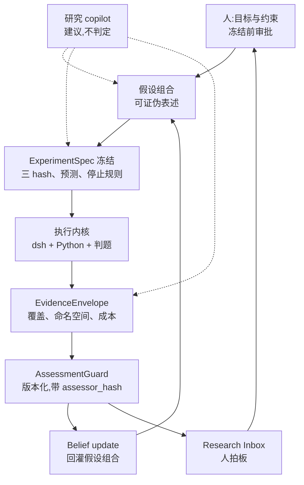
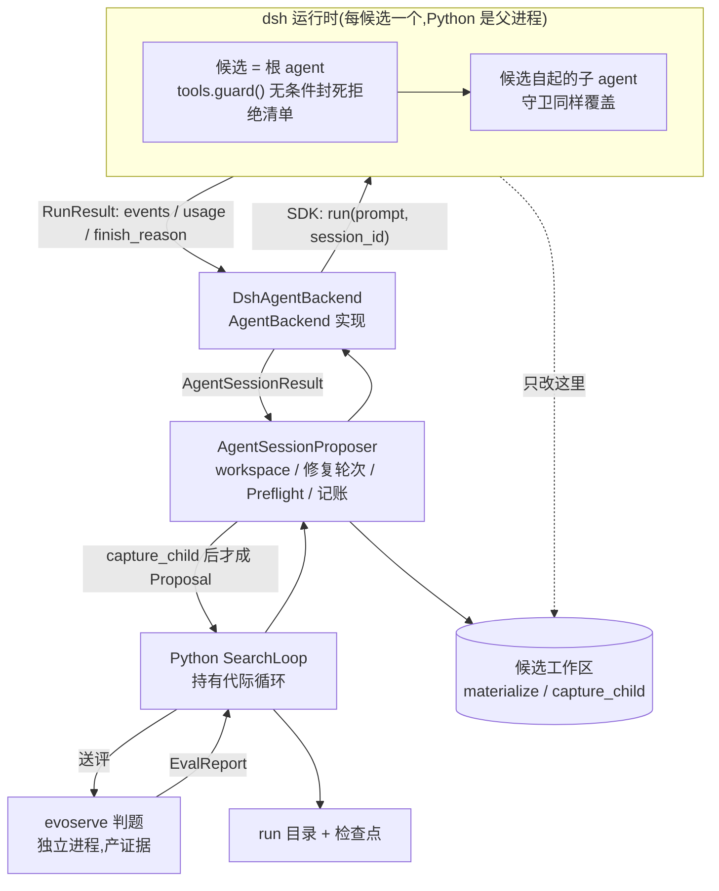

# EvoHarness 接 dsh:Agent Backend 实现与外壳可选倒置(DH-0..DH-6)

> 状态:**v5(2026-08-18 晚)—— DH-1 已落地并跑通一次真实进化**。相对 v4 的三处改判都由实测或用户决定驱动:①`cost_usd` 的价目表方案**作废**(用户决定:成本统计是次要信号,不得写死在代码里、不得变成阻断项);②`finish_reason` 的词表 v4 猜错了,真实取值是 dsh 的 `TurnEndReasonMap` 六个成员;③三个不可强制的 limit 的风险被**下调**——`_ProposalUsage.absorb` 在调用方一侧 fail-closed。架构与接缝不变:仍是现有 `AgentBackend`,`SearchLoop` / `_execute_plan` / `AgentSessionProposer` / `SingleShotProposer` 零修改(已验证)。v3.1 的两层架构图与决定六原样保留。整篇取代 v4、v3.2、v3.1、v2.1 与 v1。对象:[deepseek-harness](/Users/zhangkang/Documents/Projects/deepseek-harness/)(`@deepseek-ai/dsh`,MIT,developer preview,rc.5)。以下 dsh 侧路径均相对该仓库根。配对文档:[research_layer.md](research_layer.md)(治理层)、[eval_protocol.md](../docs/eval_protocol.md)(评估信任边界)。
>
> **当前进度一句话**:DH-0 与 DH-1 完成,DH-2 与 DH-3 各完成一半;**最大的未清项是身份没进 `spec_hashes`**(换 cordis 配置能 resume 旧 run 目录),其次是 DH-0.5 的守卫判据仍是错的。**另有一个新发现的阻塞:`evoharness/evoweb/` 已删,治理层当前没有任何人类入口**——DH-5 因此从"要不要让 dsh 参与"改写成"dsh 参与到哪一层"的三层切分。
>
> 一句话定位:**dsh 执行一次 Agent 循环,Python 驱动搜索与裁决**。dsh 出运行时——模型、工具、沙箱、会话日志;EvoHarness 出算法与裁决——种群搜索、修复策略、证据契约、研究治理。二者之间是 `AgentBackend` 这一个方法,不是嵌套控制流。

## 1. dsh 侧能力盘点

- **`python/sdk` 的 `DeepSeekHarness` 是最短路径(v4 新增,已实测)。** 它按配置拉起一个 dsh 运行时子进程并持有其生命周期,`run(prompt, session_id=...)` 跑完一次会话后返回 `RunResult{session_id, final_response, finish_reason, events, notifications}`。`cwd` 决定候选工作区,`cordis` 写进 `DSH_CORDIS_CONFIG` 决定这个运行时挂哪些插件,`close()` 回收进程。**Python 是父进程,dsh 是子进程**——反向 RPC 不再是必需品。
- **树外插件是一等公民,不用 fork。** 普通 npm 包在 `package.json` 里声明 `dsh.bundle` 指向一个 `cordis.patch.yml`,入口可以是纯 JS;`dsh plugin` 子命令把剩余参数转发给 profile 目录里的 pnpm (`apps/cli/src/args.ts:171`)。走 SDK 路径时更简单:一份完整 cordis 配置文件即可,不经 profile。
- **没有特权内核**:agent loop 本身也是插件,一切可从配置替换。
- **`ctx.subagents`** 是可编程 seam,不只给模型用:`start()` 接受 output schema、tool filter、persona、depth limit;能力不支持时抛 `SubagentError('UNSUPPORTED_CAPABILITY')` 而不是接受后静默忽略。
- **`ctx.subprocess`** 是受管子进程 seam:detached 进程树、有界收集/spill、先终止再等待退出的 dispose。**仅在可选的反向 RPC backend 里才需要**(§4.2)。
- **`--dump-config`** 打印的合成配置树与 `boot()` 实际挂载的内容一致,因此可哈希;走 SDK 路径时身份锚点改为 cordis 配置文件的内容哈希(决定四)。
- **usage 从会话日志可得(已实测)。** `assistant/message` 事件带 `usage`(`packages/core/session/src/types.ts:273`),Python 从 `RunResult.events` 自行汇总,不需要 TS 侧聚合再回灌。

**回源码后改掉的三处判断:**

**其一,隔离候选能力的正确原语不是工具过滤,是 `tools.guard()`。** `ToolRestriction` 只是 `{allow?, deny?}` 的**全局工具**可见性掩码 (`packages/core/tools/src/index.ts:680`),文档原话是"restrictions intersect and do not affect scoped registrations" ——**作用域内注册的工具它管不着**。真正管用的是 `tools.guard()` (同文件 :1110):一个在 `tools/pre-execute` 瀑布**之后**、工具体**之前** 执行的单调守卫,返回字符串即拒绝;注释写死了"no guard can force-allow a call another guard denied"。**已在 DH-0 实测证实**(§5)。

**其二,长跑的耐久性不能指望 job 注册表。** `JobStart.owner?: Agent` 的注释明说"agent disposal cancels and awaits the job"(`packages/jobs/jobs/src/types.ts:62`),而 `jobs-local` 是**进程本地** 注册表。**耐久性归 EvoHarness 的检查点。** 走 SDK 路径时这条自动成立:进程树的根就是 Python。

**其三(v4 新增),候选的委派深度是 0,不是 1。** 走 SDK 路径时每个候选拥有**自己的 dsh 运行时**,它是那个运行时的**根 agent**。按"深度 ≥ 1 才拒绝"写的守卫会把候选整个放过去。**已实测**:smoke 打出 `callerDepth: 0`。守卫判据必须改为无条件拒绝(决定三)。

## 2. 两层架构

接线分两层看:上层是研究闭环(谁提出、谁冻结、谁判定、谁拍板),下层是执行内核(进程、Agent 执行、判题、检查点)。两层之间只有一个接口——上层递进冻结好的 `ExperimentSpec`,下层递出 `EvidenceEnvelope`。中间发生了什么,治理层不需要知道;判定用什么规则,执行层无权干预。

### 2.1 研究闭环(v3.1 原图,不变)



三处是刻意画成这样的:

- **copilot 的虚线够不到 `AssessmentGuard`**。它在假设分解、实验设计与证据解读上出力,但判定那一格不归它(决定六)。
- **信念更新与 Inbox 都挂在判定之后**,不与判定并联;没有一条路径能让信念绕开 `AssessmentGuard` 更新。
- **`ExperimentSpec 冻结` 单独占一格**。它才是把 task/run/search 三个 hash、prediction_claims 与 stopping_rule 一起钉死的对象,`run_experiment` 的 `verify_refs()` 靠它拒跑漂移实验。

### 2.2 执行内核(v4 改画)



`evoserve` 与 `run 目录 + 检查点` 画在 dsh 运行时**外面**不是排版方便:前者是决定二的信任边界,后者是决定一的耐久性归属。dsh 运行时死掉,检查点还在。

**工作区那条虚线是权威边界**:dsh 只往 `workdir` 里写,Python 用 `workspace.capture_child(workdir)` 重新读回来才形成 Proposal。**backend 自报"我改了"不作数。**

**已知未画**:晋升与参照物(`PromotionPolicy` / `ReferenceStore`)是独立于信念更新的另一条反馈路径,它今天在 EvoHarness 里还没有生产调用方(见 research_layer.md 的 I-5 收尾记录),应在本计划之外单独补。

## 3. 六条设计决定

**决定一:控制流与耐久性都归 Python;dsh 只执行一次 Agent 循环。** `SearchLoop.run()` 原样跑在 Python 进程里——种群、档案、rng、断路器、检查点、停机理由,权威全在 Python。dsh 提供的是**一次模型/工具循环**,通过 `AgentBackend.run()` 这一个方法进出。**run 的真实身份是 run 目录 + 检查点**;dsh 运行时是每候选一次性的,崩了就是一次 backend 失败,由现有 `proposer_dead` 路径接住。

**v4 修订**:v3.2 里"dsh 是宿主、Python 是被 spawn 的引擎"这个进程关系**不再是主线**。走 SDK 路径时 Python 是父进程。dsh 会话当运行入口的形态保留为可选的第二 backend(§4.2),它是体验问题,不在关键路径上。

**决定二:证据主权不转移。** dsh 的会话日志遵守"模型可见即已记录",它是**模型上下文的来源**,不是评测判定的来源;格式随版本演进且无兼容承诺。EvidenceEnvelope 仍是唯一事实层,构造与落盘全程发生在 Python 进程内。dsh 的 `session.event` 流以**冷 trace 副本**身份归档进候选工件——建议**同时**保留 dsh 原始日志与翻译后的 `AgentEvent`,因为翻译是有损的。session log 什么都记,顺手拿它当证据是最省事也最错的一步。

**决定三:候选能力靠单调守卫封死,不靠可见性(v4 改判判据)。** 每个走 agentic lane 的候选由一个**独立的 dsh 运行时**执行改写;single-shot lane 仍走 Python 基线。隔离分两层,**顺序不能颠倒**:

1. **`tools.guard()` 是承重的那层**——插件注册一个全局守卫,拒绝 `cordis_define` / `cordis_run` / `cordis_stop` / `cordis_undefine`、`tool-ask-user`、`tool-web`。单调、不可被顺序绕过、在工具体之前执行。
2. **`tools.restrict()` 是纵深**——把这些工具从可见集合里也去掉;但它只管全局工具,**不能当作安全边界**。

**v4 修订(承重)**:判据**不是**委派深度。整个运行时的存在意义就是跑这一个候选,所以拒绝**无条件生效**,包括根 agent。v3.2 写的"对候选子 agent 拒绝"在 SDK 架构下等于不设防——候选就是根 agent。

拒绝清单是封闭集合,进 cordis 配置因而进身份哈希——**改清单 = 改身份 = 新实验**。理由:插件树**就是**运行环境,能挂插件的候选可以改写搜索本身。

**决定四:身份是候选运行时的完整定义,且必须进 resume 校验(v5 去掉价目表)。** `RunSpec.proposer_backend` 的 `ComponentSpec.config` 记:

- dsh 版本
- **候选 cordis 配置文件的内容哈希**(取代 v3.2 的 `--dump-config` 输出哈希——SDK 路径不经 profile)
- provider / model
- 守卫拒绝清单
- backend 声明的**不可强制 limit 清单**(读 trace 的人要知道当时哪些上限只是摆设)

~~价目表~~ —— **v5 删除**。价格不影响候选能干什么,不该改变实验身份;`DshRuntimeSpec.identity()` 已按此实现。

该哈希进 checkpoint 指纹。换配置后对同一 run 目录 resume,Python 按现有指纹不符语义直接拒绝。dsh 升级即换身份,没有热升级。

**⚠️ v5 实测缺口:这一条只做了一半。** `DshRuntimeSpec.identity()` 已经产出上述内容,并写进了 run manifest 的 `proposal.agent_backend.identity`;但 `RunSpec.proposer_backend` 里记的**仍是单发模式的 `_OpenAICompatTransport`**,身份因此**没有进 `spec_hashes`**。具体后果:换掉 `candidate.cordis.yml` 再 resume 同一个 run 目录,**不会被拒**。见 DH-2。

**决定五:治理留在 EvoHarness,不迁进 dsh 的审批 seam。** dsh 的审批是会话内操作级、同步、以秒计;Research Inbox 的决策是跨天治理级、异步、要证据引用与署名。两者粒度不匹配,合并会让其中一个变形。决定仍只认 `InboxStore` 的 actor 鉴权路径。

**v5 澄清:这一条拒的是"拿 dsh 的审批机制当决定的载体",不等于拒绝 dsh 参与治理。** 两件事必须分开:

- **迁移机制**(把 Inbox 换成 dsh 的 approval)—— 拒绝,理由如上。
- **当输入设备**(人在 dsh 会话里点一下,权威仍归 `InboxStore`)—— 有条件可行,见 DH-5 的三层切分。

`InboxStore.answer()` 的实际保护只有三条:`actor` 在 store 的白名单里、`action` 在这张卡的 `allowed_actions` 里、写一次即锁死;`require_decision()` 再绑 kind / experiment_id / **subject_hash**。**保护不在 store 里,在"谁被允许调它"**——能调 `answer()` 的进程就能以白名单里任何一个人的名义签字。旧 evoweb 服务端因此把 actor 绑在服务端,请求体里带 `actor` 直接 400。任何新的答复入口都必须沿用这个形状。

**决定六:copilot 建议,不判定。** 研究 copilot 可以在目标澄清、假设分解、实验设计与证据解读上出力,产物是叙述、Finding 与 DecisionRequest 草案。但 **verdict 不归它**:supported / contradicted / unknown 三态只能由带 `assessor_hash` 的 `AssessmentGuard` 产出,信念更新与 Inbox 卡片一律挂在判定之后(§2.1)。理由不是防 agent 说谎,是防**判定标准悄悄漂移**:LLM 每次解读的隐含阈值都不一样,而现行 assessor 的噪声下限有具体来历——IMO 终选在 12 题上取 argmax,validation 到 test 掉 0.206,点估计比较会把幸运种子当成优势。方向与 research_layer.md 的 I-7 约束一致。

## 4. 接缝与两个 backend

### 4.1 接缝位置(不变)

切口是已经存在的 `AgentBackend`,不是 `Proposer`。`SearchLoop._propose` ([loop.py:801](../evoharness/core/loop.py:801))仍是 `_plan_proposal` → `_execute_plan` → `_absorb_proposal`,不感知 dsh。

`AgentSessionProposer` ([session_proposer.py:436](../evoharness/core/agent/session_proposer.py:436))**已经全包**了以下事项,backend 一概不碰:

- workdir 的建立(`workspace.materialize(temp)`)与读回(`workspace.capture_child(workdir)`)
- 修复轮次与 feedback 组装、`ProposalPreflight`
- event sink 的开关与 `release()` 的调用时机
- 跨轮次 usage 聚合、transcript、`ProposeResult` 构造

因此 **`DshAgentBackend` 只有一件事**:拿到一个已经铺好的 workdir,跑完一次初始或恢复的 Agent 循环,返回归一化的 `AgentSessionResult`。

```text
Python SearchLoop
  -> AgentSessionProposer            # workspace / 修复 / Preflight / 记账
      -> DshAgentBackend.run(AgentSessionRequest)
          -> DeepSeekHarness.run(user, session_id=...)   # 一次 dsh 会话
      <- AgentSessionResult
      -> ProposalPreflight;repairable 时携 feedback + 同一 session_id 再 run
      -> workspace.capture_child(workdir)  # 权威读回
  -> SearchLoop admission / novelty / grade / population / checkpoint
```

### 4.2 两个 backend 实现

| 实现 | 传输 | 状态 | 换来什么 |
|---|---|---|---|
| `DshAgentBackend`(SDK) | `python/sdk` 的 `DeepSeekHarness`,Python 是父进程 | **主线**,smoke 已跑通 | 零 TypeScript,最短路径 |
| `ReverseRpcAgentBackend` | `ctx.subprocess` 双向 JSON-RPC,TS 是父进程 | **推迟,不删** | dsh 会话当运行入口 |

两者实现同一个 `AgentBackend` 协议,可以并存。第二个只有在"从 dsh 聊天界面里起一次进化跑"这件事被证明值得那份 TS 维护成本时才做。

**契约映射(SDK backend):**

| `AgentSessionRequest` | 对到 SDK | v5 状态 |
|---|---|---|
| `system` | `DSH_SYSTEM_PROMPT` → cordis 里的 persona | 真实跑已验 |
| `user` | `harness.run(user)` | 真实跑已验 |
| `workdir` | `DeepSeekHarnessConfig.cwd`,每候选一个 | 真实跑已验(两次提案两个运行时目录) |
| `session_id` | `harness.run(session_id=...)` 续跑同一会话 | **仅单元测试**——真实跑 `repair_rounds: 0`,恢复路径没被走到 |
| `event_sink` | 逐事件翻译后 emit | 真实跑已验 |
| `preflight` | **不出 Python 进程**,backend 看不到 | 设计如此 |
| `feedback` | 恢复轮只送 feedback,不重复原任务 | **仅单元测试** |

| `AgentSessionResult` | 从哪来 | v5 状态 |
|---|---|---|
| `session_id` / `final_message` | `RunResult` 同名字段 | 真实跑已验 |
| `prompt_tokens` / `completion_tokens` | 汇总 `assistant/message.usage` | 真实跑已验(3395/747、27314/2838) |
| `turns` / `tool_calls` / `elapsed_s` | 数 events / 计时 | 真实跑已验(6/6、10/15) |
| `events` | `session.event` → `AgentEvent` 翻译 | 真实跑已验,**有损**,未译类型按类计数上报 |
| `termination` | **`turn/end` 的 `reason.kind`** → `AgentTermination` | 真实跑已验为 `completed` |
| `cost_usd` | 可选价格,缺省 `0.0` + `cost_priced: false` | 真实跑为 0(未配价) |

**`termination` 的词表 v4 写错了,v5 更正。** 它不是 provider 的 finish reason,而是 dsh 的 `TurnEndReasonMap`([session/src/types.ts:155](/Users/zhangkang/Documents/Projects/deepseek-harness/packages/core/session/src/types.ts))六个成员:`completed` / `aborted` / `blocked` / `error` / `max-tokens`(连字符)/ `interrupted`。照 v4 那张 OpenAI 风格的表(`stop` / `length` / `content_filter`),**每一次真实会话都会落进 `PROTOCOL_ERROR`**,而用假事件写的单元测试一路绿。现有实现另有一个用例专门断言 provider 风格取值必须被拒,防这张表被改回去。

`finish_reason` 为 `None` 判 `PROTOCOL_ERROR` 而非 `COMPLETED`:SDK 返回 `None` 表示区间内**没有 `turn/end` 事件**,那是"结束方式未知",按成功处理会去给一个候选可能还在改的工作区打分。

## 5. 分阶段实施

### DH-0:可行性 spike —— 已完成(2026-08-18)

产物在 deepseek-harness 仓库 `packages/examples/evo-harness/`:守卫插件 `src/index.ts`、单元测试 `tests/guard.spec.ts`(6 例)、真实模型 e2e `tests/guard.e2e.ts`(3 例)、SDK 冒烟 `fixtures/smoke.py` 与候选配置 `fixtures/candidate.cordis.yml`。

- [x] **守卫验证(承重项)** —— 单元 6 例 + 真实模型 e2e 3 例,两套都做了变异对照(把判据改成永不生效,承重用例应声而倒)。实测证据:子 agent 调 `cordis_define` 被拒,**拒绝理由原文出现在子模型的报告里**——说明理由确实回到了模型上下文,而不只是记进了日志。
- [x] **`tools/pre-execute` 无法翻案** —— 挂一个抢在最前、不调 `next()` 的强制放行监听器,结果与不挂时逐字一致。单调性在真实链路上成立。
- [x] **嵌套穿透** —— 孙代(depth 2)同样被拒,且台账里的 agent id 与直接子代的 session id **不同**,证明被拒的确实是第二层。守卫从未为孙代注册过任何东西。
- [x] **枚举拒绝清单** —— 挂上 `tool-cordis` 后:四个挂载类工具全部落进拒绝集,三个 `cordis_inspect_*` 按设计留在允许集。**顺带发现:`tool-cordis` 与 `tool-ask-user` 在 `dsh-base` 和 `dsh-web-app` 里都没挂**,不显式挂载的话第二、第四轮测的是一个不存在的工具。
- [x] **程序化调 `ctx.subagents.start()`** —— `evo_spike_probe` 工具走通,拿到子 agent 的结构化返回与工作区改动。
- [x] **SDK 路径可行(v4 新增)** —— `fixtures/smoke.py` 实测:`DSH_CORDIS_CONFIG` 确实是插件注入口;候选 `callerDepth: 0`;`assistant/message` 里捞得到 usage;起一个运行时约 1 秒;工作区改动**由脚本读磁盘确认**,不采信模型自述。
- [ ] ~~`ctx.subprocess` 双向 JSON-RPC~~ —— **推迟**。SDK 路径不需要;只有做 `ReverseRpcAgentBackend` 时才回来做。
- [ ] ~~parent 存活性~~ —— **失效**。SDK 路径下 Python 是父进程,不存在"parent agent 挂在会话寿命上"这个问题。
- [ ] 树外 bundle 打包(`dsh plugin add`)—— 部分。插件经 `--patch` 与 `DSH_CORDIS_CONFIG` 加载均已验证,bundle 打包未做,不阻塞。
- [ ] `--dump-config` 连跑两次比对 —— 未做。SDK 路径的身份锚点改为 cordis 配置内容哈希,此项降级为可选。
- [ ] **沙箱 fail-closed —— 未验(记录在案)**。`candidate.cordis.yml` 已从 `danger-full-access` 改为 `workspace-write`,但**只验证了工作区内能写,未验证工作区外写不了**。

**停止线判读:守卫这一条过了。** 承重项、嵌套穿透、抗翻案三项都有真实链路证据,拒绝清单是封闭集合。

### DH-0.5:立即清账(零成本)—— 用户决定暂缓,仍全部未做

- [ ] **守卫判据改为无条件拒绝**(决定三的 v4 修订)。现判据 `depth < 1 就放行` 在 SDK 架构下等于不设防,而六个单元测试与三个 e2e 全绿——**测试正在断言那个漏洞是正确行为**。同时反转 `tests/guard.spec.ts` 里两个"放行主 agent"的用例。
- [ ] 修 `candidate.cordis.yml` 里那句说 `danger-full-access` 的过期注释(实际已是 `workspace-write`)。
- [ ] 提交现有产物。变异实验会反复弄脏工作区,没有基线就没法回退。

### DH-1:`DshAgentBackend`(SDK 实现)—— 已完成(2026-08-18)

位置:`evoharness/core/agent/dsh_backend.py`,导出经 `evoharness/core/agent/__init__.py`。SDK 依赖是**懒导入**,框架包不硬依赖 dsh。测试:`tests/test_agent_dsh_backend.py`(24 例,假 harness,不需要 key),含变异对照。

- [x] **同 session 修复恢复** —— 会话表按 `session_id` 缓存运行时,恢复轮复用同一个;恢复轮的 prompt **只送 feedback,不重复原任务**(重复会读成第二个竞争请求)。⚠️ **仅单元测试覆盖**:真实进化跑里 `repair_rounds: 0`,恢复路径没被真实链路走到。停止线因此**保留**。
- [x] 会话表与 `release()` —— `release` 幂等、吞掉 `close()` 异常(teardown 失败不得掩盖真实提案结果);换了 workdir 还想 resume 直接拒(运行时 cwd 在构造时钉死,继续跑会去改上一个候选的目录)。
- [x] 事件翻译 —— `assistant/message` / `tool/call` / `tool/result` / `compaction/*` 映射,`SESSION_START` / `SESSION_RESUME` / `TERMINATION` 由 backend 自补。**未映射类型不硬塞进相邻 kind**(那是往耐久 trace 里写编造的事实),而是按类型计数挂在 TERMINATION 的 `data.untranslated_event_types` 上——有损翻译必须看得见。
- [x] `AgentTermination` 映射 —— 见 §4.2 的更正。映射不出来一律 `PROTOCOL_ERROR`,`None` 也判 `PROTOCOL_ERROR`。传输/启动异常返回 `BACKEND_ERROR` 而**不是 raise**:`_ProposalUsage.absorb` 在检查 termination **之前**跑,返回才能把失败会话的花费记上账。
- [x] ~~`cost_usd` 价目表~~ —— **v5 作废(用户 2026-08-18 决定)**。理由:可信花费账本只有 BudgetMeter 的 `budget.json`,这个字段至多是参考数;而 v4 的方案把它做成**构造时硬报错**,等于拿次要指标卡住新模型跑不起来,价目表还会随端点和时间静默过期。现方案:token 照记(会话日志里的观测事实),美元换算做成调用方可选传入 `price_usd_per_mtok`,缺省 `cost_usd = 0.0` 并在 trace 里标 `cost_priced: false`——**"没定价"与"免费"必须可区分**。
- [x] `AgentSessionLimits` 三项只能观测不能强制 —— 已确认 dsh 的 agent loop **没有任何 turn/step 上限配置项**;`UNSUPPORTED_LIMITS` 常量显式列出三项,并写进 `identity()` 与 SESSION_START 事件。**v5 新发现**:调用方一侧是 fail-closed 的——`_ProposalUsage.absorb` 在 `turns > max_turns` 或 `tool_calls > max_tool_calls` 时抛 `backend-error`。所以超限的代价是**浪费一次会话**,不是无上限烧钱。因此故意老实上报:少报以躲开这个检查,正是本文件禁止的静默忽略。
- [x] `SearchLoop`、`_execute_plan`、`AgentSessionProposer`、`SingleShotProposer` 零修改 —— 真实跑验证。

### DH-2:接线与身份 —— 一半(2026-08-18)

- [x] 接线 —— 没有新建 lane,而是给 `RecipeContext` 加了 `agent_backend` 覆盖位,由 `_build_proposer` 在 agent 模式下**替换**进程内运行时;`experiments/run_evolution.py` 加 `--dsh-config` / `--dsh-runtime`(必须成对)。替换而非包装是刻意的:外部运行时自带工具集、上下文策略与沙箱,`max_input_tokens` / `max_parallel_tools` / 压缩阈值对它一个都不适用,同时把 `tools` 清空——**manifest 不得列出候选从未见过的工具**。
- [x] 冷 trace —— `JsonlEventSinkFactory` 原样可用;SDK 的 `session_root` 指到 `<run>/dsh_sessions/`,dsh 原始会话日志与翻译后的 `AgentEvent` 并存(决定二要求的"两份都留")。
- [ ] **身份进 `spec_hashes`(承重,未做)** —— `identity()` 目前只写进 manifest 的 `proposal.agent_backend`,`RunSpec.proposer_backend` 里仍是 `_OpenAICompatTransport`。**换 cordis 配置能 resume 旧 run 目录**,决定四不成立。牵扯 `RunSpec` 字段语义,不是顺手能改的。
- [ ] backend 对拍(fake 与 dsh 返回结构等价)—— 未做。
- [ ] 断路器语义测试(`proposer_dead` 路径)—— 未做;真实跑 `proposals_failed: 0`,失败路径一次没走到。

### DH-3:跑一次真实进化 —— 一半(2026-08-18)

**已跑通**:`--recipe e0 --task demo_counter --live`,2 代,3 次评测,`proposals_failed: 0`,`best_fitness: 1.0`,`stopped_reason: completed`。

- [x] agentic lane 的候选进种群并被评分 —— patch 是 `SOLVED = ["q0"]` → `["q0","q1","q2","q3","q4"]`。
- [x] 执行内核确实换掉了 —— 冷 trace 里候选用的是 **dsh 自己的工具**(`bash` 17 次、`str_replace_editor` 2 次、`evo_spike_tools` 2 次),不是 EvoHarness 的进程内工具集。两次提案两个 `dsh_sessions/` 目录,**每候选一个运行时**成立。会话规模:6 turns/6 tool_calls/25.9s 与 10 turns/15 tool_calls/103.4s。
- [ ] ~~成本对账~~ —— **随价目表一起作废**。`total_llm_cost: 0.0` 是设计结果不是 bug。**但留下一个真问题**:`--budget-usd` 现在对提案侧完全不起作用(BudgetMeter 收到的提案花费恒为 0),评测侧照常。要用预算停机,得先决定是给 backend 传价格,还是明确预算门只管评测侧。
- [ ] **可回溯四跳** —— 前三跳通(候选 → `session_id` → 冷 trace → `dsh_sessions/*/session.jsonl`),未系统验证。
- [ ] 杀掉进程再 resume —— 未做。
- [ ] `scripts/audit.py` 活性检查(dsh 后端的 run,agentic 候选必须带 session 引用,全零即 DEAD)—— 未做。
- [ ] **turn 预算的洞未被逼出来** —— 预测的 `absorb` 硬失败没发生,因为默认上限是 48/120 而实测只用到 10/15。**这不是"问题不存在",是任务太小**。把 `proposal.max_turns=3` 再跑一次即可复现。

**v5 观测到的翻译损耗**(未译事件按类计数):`assistant/chunk` 586、`step/start`/`step/end` 各 16、`turn/start`/`turn/end` 各 2、`user/message` 2、`session/title` 2、`request/header` 2、`request/context` 2、`agent/inbox/spliced` 4。chunk 是流式碎片,不进冷 trace 是对的;但 **turn/step 边界丢了**,后果是从冷 trace 里重建不出"哪几次模型调用属于同一轮",下钻只能看到平铺事件。要不要补映射取决于下钻时想不想要轮次结构。

### DH-4:安全加固(**已按决定跳过,条件保留**)

用户 2026-08-18 决定跳过安全测试,先做业务实现。以下条目保留但不阻塞 DH-1..DH-3:

- [ ] 沙箱逃逸验证:候选试图写工作区外的绝对路径,断言被拒且留痕;
- [ ] 对抗测试:诱导候选挂插件、联网、改评测配置、用 `tools/pre-execute` 翻案、经嵌套子 agent 逃逸,断言全部被拒且留痕;
- [ ] 审批答复循环:白名单内 allowed-once,名单外 rejected 并落审计。

**常设条件:在对抗测试通过前不无人值守运行。** 有人盯着跑没问题,别让它悄悄变成常态。

### DH-5:治理与观测 —— dsh 参与到哪一层

**⚠️ 先记一个阻塞事实(v5 发现):`evoharness/evoweb/` 已从工作树删除**(git 标 `D`,目录不存在)。原验收写的"隔天在 evoweb 拍板"当前**没有界面可走**。治理层眼下没有任何人类入口——这不是 dsh 接入的可选项问题,是治理闭环现在就是断的。

因此 DH-5 的问题从"要不要让 dsh 参与"变成"**dsh 参与到哪一层**"。按权限递减切三层,界线落在 `InboxStore.answer()` 这**一个方法**上:**dsh 可以读、可以起草、可以通知;不可以签字。**

#### 第一层:通知与深链(安全,决定五本就允许)

- [ ] 卡片产生时向 dsh 会话发通知,带 `request_id` 与深链;`evo_status` 报告待决卡片数**但不提供回答能力**。

#### 第二层:只读渲染(安全,建议优先做)

- [ ] dsh 会话内渲染决策卡内容、证据引用、记分卡与迁移面板报告。**读不产生任何权威**,所以这一层不需要新的鉴权设计。
- [ ] 这是 evoweb 删除后**最便宜的补救**:不重建前端就能把治理状态变回人能看的东西。深链的落点从网页改成会话里的一段渲染,决定五的约束不变。

#### 第三层:答复(有条件,且不得做成模型工具)

**真正的危险不是粒度不匹配,是这一条:工具调用由模型发起,不由人发起。** 会话里若有 `evo_answer_card` 工具,就是 **agent 决定何时答复**;人在聊天里说的"行,批了"只是模型对自然语言的解读,签了名的治理决定退化成"模型认为你同意了"。这是决定六那个失败模式往上一层——不是 agent 产出 verdict,是 **agent 产出批准**。

若要做,只有一种形态成立:

- [ ] **人的点击本身是事件**,走 dsh 的人机交互 seam(`user-approval` / `tool-ask-user` 一族);模型只能**呈递**卡片,不能代答。工具 schema 里**不得出现 `actor` 参数**,actor 由进程侧绑定(沿用旧 evoweb 服务端的形状)。
- [ ] **机会主义路径,不能是唯一路径。** dsh 的审批是同步、阻塞一次工具调用的,而跨天决定没法阻塞工具调用。所以会话只能"正好有人在,顺手批一张";**没有任何会话开着时,卡片必须仍然可答**。durable 入口要独立存在(恢复 evoweb,或先做一个命令行答复入口)。
- [ ] **补 `ResearchDecision` 的来源字段。** 现有字段只有 `actor` / `reason` / `created_at` / `request_id` / `experiment_id`,**没有"从哪个界面签的"**。不补的话事后审计分不清"人在 evoweb 里按的"和"经会话签的",而这两者可信度不同。

#### 原有条目(不变)

- [ ] 冻结实验的启动仍走 `run_experiment`;
- [ ] **copilot 边界(决定六)**:copilot 读得到 `ClaimAssessment` 与 EvidenceEnvelope,写得出 Finding 与 DecisionRequest 草案,但**没有任何工具能写 assessment**。注意 copilot 这一条**本来就是 dsh 交互**——DH-5 从设计之初就预设了 dsh 参与,只是参与在**起草与呈现**那一侧;
- [ ] 反向断言测试:构造"copilot 声称支持、assessor 判 unknown"的场景,断言信念不更新、卡片如实显示 unknown。

**验收(v5 改写)**:一次跨天的完整闭环——起跑、隔天拍板、决定回到下一轮实验,全程不读 agent transcript 也能复原研究状态。**拍板的界面不再限定 evoweb**,但必须满足:签字动作由人发起而非模型发起、actor 由进程侧绑定、决定记录带来源、且存在一条不依赖任何活会话的答复路径。

### DH-6:决策门与固化

- [ ] 采纳 → `DshAgentBackend` 文档化为一等 backend;升级纪律(升 dsh = 新身份)写进文档;向 `docs/capability_matrix.md` 回写现状;
- [ ] 评估是否值得做 `ReverseRpcAgentBackend`(唯一收益是 dsh 会话当入口);
- [ ] 退出 → spike 报告与阶段结论归档,插件包保留不删;
- [ ] 无论哪个结局:`SingleShotProposer` 与现有 CLI 路径默认**保留**。

## 6. 风险与对策

| 风险 | 对策 |
|---|---|
| 守卫判据按深度写,候选是根 agent 因而被放过 | **已实测发生**;DH-0.5 改为无条件拒绝并反转两个用例 |
| 会话日志被当证据 | 决定二;audit 断言候选必须带 EvidenceEnvelope 而非 session id |
| 候选改写运行环境 | 决定三:`tools.guard()` 承重、`restrict()` 兜底;DH-0 已验含嵌套穿透 |
| 换 cordis 配置还能 resume | 决定四:配置内容哈希进 checkpoint 指纹,不符即拒。**⚠️ v5 实测:目前正在发生**——身份只进了 manifest,没进 `spec_hashes`(DH-2 未清项) |
| ~~`cost_usd` 静默归零 → 预算门永不触发~~ | **v5 重述**:归零是明文设计,`cost_priced: false` 使"没定价"与"免费"可区分。真风险改为:**`--budget-usd` 对提案侧失效**,预算停机只剩评测侧 |
| 三个 limit 被当成硬上限 | DH-1:`UNSUPPORTED_LIMITS` 进 identity 与 SESSION_START 事件。**v5 下调**:`_ProposalUsage.absorb` 在调用方 fail-closed,超限代价是浪费一次会话而非无上限 |
| 同 session 无法恢复修复上下文 | DH-1 已实现,**但只有单元测试**;真实跑 `repair_rounds: 0` 没走到该路径。停止线保留 |
| 冷 trace 丢失轮次结构 | v5 实测:`turn/*` 与 `step/*` 未翻译。下钻只见平铺事件,重建不出轮次归属。补映射与否待定 |
| 用小任务验证后误判"限制不成问题" | v5 已发生一次:默认 48/120 而实测 10/15,预测的 `absorb` 硬失败没被触发。逼洞要显式压低 `max_turns` |
| 每候选一个运行时太贵 | 实测约 1 秒,先按这个方案做;真成瓶颈再考虑复用,但复用会牺牲"一个运行时=一个候选沙箱" |
| dsh preview 破坏性变更 | 身份含 cordis 配置哈希,升级即新实验 |
| dsh 运行时进程泄漏 | `release()` 幂等且必调;DH-1 加僵尸进程检查 |
| 跨语言调试成本 | 接缝是现有 `AgentBackend`;Python 侧保留 fake backend,两侧可独立对拍 |
| 判题被拖进 agent 进程 | 决定二 + DH-3:判题留在 Python 进程内经 evoserve |
| copilot 的解读被当判定 | 决定六;DH-5 有反向断言测试 |
| **agent 产出批准**(比 agent 产出 verdict 更隐蔽) | DH-5 第三层:答复不得做成模型工具,人的点击本身是事件;工具 schema 不出现 `actor` |
| 治理闭环当前是断的 | **v5 实测**:`evoharness/evoweb/` 已删,没有任何人类入口。DH-5 第二层是最便宜的补救 |
| 决定的来源不可区分 | `ResearchDecision` 无来源字段,evoweb 签的与会话签的事后分不开;做第三层前必须补 |
| 跳过安全测试后无人值守跑 | DH-4 的常设条件;audit 无法覆盖此项,只能靠纪律 |

## 7. 明确不做

- 不把代际循环、种群、算子搬进 TypeScript;
- 不新增 Proposer,不修改 `SearchLoop._execute_plan` 与 `AgentSessionProposer`;dsh 只实现 `AgentBackend`;
- 不让 backend 承担 workspace 生命周期——`materialize` / `capture_child` 归 `AgentSessionProposer`;
- 不采信 backend 自报的"工作区已修改";Python 必须重新 capture;
- 不把所有 lane 迁进 dsh:`SingleShotProposer` 保留为 Python 基线;
- 不把判题放进 dsh 进程(评估信任边界见 eval_protocol.md);
- 不把 Research Inbox / 记分卡迁进 dsh 的审批 seam(粒度不匹配)——但**允许 dsh 当输入设备**,权威仍归 `InboxStore`(决定五 v5 澄清);
- 不把答复卡片做成模型可调的工具:签字动作必须由人发起,`actor` 不得进工具 schema;
- 不让"会话里有人"成为答复的唯一路径:没有活会话时卡片必须仍可答;
- 不用 dsh 会话文件当任何形式的事实来源;
- 不靠工具可见性(`restrict`)当安全边界;
- 不按委派深度判断候选——SDK 架构下候选是根 agent(决定三 v4 修订);
- 不给候选开放插件挂载、`tool-ask-user`、`tool-web`;
- ~~不在 `cost_usd` 无法换算时返回 0~~ —— **v5 反转**:未配价就返回 0,但必须同时标 `cost_priced: false`;不得让缺价成为构造失败或运行阻断;
- 不为次要指标建会变成阻断项的机制;可配置的数据不进代码常量(价目表即为此删除);
- 不在替换 backend 后仍让 manifest 列出候选没见过的工具;
- 不在对抗测试通过前无人值守运行;
- 不让任何 agent(含研究 copilot)产生或改写 `ClaimAssessment`;
- 不把信念更新与判定并联:没有绕开 `AssessmentGuard` 的路径;
- v1 不做远程执行:同机共享文件系统是前提,工作区按路径传递。

## 8. 停止线

```text
DH-0(done) → DH-0.5(未做) → DH-1(done) → DH-2(半) → DH-3(半) → [DH-4 已跳过] → DH-5 → DH-6
```

- ~~DH-0 守卫拦不住插件挂载能力~~ —— **已通过**,含嵌套穿透与抗翻案;
- **DH-0.5 守卫判据仍未改为无条件拒绝**:后续所有基于守卫的结论都不成立,**不得据此声称候选被隔离**。已跑过的真实进化里守卫对候选未生效——这是明文状态,不是推测;
- DH-1 同 `session_id` 无法恢复 Agent 上下文:不得替换现有可修复 agentic lane。**当前状态:实现了但只有单元测试背书**,真实链路未走到,该停止线保留;
- ~~DH-1 `cost_usd` 无法换算即构造失败~~ —— **v5 撤销**。改为:未配价必须标 `cost_priced: false`,且**不得声称提案侧受 `--budget-usd` 约束**;
- **DH-2 身份未进 `spec_hashes` 期间**:不得对同一 run 目录换配置后 resume,也不得把两次 run 当作同一实验比较——运行环境的差异当前不会被任何机制拦住;
- DH-2 对拍不过:不得进入**用于产生结论的**真实进化(demo_counter 这种验证性跑不受此限,已跑);
- DH-3 候选不可回溯:不得用于产生对外结论;
- DH-4 对抗测试未通过期间:不得无人值守运行(常设);
- DH-5 反向断言不过(agent 的解读能变成 verdict):copilot 不得接入证据解读环节;
- **DH-5 第三层未满足四项前提**(签字由人发起、`actor` 进程侧绑定、决定记来源、存在不依赖活会话的答复路径):dsh 会话不得具备任何答复卡片的能力,只做第一、二层;
- **治理闭环当前是断的**(evoweb 已删):在恢复任一人类入口之前,不得声称实验经过治理审批,也不得让任何自动路径以"卡片已批"为前提继续;
- 任何阶段:判题不得进 dsh 进程,候选不得触达守卫拒绝清单上的能力,换 cordis 配置不得 resume 旧 run 目录,判定不得由 agent 产出。

## 9. 一句话主张

> dsh 执行一次 Agent 循环,Python 驱动修复与搜索:壳保持薄且可换,循环权威保持一个,证据、覆盖与晋升的判定权一寸不让。
