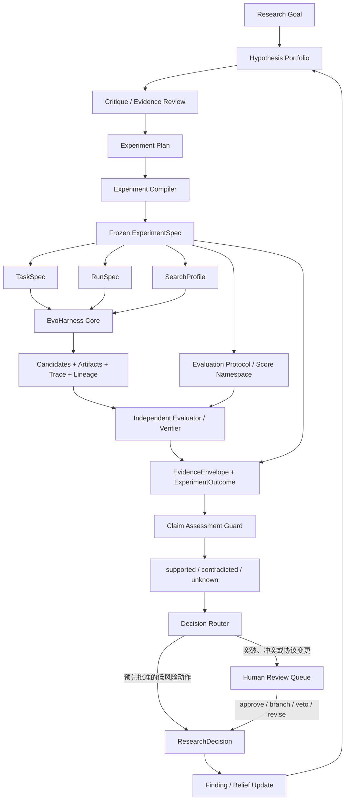
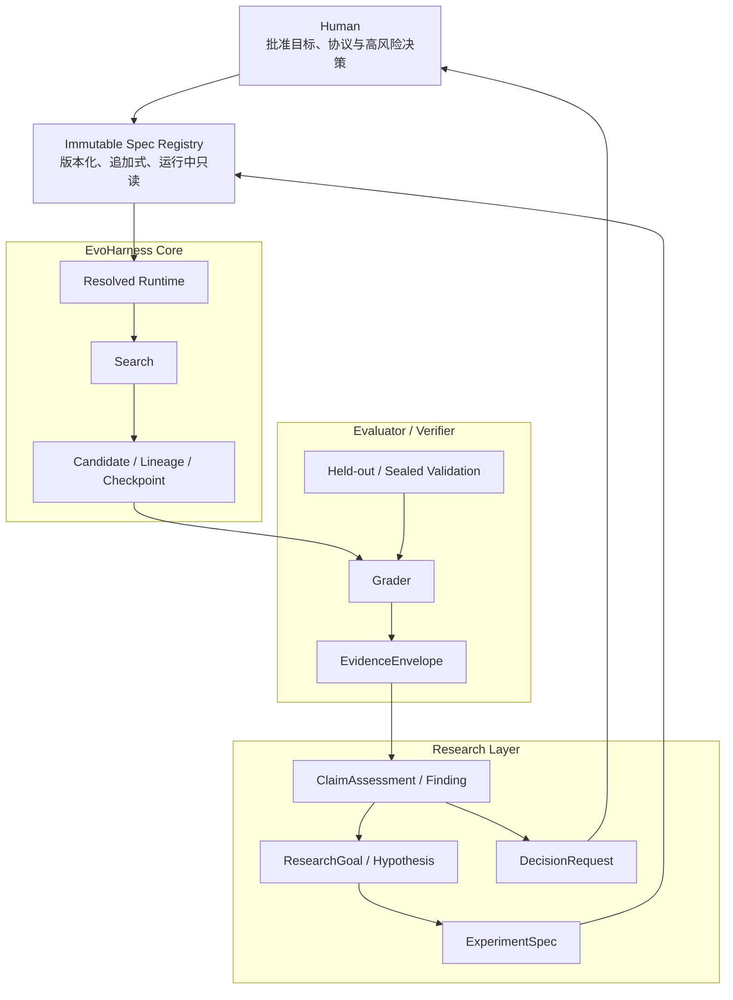
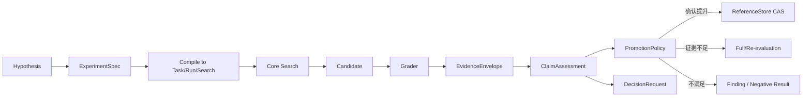
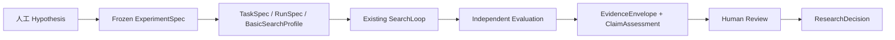

# EvoHarness Research Layer：证据契约与实验一等公民

> 状态：设计与实施跟踪 v4（2026-08-12，I-1 已落地）。
> 定位：**契约与研究治理层**。与
> [computational_discovery.md](computational_discovery.md)（产品轨）、
> [EvoHarness.md](../docs/EvoHarness.md)（Core 架构）和
> [eval_protocol.md](../docs/eval_protocol.md)（评估信任边界）配对。
>
> 本文只定义跨任务通用的 Research Layer；任务专有的题集、指标、证明器、判题器、
> 数据字段和实验策略均由 Domain Controller 提供。

## 0. 问题与目标

EvoHarness Core 已能忠实执行以下闭环：

```text
生成 Candidate → Preflight → Grader → EvalReport
→ 存储与谱系 → Parent/Operator 选择 → 下一轮搜索
```

但“执行正确”不等于“研究结论正确”。常见错误发生在解释层：

- 把未运行、超时或基础设施失败当成任务失败；
- 把局部样本的结果当成总体结论；
- 把找到一个成功见证解释成整体指标提升；
- 把未观察到增益解释成没有增益；
- 把不同评测标准产生的数值放入同一排序；
- 在看到结果后修改预测、停止规则或成功定义；
- 把实现失败解释成研究假设被证伪；
- 把软评分、Rater 判断或 Candidate 自述当成硬事实。

Research Layer 的目标不是替 Core 做搜索，而是让以下链条成为机器可检查、可追溯的
研究对象：



这张图表达研究闭环，不把执行结果直接等同于可信结论：Core 产生 Candidate 和运行记录，
独立 Evaluator / Verifier 产生 Evidence，Assessment Guard 判断 Evidence 能支持哪类 Claim，
Decision Router 再按预先批准的权限决定自动处理或提交人工审批。所有路径最终写入追加式
`ResearchDecision`，再更新 Finding、Belief 和 Hypothesis Portfolio。

一句话定位：

> Core 负责忠实执行；Evaluator 负责产生证据；Research 负责提出可证伪问题并解释
> 证据；Human 负责目标、协议和研究价值的最终审批。

## 1. 角色、分层与信任边界



### 1.1 Human

Human 拥有：

- 研究目标与价值判断；
- `CriterionSpec` 的批准权；
- 评测协议迁移的批准权；
- 高成本、高风险和不可逆实验的批准权；
- 对外宣布突破、数学结论或科学结论的批准权。

Human 拥有的是**规范性意图和审批权**，不是“真值本身”。数学真值由形式验证证据
约束，经验任务的结论由可复现实验和验证协议约束。

### 1.2 Research Layer

Research Layer 可以：

- 创建和维护 Hypothesis、Experiment proposal、Finding 与 DecisionRequest；
- 读取脱敏 Candidate diff、公开 Evidence、Trace 和运行成本；
- 提议修改 Measurement、Feedback、Inspiration 或 SearchProfile；
- 对证据形成 `supported / contradicted / unknown` 判断。

Research Layer 不可以：

- 修改正在运行的冻结 Spec；
- 修改 Candidate workspace；
- 读取 sealed holdout 明细、答案或评测密钥；
- 自行把软判断晋升为任务成功或 Breakthrough；
- 绕过 Evaluator 直接写入可信事实层。

### 1.3 Core

Core 负责：

- Agent Runtime、Workspace、Candidate 生命周期；
- Basic / Evolution 搜索；
- Parent、Inspiration、Operator 和资源调度；
- Budget、并发、重试、checkpoint、谱系和审计；
- 按冻结 Spec 忠实执行，不解释领域证据。

Core 不理解 Hypothesis、Lean、题档或领域指标，也不能写评测标准。

### 1.4 Evaluator / Verifier

Evaluator 是独立信任域，负责：

- 执行冻结的 MeasurementSpec；
- 访问必要的 held-out 或 sealed 数据；
- 区分任务结果与基础设施故障；
- 产生带 provenance、coverage 和 reliability 的 Evidence；
- 执行最终验证、反作弊和版本一致性检查。

Grader 只产生证据。候选是否晋升由 `PromotionPolicy` 判断，reference 的持久化由
`ReferenceStore` 原子执行；三者不能混成一个有副作用的评分函数。

### 1.5 权限矩阵

| 角色 | 可写 | 只读 | 不可见 |
|---|---|---|---|
| Human | Approval、Decision | Spec、Evidence、审计与脱敏产物 | 可按治理策略隐藏 sealed 明细 |
| Research | Hypothesis、Experiment proposal、Finding | 冻结 Spec、脱敏 diff、Evidence、Trace | sealed 数据、评测密钥、Candidate 写权限 |
| Core | Candidate workspace、搜索状态 | 冻结 Task/Run/Search | Spec 写面、sealed 数据 |
| Evaluator | Evidence、验证产物 | Candidate、冻结 Criterion/Measurement | Research 私有推理、搜索内部提示 |

权限应用进程、文件系统或远程协议强制，而不是依靠 Prompt 约定。

## 2. 与 Core 三契约的关系

Research Layer 不建立与 Core 平行的运行合同。所有实验最终编译为既定三契约：

```text
TaskSpec       = What：解决什么、如何验证、什么算成功
RunSpec        = With what：模型、后端、预算、并发、输出、随机种子
SearchProfile  = How：Basic/Evolution、Parent、Inspiration、Operator、资源分配
```

### 2.1 TaskSpec

```text
TaskSpec
├── Initial Workspace
├── Domain Prompt / Knowledge
├── CriterionSpec
├── MeasurementSpec
├── FeedbackSpec
├── Preflight Validators
├── Grader / Verifier Factory
├── SuccessPolicy
└── Domain Tools
```

- `CriterionSpec`：规范性成功标准、优化方向、不可接受条件和结果语义；
- `MeasurementSpec`：如何测量 Criterion，包括数据范围、采样、预算、早停和验证后端；
- `FeedbackSpec`：哪些 Evidence 可以反馈给搜索，以及如何脱敏、聚合和渲染。

`FeedbackSpec` 可以允许领域扩展字段，但它仍然必须版本化并在 run 内冻结。“自由”只
表示 schema 可扩展，不表示可以运行中任意修改。

### 2.2 RunSpec

```text
RunSpec
├── Models / Agent Backend
├── Total Budget
├── Concurrency / Retry
├── Output / Checkpoint / Observability
└── Random Seed
```

RunSpec 定义资源上限，不定义资源给哪条路线。

### 2.3 SearchProfile

```text
SearchProfile
├── BasicSearchProfile | EvolutionSearchProfile
├── Parent Policy
├── InspirationSet / Inspiration Policy
├── Operators
├── Population / Archive / Migration
└── Resource Allocation Policy
```

`InspirationSet` 是实验处理条件和搜索机制，不是无身份附件。它必须进入 SearchProfile
指纹，并记录实际是否被读取、引用、用于实现以及是否产生了验证贡献。

## 3. 六条核心契约

### C1：证据自带出处、覆盖范围和可靠性

任何聚合结果都必须能回答：

```text
测了哪个候选？
针对哪个任务和评测版本？
计划测哪些单位？
实际执行了哪些单位？
哪些结果可信？
哪些缺失，为什么缺失？
用了什么预算、后端、缓存和早停规则？
```

未运行、任务失败、基础设施失败和未知必须是不同状态，不能都编码为 0 或 False。

通用证据载荷：

```python
EvidenceEnvelope:
    evidence_id
    experiment_id
    candidate_id

    criterion_hash
    measurement_hash
    evaluator_hash

    universe_hash
    planned_units
    executed_units
    trustworthy_units

    observations
    missing_reasons
    infra_errors
    budget_used
    provenance
    artifacts
```

领域可以在 `observations` 下扩展自己的结构，但不能省略通用 provenance 与 coverage。

### C2：Claim 带类型，Evidence 的能力由系统推导

Research 不能直接问“这个分数说明了什么”，而应提交具体 Claim：

```python
Claim:
    claim_id
    kind
    scope
    reference_id
    threshold
    direction
```

常见 Claim 类型：

```text
HasAnyGain
NoGain
NoRegression
RateAtLeast
RanksAbove
EquivalentBehavior
ObjectiveMet
```

系统根据 MeasurementSpec、实际 coverage、reference 状态和可信结果推导：

```python
ClaimAssessment:
    status: supported | contradicted | unknown
    evidence_refs
    reasons
    assumptions
```

`MeasurementSpec` 不得自行声明 `sound_for`。例如，抽样是否足以判断无回归，取决于
它是否完整覆盖 reference 已通过的单位；有限预算下观察到一个独立验证的成功，可以
支持 `HasAnyGain`，但不能支持 `NoGain` 或完整总体比例。

当证据不足时，产品路径返回 `unknown` 和原因；关键自动化路径 fail closed，不允许把
unknown 隐式转换成 0、False 或成功。

### C3：协议冻结，跨命名空间比较是类型错误

分数和 Evidence 至少属于以下命名空间：

```text
score_namespace =
    criterion_hash
    + measurement_hash
    + evaluator_hash
```

完整实验身份为：

```text
experiment_fingerprint =
    task_hash
    + run_hash
    + search_hash
    + source_commit
    + environment_fingerprint
```

规则：

- Criterion 改变：形成新的任务血脉，历史分数不再表达同一目标；
- Measurement/Evaluator 改变：不得直接与旧分数混排，必须走迁移验证；
- Feedback/Inspiration/Search 改变：分数可能仍可比较，但实验处理条件不同，必须有不同
  Experiment fingerprint；
- run 内所有 Spec 只读；
- Agent 可以提出 `ProtocolChangeProposal`，但不能直接修改生效协议；
- human-approved 迁移生成新版本、新 baseline 和新 run。

### C4：Measurement 变更必须通过历史面板验证

MeasurementSpec 或 Evaluator 变化前，使用冻结的历史候选面板重新测量。迁移报告至少
包括：

- Spearman/Kendall rank correlation；
- champion identity 是否变化；
- top-k overlap；
- promotion/rejection 决策翻转数；
- 关键 pairwise inversions；
- 置信区间与效应大小；
- 失败类别和缺失率变化；
- 新旧 Measurement 的成本差异。

全局秩相关高不代表迁移安全；冠军互换、阈值附近翻转或关键能力被隐藏，都必须进入
人工审批。

历史面板应覆盖：

```text
历史冠军与当前冠军
近晋升阈值候选
明确回归候选
不同能力签名和实现路线
随机样本
已知 adversarial 候选
```

面板本身具有版本和哈希。Criterion 改变时不要求保序，因为那已是新任务血脉。

### C5：权限由系统强制

- Spec Registry 采用追加式版本，不允许原地覆盖；
- Core 只获取解析后的只读 Spec；
- Candidate 无法访问 Grader、held-out、答案或评测密钥；
- Research 只能读脱敏 Candidate artifact，不能写 workspace；
- Evaluator 输出 Evidence，不能修改搜索状态；
- PromotionPolicy 只能消费命名空间兼容且满足 Claim 的 Evidence；
- 所有人工批准、拒绝和覆写都形成 append-only Decision。

### C6：实验是一等对象，预测在运行前锁定

实验不能只是一条 shell 命令、环境变量组合或聊天指令。最小对象拆为三个追加式实体：

```python
ExperimentSpec:
    experiment_id
    research_goal_id
    hypothesis_id

    intervention
    control
    prediction_claims
    expected_observations
    falsification_conditions
    confounders

    task_ref
    run_ref
    search_ref

    promotion_rule
    stopping_rule
    estimated_cost

    created_at
    approved_by
    spec_hash

ExperimentOutcome:
    experiment_id
    run_ids
    evidence_refs
    claim_assessments
    infra_status
    actual_cost
    created_at

ResearchDecision:
    experiment_id
    action
    reason
    actor
    timestamp
```

`ExperimentSpec` 一经启动不可修改。Outcome 和 Decision 追加写入，不回填或覆盖原始预测。
一个 Experiment 可以包含多个 Run，用于多随机种子、Basic/Evolution 对照、不同实现或
重复验证。

## 4. 搜索、评估与晋升的真实控制流



关键不变量：

1. Grader 只测量，不推进 reference；
2. PromotionPolicy 只比较同一 score namespace 的 Evidence；
3. Evidence 不足时请求复评或返回 unknown；
4. ReferenceStore 记录晋升所依据的 candidate、evidence 和 comparison policy；
5. Candidate 自述、Rater、Elo 和软 fitness 不能设置 `ObjectiveMet`；
6. 基础设施失败不进入研究假设的支持/反对证据。

## 5. Core 与 Research 的两张记分卡

两层必须优化不同目标，否则权限分离只是形式。

### 5.1 Core 记分卡

- confirmed champion performance；
- gain / regression；
- time/cost-to-first-confirmed-improvement；
- 有效候选率与基础设施失败率；
- 搜索覆盖、谱系健康和预算利用率。

### 5.2 Research 记分卡

#### 发现延迟

```text
经过事后完整验证确认的能力首次出现
→ 首次被记分板、Finding 或 Human 看见
```

#### Measurement 保真度

- 便宜测量被完整复评推翻的比例；
- 推翻的严重度；
- 造成的错误晋升、错误淘汰和预算浪费；
- unknown 被错误压成数字的次数。

#### 单位成本决策产出

在没有校准信念概率模型前，不使用含义过强的“信息增益”。第一版统计：

- 每单位成本消除多少个 Unknown Claim；
- 每单位成本形成多少个可执行 Decision；
- 每单位成本发现多少个新的、可信失败类别。

#### Inspiration 可达性与贡献

分开记录：

```text
read_rate
citation_rate
implementation_rate
validated_contribution_rate
```

采纳率只是诊断信号，不能单独作为质量目标，避免 Agent 为刷指标而表面引用资料。

## 6. 人类参与：Research Inbox

Research Layer 的目标不是让人阅读更多日志，而是只在机器无法安全决定时请求判断。

```python
DecisionRequest:
    request_id
    question
    alternatives
    recommended_action
    evidence_refs
    uncertainty
    consequence_of_waiting
    estimated_costs
    default_action
    approval_required
```

### 自动执行

- 在已批准 ExperimentSpec 和预算内生成、修复和复评；
- 淘汰硬回归或完整性失败候选；
- 证据不足时自动进入预先批准的升级测量；
- 写入 Observation、Outcome 和低风险 Finding。

### 通知但不阻塞

- 出现新的失败类别；
- cheap/full Measurement 长期偏离；
- 多个 Hypothesis 获得冲突证据；
- 成本、延迟或基础设施故障异常；
- 重复尝试已存在负证据的方向。

### 必须人工批准

- 修改 Criterion、Measurement、Evaluator 或 held-out；
- 修改任务成功语义、反作弊和信任边界；
- 扩大高额预算或执行不可逆操作；
- 处理关键排名翻转；
- 宣布 Breakthrough、数学结果或对外结论。

## 7. 实施 ToDo

总原则：**包住现有 Core，不重写 Core；先建契约和证据边界，最后才建 Research Agent。**
第一条纵向链路先采用 Basic Search 和一个已有 Domain，验证稳定后再接 Evolution 和形式
证明任务。任务专有 Evidence、证明语义和验证器不得进入通用 Core。

### 7.1 当前仓库基线（2026-08-13）

| 能力 | 当前状态 | 主要位置 |
|---|---|---|
| SearchLoop、Population、Lineage、Checkpoint、Budget | 已实现 | `evoharness/core/`、`evoharness/guard/` |
| ResolvedTask、Grader、Preflight Validators | 已实现 | `evoharness/runtime/`、`evoharness/core/preflight.py` |
| EvalReport、fitness、passed、fault | 已实现，但语义过载 | `evoharness/core/population.py` |
| Manifest、配置、代码版本和运行结果 | 已实现 | `experiments/run_evolution.py` |
| TaskSpec / RunSpec / SearchProfile | 已实现 | `evoharness/contracts/` |
| 三契约编译、公共 `run()` 与稳定 hash | 已实现 | `evoharness/runtime/compiler.py`、`evoharness/api.py` |
| EvidenceEnvelope / ClaimAssessment | Envelope 与搜索使用决策已实现；ClaimAssessment 只有设计 | `evoharness/evaluation/`、本文档 I-4 |
| ExperimentSpec / Outcome / ResearchDecision | 只有设计 | 本文档 |
| Human Review Queue | 部分实现，仍是松散 proposal JSON | `evoharness/evoweb/data.py` |
| Hypothesis Portfolio / Belief Update | 尚未实现 | — |

Preflight 已收口到 `SearchLoop` 的统一 `Proposal → Preflight → Grade` 准入路径。
Agent Session 内仍可提前执行同一 Pipeline 以获得修复反馈，但最终候选无论来自
`single_shot`、`conversational` 还是 `agentic`，都必须在 Grader 前通过 Core 门禁。
状态合并的 workspace 按设计不发生变化，因此只执行领域 Validators，不套用“文件必须变化”
规则。

### I-0：稳定基线与通用契约盘点

目标：确认可复用资产和缺口，不强制建设领域特定的历史案例回归集。

- [x] 完成 `evocore → core`、I-1 和 I-2 通用链路迁移并通过全量测试
  （2026-08-13：682 passed，9 skipped）；
- [x] 形成能力矩阵，标记已实现、部分实现、只有设计和缺失；
- [x] 标出 provenance、coverage、dataset hash、config fingerprint、lineage 和 trace；
- [x] 明确 Core、Research Layer、Domain Layer 三层测试边界；
- [x] 为以下跨任务不变量增加命名契约测试：
  - missing 不等于 task failure；
  - infra error 不形成假设的负面证据；
  - partial coverage 不等于完整总体；
  - resume 不允许改变实验身份；
  - 不同评测协议产生的分数不可直接比较。

验收产物：一页能力矩阵、契约缺口清单、可自动执行的通用一致性测试集。

### I-1：三个公共契约与统一入口（已完成）

已落地：

```text
evoharness/contracts/
  task.py
  run.py
  search.py
  fingerprint.py
```

- [x] 实现 `TaskSpec`：workspace、Prompt/Knowledge、tools、validators、grader、SuccessPolicy；
- [x] 实现 `RunSpec`：model/backend、budget、concurrency、retry、output、seed、observability；
- [x] 实现 `BasicSearchProfile | EvolutionSearchProfile`；
- [x] 实现统一入口
  `run(task: ResolvedTask, run: RunSpec, search: SearchProfile) -> RunReport`；
- [x] 为三个 Spec 分别生成稳定 hash，并写入 manifest 与 checkpoint identity；
- [x] 删除 `ScorableTask` 和 `evoharness/task.py`，现有任务直接迁移为 `ResolvedTask`，
  不保留双模型兼容层；
- [x] 保留现有 recipe 装配能力；experiment runner 同时冻结三 Spec 并记录 hash；
- [x] 将 Preflight 下沉到所有 proposer 共享的 Core 最终准入入口；
- [x] 增加 Basic/Evolution 编译、稳定身份、公共执行和 SingleShot Preflight 回归测试。

这里刻意区分 `TaskSpec` 与 `ResolvedTask`：前者是可序列化、可 hash、运行中不可变的领域
合同；后者只在进程内绑定真实 Grader、Validator、Runner 和 transport。纯 `TaskSpec` 不应
通过字符串反射偷偷创建有权限的运行时对象。

验收：现有任务已直接迁移；Basic 和 Evolution 复用同一 `SearchLoop` 生命周期；Core
不导入 Research、数学或证明概念；相同 Spec 与 seed 冻结 Core 选择身份；所有正式装配
路径在 Grader 前执行同一 Preflight Pipeline。

### I-2：EvidenceEnvelope 与独立评估边界（通用链路已完成，领域声明迁移中）

已实现：

```text
evoharness/evaluation/
  faults.py
  namespace.py
  evidence.py
  factory.py
  validation.py
  codec.py
  json_value.py
  guards.py
  policy.py
  producer.py
```

其中 `EvidenceEnvelope` 只保留不可变数据和兼容薄方法；报告/故障构造、跨字段协议校验、
JSON 与内容哈希、准入/比较规则分别由 `factory`、`validation`、`codec`、`guards` 负责；
`json_value` 只提供两者共享的严格 JSON 类型检查与 freeze/thaw，避免复制边界代码。
这些模块保持原有 JSON schema、公开函数名和 fail-closed 行为，不把协议职责重新塞回数据类。

- [x] 定义 `evaluation_valid`、`admissible`、`objective_met`、`fitness` 和 `fault_kind`；
- [x] 定义 planned units、observed units、coverage 和 artifacts(逐单位 unit refs 留待协议 v2 的 universe manifest);
- [x] 实现 `score_namespace`(四元组:criterion + measurement + evaluator + **universe**,数据版本进身份);
- [x] 实现 `EvalReport → EvidenceEnvelope` adapter，暂时保留现有 Population schema；
- [x] 将 missing、infra_error、task_failure、**timeout**、invalid_candidate 和 unknown 分开；
- [x] 规定哪些 Evidence 可以进入 Population、用于搜索排序或用于目标完成判断（may_enter_population / may_rank / may_support_objective）；
- [x] Candidate、Rater 和搜索 Agent 无权声明 `objective_met`。
- [x] 在公共 `run()`、`experiments/run_evolution.py`、S8 live smoke 和 IMO proof 实验的 Grader chokepoint 强制生产 Evidence；
- [x] 将内容寻址 `evidence_id` 写入 Candidate `metadata.evidence_refs`，并在 manifest 冻结 Evidence namespace、路径和 coverage mode；
- [x] 用 `SearchUseDecision` 将 recordable、selectable、archive eligible、repairable 和 rankable 分开；部分覆盖不会进入选择、archive 或 repair；
- [x] Evidence JSONL 支持逐行严格校验、`fsync`、幂等追加和崩溃断尾恢复；中段损坏直接终止运行；
- [x] 严格拒绝字符串布尔值、未知/基础设施故障伪装成 verdict、矛盾信封和跨 namespace 排名；
- [x] 声明式 Measurement 的成功报告必须显式给出 `trustworthy_units`；执行数不再自动等于可信数，且执行数越过冻结 universe 会直接失败；
- [ ] 为仍使用 `planned_units=0` 的领域任务声明真实 Measurement universe 和单位数；manifest 将这些运行明确标记为 `legacy_undeclared`，其 Evidence 不具备 rankable 能力。

验收：`passed` 不再同时承担执行成功、候选合法和达到目标三种语义；部分覆盖、缺失或
基础设施错误不能生成冒充完整观察的可比较分数；所有 proposer 通过相同 Preflight。
`demo_counter`、`s8_multifile` 与 IMO proof 训练 split 已使用声明式 coverage 跑通正式入口；其余领域任务在
完成 Measurement 迁移前只能得到 `legacy_undeclared` Evidence，不能作为 Research Layer
中的可比较证据。

### I-3：Experiment 一等对象与冻结 Registry

建议新增：

```text
evoharness/research/
  models.py
  store.py
  compiler.py
```

- [x] 实现 ResearchGoal、Hypothesis、ExperimentSpec（ExperimentPlan 并入 Spec,未单列）；
- [x] 实现 ExperimentOutcome 和 append-only ResearchDecision；
- [x] `ExperimentCompiler` v1 为校验模式:领域构建三元组,runner 以 hash 相等强制确定性（生成模式待 Registry 能存领域构建配方）；
- [x] ExperimentSpec 启动前冻结 prediction、control、falsification、stopping rule 和预算（改任一项 = 新实验身份）；
- [x] 首版复用 run directory 和原子 JSON/JSONL，不先引入服务端数据库；
- [x] 将 `experiment_id`、`hypothesis_id` 和所有 Spec hash 写入 manifest（`experiment_ref` section）；
- [ ] 将实验引用写入 Candidate metadata、Evidence 和 RunReport（v1 追溯链为 Candidate → manifest → experiment,字段级引用待 I-4 信封被 Claim 消费时）；
- [x] resume 时验证三个 Spec hash（checkpoint 指纹已含之,ExperimentSpec 冻结同一组 hash,传递性覆盖）；
- [x] ProtocolChangeProposal 只产生新版本和新实验，不修改运行中 Spec（存储层 write-once 强制）。

建议存储布局：

```text
research/
  goals/
  hypotheses/
  experiments/<experiment_id>/
    spec.json
    outcomes/
    decisions.jsonl
```

验收：任何 Candidate 都能追溯到 Hypothesis、Experiment 和评测协议；Outcome 与 Decision
只能追加；任意两次实验的差异可以由 spec diff 解释。

### I-4：Claim Assessment、晋升与评测迁移

建议新增：

```text
evoharness/research/
  claims.py
  assessment.py
  promotion.py
  references.py
```

- [ ] 第一版实现 CandidateValid、ObjectiveMet、HasAnyGain、BetterThanReference、
  NoRegression 五类 Claim；
- [ ] AssessmentGuard 只输出 `supported / contradicted / unknown`；
- [ ] 自动化决策对 unknown fail closed；
- [ ] 分离 Grader、AssessmentGuard、PromotionPolicy 和 ReferenceStore；
- [ ] PromotionPolicy 只比较同一 score namespace 的 Evidence；
- [ ] ReferenceStore 采用 compare-and-swap，并记录完整晋升依据；
- [ ] 建立 Measurement Migration Panel；
- [ ] 报告 rank correlation、champion identity、top-k overlap、decision flips、关键 pairwise
  inversions 和成本，而不是只报告相关系数；
- [ ] Measurement 或 Evaluator 变更强制形成新版本并进入人工审批。

验收：局部成功只支持存在性 Claim；覆盖不足时 NoRegression 为 unknown；Grader 不能直接
推进 reference；会改变晋升决策的协议迁移必须被识别和拦截。

### I-5：人工研究闭环与 Research Inbox

建议新增：

```text
evoharness/research/
  routing.py
  inbox.py
```

- [ ] 将现有 proposal JSON 升级为类型化 DecisionRequest；
- [ ] 支持 approve、branch、veto、revise、request-more-evidence 和
  approve-protocol-change；
- [ ] 每个动作都生成 append-only ResearchDecision；
- [ ] 只自动执行已冻结协议、预先批准预算和低风险复评内的动作；
- [ ] 将突破、证据冲突、协议变更、关键排名翻转和高预算扩展送入人工队列；
- [ ] UI 展示 claim、assessment、coverage、cost、alternatives 和 consequence of waiting；
- [ ] UI 不提供原地修改 ExperimentSpec 的能力；
- [ ] 建立 Core 与 Research 两张独立 Scorecard。

验收：研究者不阅读完整 Agent transcript，也能回答“发生了什么、证据够不够、需要决定
什么、继续要花多少”；每次人工决定都有 actor、reason、timestamp 和 evidence refs。

### I-6：第一个形式证明纵向切片

通用链路稳定后，在 Domain Layer 新建形式证明外壳；不把 Lean 或证明语义放入 Core。

```text
evoharness/proof/
  controller.py
  task.py
  planner.py
  backend.py
  verifier.py
  grader.py
  claims.py
```

- [ ] 先选择可本地复验的小型形式证明任务，不直接从未知数学题起步；
- [ ] 打通人工 Hypothesis → Frozen ExperimentSpec → BasicSearchProfile；
- [ ] 实现 Proof Agent 多轮生成、Lean 编译反馈与修复；
- [ ] 由独立 Verifier 产生 ObjectiveMet Evidence；
- [ ] 将证明完整性、禁用公理和 task-specific Claim 放在 Proof 外壳；
- [ ] 打通 Assessment → Human Review → ResearchDecision；
- [ ] 增加 Basic trajectory 的确定性回放测试；
- [ ] 再依次增加子目标 Planner、verified lemma store、inspiration、Evolution、Population、
  Rater/Elo/P-UCB 和独立 SafeVerify。

验收：第一条形式证明研究链路可端到端重放；Lean/Verifier 决定正确性；Rater、Elo、模型
评价和 soft fitness 只影响搜索排序，不能建立证明成立的事实。

### I-7：Research Agent 与 Portfolio 自动化

只有 I-0～I-6 的契约和人工闭环稳定后才开始：

- [ ] Hypothesis Generator；
- [ ] Critique / Evidence Review Agent；
- [ ] Experiment Planner；
- [ ] Evidence Interpreter；
- [ ] Stagnation Detector；
- [ ] Portfolio 与资源分配策略；
- [ ] 自动生成 Finding 和 DecisionRequest，但不绕过 AssessmentGuard 和 Human Policy。

Research Agent 无权自行修改冻结协议、held-out、SuccessPolicy、反作弊规则、高额预算或
对外宣布突破。

### 7.2 第一个可交付 MVP

MVP 只要求打通一条可审计的 Basic Search 研究闭环，不要求完整 Hypothesis Portfolio、
Evolution 或多 Agent 系统：



MVP 完成条件：

- [ ] 一条命令能够执行冻结实验；
- [ ] 每个结果都能追溯到完整 Spec 和评测命名空间；
- [ ] missing、infra failure、task failure 和 unknown 明确分离；
- [ ] Evidence 只能支持与其能力和覆盖相符的 Claim；
- [ ] 人可以批准、否决、分支或要求补充证据；
- [ ] 决策能够生成下一轮实验，同时保留原始 Spec、Outcome 和 Decision；
- [ ] 全过程不依赖阅读 Claude Code 原始日志才能恢复研究状态。

### 7.3 实施依赖与停止线

```text
I-0 → I-1 → I-2 → I-3 → I-4 → I-5 → I-6 → I-7
```

- I-1 未完成：不得为每个任务复制一套运行入口；
- I-2 未完成：不得把 EvalReport 直接解释为研究结论；
- I-3 未完成：不得启动自动 Experiment Planner；
- I-4 未完成：不得自动晋升 reference 或更新 Belief；
- I-5 未完成：不得让 Research Agent 自动扩大实验；
- I-6 未完成：不得声称架构已经适配未知数学发现；
- 任一阶段都不能以“Agent 认为成功”代替独立评测或形式验证。

## 8. 三条必须坚持的设计判断

1. **Core 保持笨且忠实。** 它执行冻结契约、保存事实和管理生命周期，不形成科学解释。
2. **Research 的主要输出是版本化 Spec、Assessment、Finding 和 DecisionRequest。**
   正在运行的实验不接受解释层的隐式修改。
3. **Inspiration 是有身份、可追踪的实验机制。** 可达性、采用和验证贡献分开记录，不能
   把资料是否存在误认为 Agent 实际获得了信息。

## 9. 明确不做

- 不在契约稳定前自动化完整 Research Agent；
- 不把 Research/Hypothesis 语义放进通用 Core；
- 不用单一 Rater、Elo 或 LLM judge 宣称科学正确性；
- 不把 unknown、未运行或基础设施失败编码成任务失败；
- 不在第一个任务中提前抽象所有跨领域 Criterion schema；
- 不以自动写论文或自动宣布发现作为近期目标；
- 不在缺少第二个领域验证前建设复杂分布式 Research 多 Agent 系统。

## 10. 一句话主张

> 搜索层的可靠性来自冻结契约与硬验证；解释层的可靠性来自 Evidence、Claim 和
> Assessment 的类型关系；人类效率来自只处理机器无法安全决定的 Research Inbox。
